# SmartCityAI — Urban Intelligence & Predictive Decision Platform
## Technical Architecture & System Design Specification

---

### Executive Metadata & Project Governance

| Dimension | Specification |
| :--- | :--- |
| **Project Title** | SmartCityAI — Urban Intelligence & Predictive Decision Platform |
| **Target Domain** | Intelligent Transportation Systems (ITS), Urban Informatics & Environmental Modeling |
| **Academic Scope** | Final-Year B.Tech Capstone Project (Artificial Intelligence & Data Science) |
| **Engineering Standard** | Production-grade Twelve-Factor Micro-Service / Modular Monolith |
| **Target Municipality** | City of Chicago, Illinois (Cook County) — Chosen for rich, unified open spatial data layers |
| **Document Version** | 1.0.0-PROD-SPEC |
| **Author / Architect** | Senior AI/ML Architect & MLOps Engineer |

---

## 1. Problem Definition

### 1.1 Context & Real-World Urban Challenges
Modern metropolitan centers face compounding, interconnected crises across three primary pillars:
1. **Traffic Congestion & Dynamic Bottlenecks**: Recurrent and non-recurrent congestion costs metropolitan economies billions of dollars annually in lost productivity, excess fuel burn, and elevated emergency medical service (EMS) response latencies.
2. **Pedestrian & Vehicular Safety Hazards**: Urban traffic crashes are non-random; they cluster spatially at high-risk "blackspots" influenced by geometric road defects, speed variance, visibility, lighting, and ambient weather. Municipalities traditionally respond *reactively* (after fatal collisions occur) rather than *predictively*.
3. **Micro-Climate & Air Quality Degradation**: Urban vehicular emissions contribute drastically to localized spikes in fine particulate matter ($PM_{2.5}$), nitrogen dioxide ($NO_2$), and ozone ($O_3$). These spikes often coincide with traffic gridlock and meteorological inversions, causing acute respiratory distress in vulnerable urban populations.

### 1.2 The Engineering Challenge: Siloed Urban Data
Urban data streams exist in disconnected operational silos:
- Traffic sensor loops and bus tracker GPS records reside in Department of Transportation (DOT) servers.
- Police accident incident reports reside in public safety records.
- Continuous air quality monitoring sensors reside in environmental protection arrays (EPA / municipal IoT).
- Meteorological observations are collected via regional airport stations (NOAA / ASOS).

Because these datasets differ in spatial granularity (point coordinates, line segments, regional polygons) and temporal sampling rates (15-minute sensor intervals, discrete collision timestamps, hourly ambient weather), municipal decision-makers lack an integrated, predictive system to anticipate risks and optimize urban interventions before crisis events occur.

### 1.3 Proposed Solution: SmartCityAI Platform
**SmartCityAI** is a production-style urban intelligence platform that unifies real municipal data streams into a cohesive, spatial-temporal modeling and analytical decision platform. It integrates:
- Multi-step predictive traffic forecasting.
- Multi-class accident risk and severity estimation.
- Multivariate environmental ($PM_{2.5}$) time-series forecasting.
- Spatial clustering (DBSCAN / Getis-Ord $G_i^*$) and hexagonal H3 indexing for hotspot discovery.
- Automated anomaly detection across traffic flow and pollution sensors.
- Local and global Explainable AI (SHAP) to interpret risk factors for safety planners.
- A deterministic-to-generative analytical insight engine that synthesizes statistical anomalies into natural-language decision briefs.
- Interactive, responsive geospatial dashboards (React, TypeScript, Tailwind, Leaflet).
- Asynchronous, strongly-typed REST APIs (FastAPI) backed by spatial persistence (PostgreSQL/PostGIS) and reproducible MLOps pipelines (MLflow).

---

## 2. Functional Requirements

The platform delivers its capabilities across eight functional modules:

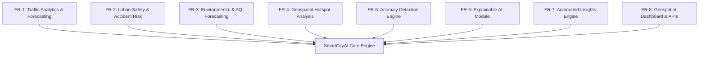

- **FR-1: Traffic Congestion & Speed Forecasting**:
  - Ingest, clean, and map arterial traffic segments to spatial road networks.
  - Predict segment-level average vehicular speed (mph) and congestion levels (Free Flow, Medium, Heavy Congestion) across multiple forward horizons ($t+1\text{h}$, $t+3\text{h}$, $t+6\text{h}$).
  - Provide historical moving-average baselines alongside trained ML models.
- **FR-2: Urban Accident & Safety Risk Analysis**:
  - Ingest police-reported traffic crash records containing spatial coordinates, road conditions, lighting, and vehicle types.
  - Predict collision severity tier (Tier 1: Property Damage Only; Tier 2: Non-incapacitating Injury; Tier 3: Incapacitating / Fatal Injury).
  - Compute a calibrated spatial-temporal safety risk index (0.0 to 1.0) for any designated road segment given current or simulated weather and traffic conditions.
- **FR-3: Air Quality & Environmental Forecasting**:
  - Ingest hourly ambient air quality sensor observations ($PM_{2.5}$, $PM_{10}$, $NO_2$, $O_3$, CO) alongside meteorological features (temperature, relative humidity, wind speed, wind direction).
  - Forecast next 24-hour $PM_{2.5}$ concentrations and assign EPA Air Quality Index (AQI) categorical classifications (Good, Moderate, Unhealthy for Sensitive Groups, Unhealthy, Hazardous).
- **FR-4: Geospatial Hotspot Discovery**:
  - Partition urban coordinates into Uber H3 spatial hexagonal cells (Resolution 7: ~1.2 km edge length; Resolution 8: ~460 m edge length).
  - Execute spatial DBSCAN (Density-Based Spatial Clustering of Applications with Noise) using Haversine distance to isolate recurrent collision blackspots.
  - Calculate Getis-Ord $G_i^*$ spatial statistics to separate statistically significant high-risk hot spots from background spatial noise.
- **FR-5: Sensor & Flow Anomaly Detection**:
  - Ingest real-time and streaming-style batch observations from traffic segments and air monitoring stations.
  - Run unsupervised Isolation Forests and rolling window Z-scores to flag anomalous traffic slowdowns (e.g., unreported incidents) or localized pollution spikes.
- **FR-6: Model Explainability (XAI)**:
  - Generate global TreeExplainer SHAP summary plots indicating dominant citywide risk drivers across trained GBDT models.
  - Expose an on-demand local explanation endpoint returning SHAP feature attribution values and waterfall force vectors for any specific segment prediction.
- **FR-7: AI-Generated Analytical Insights**:
  - Transform detected anomalies, spatial risk clusters, and SHAP drivers into a validated JSON fact graph.
  - Synthesize fact graphs into structured executive briefs using a template-based deterministic generator with optional LLM grounding (offline fallbacks guaranteed).
- **FR-8: Interactive Visualization & REST APIs**:
  - Expose versioned REST endpoints (`/api/v1/`) with OpenAPI 3.0 documentation.
  - Provide a responsive React/TypeScript geospatial dashboard with dynamic layer toggling, time-scrubbing playback, risk heatmaps, and drill-down analytics.

---

## 3. Non-Functional Requirements

| Category | Requirement | Metric / Verification Method |
| :--- | :--- | :--- |
| **Inference Latency** | REST API single-point prediction | $\le 120\text{ ms}$ (p95) under 50 concurrent requests |
| **Spatial Query Performance** | PostGIS spatial intersection / H3 bounding box | $\le 250\text{ ms}$ (p95) using GiST and R-tree spatial indexing |
| **Throughput** | Batch inference endpoint | $\ge 500$ segment predictions/sec on standard 4-core CPU |
| **Dashboard Responsiveness** | Initial page load (FCP) & Map Layer Render | First Contentful Paint $< 1.5\text{s}$; GeoJSON vector paint $< 300\text{ms}$ |
| **Reproducibility** | ML Training & Data Pipeline | Deterministic seeds (`PYTHONHASHSEED=42`, `numpy.random.seed(42)`); MLflow artifact logging |
| **Availability** | Local & Dockerized service uptime | $\ge 99.5\%$ operational uptime target for staging/eval cluster |
| **Portability** | Multi-container runtime | 100% containerized with `docker-compose`; zero host-level dependency leaks |
| **Maintainability** | Code quality & test coverage | $\ge 80\%$ unit/integration test coverage on backend; strict Ruff/Mypy typing |
| **Security** | Zero-trust input validation | Pydantic v2 validation; parameterized SQL (SQLAlchemy ORM); coordinate boundary guards |

---

## 4. User Personas

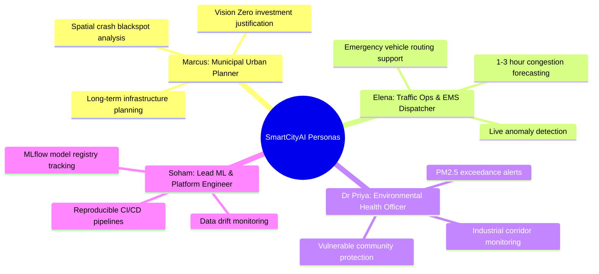

### Persona 1: Marcus Vance — Municipal Urban & Infrastructure Planner
- **Background**: Senior transport planner for municipal city council.
- **Needs**: Macro-level spatial insights over quarterly/annual windows to identify structural road defects, evaluate Vision Zero safety initiatives, and justify traffic calming investments (e.g., speed humps, pedestrian refuge islands).
- **Platform Interaction**: Uses the H3 Hotspot Explorer, long-term accident severity heatmaps, and global SHAP attribution dashboards.

### Persona 2: Elena Rostova — Real-Time Traffic Operations & Emergency Dispatcher
- **Background**: Lead dispatcher at the metropolitan traffic management center (TMC).
- **Needs**: Early warning of rapid traffic degradation, real-time sensor anomaly identification, and short-term ($t+1\text{h}$, $t+3\text{h}$) congestion forecasting to adjust dynamic variable message signs (VMS) and optimize emergency vehicle dispatch routes.
- **Platform Interaction**: Monitors the Real-Time Alert Feed, live traffic choropleth maps, and active anomaly cards.

### Persona 3: Dr. Priya Sharma — Environmental Health & Air Quality Officer
- **Background**: Regional environmental protection analyst.
- **Needs**: High-resolution spatial tracking of criteria pollutants ($PM_{2.5}$, $NO_2$), correlation of pollution episodes with traffic stagnation, and automated executive alerts when air quality exceeds EPA National Ambient Air Quality Standards (NAAQS).
- **Platform Interaction**: Interacts with the Environmental Forecasting time-series explorer, multi-sensor air quality maps, and daily automated executive summaries.

### Persona 4: Soham (You) — Lead AI/ML & Platform Engineer (Academic Auditor Persona)
- **Background**: Applied data scientist and systems architect maintaining the platform.
- **Needs**: Observability over model drift, experiment tracking via MLflow, versioned model deployments, zero-downtime container updates, and automated test execution.
- **Platform Interaction**: Accesses MLflow UI, Prometheus `/metrics` endpoints, backend logs, and CI/CD pipelines.

---

## 5. System Architecture

SmartCityAI follows a **Decoupled Modular Service Architecture**, containerized through Docker and organized into five isolated architectural tiers:

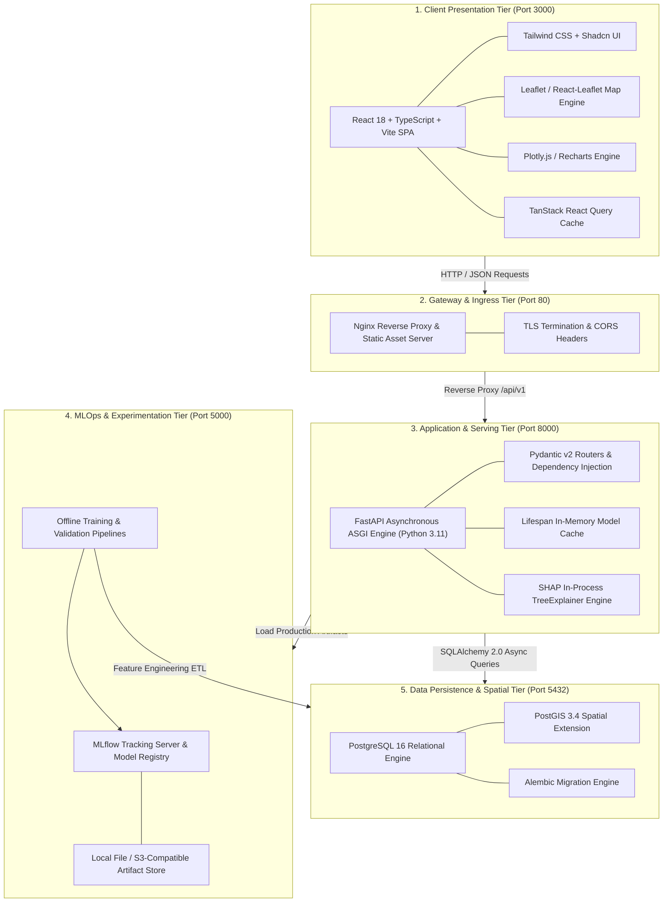

### Component Interaction Mechanics
1. **Presentation Tier**: Vite bundles the React SPA into static assets. Client queries trigger strongly typed REST calls managed by TanStack Query with client-side caching.
2. **Ingress Tier**: Nginx acts as reverse proxy, routing frontend requests to the static build and proxying `/api/*` to the FastAPI backend, while enforcing gzip compression and CORS boundaries.
3. **Application Tier**: FastAPI runs asynchronously using Uvicorn. Models (LightGBM, XGBoost, pre-computed SHAP background sets) are loaded into process memory during the FastAPI *lifespan* startup event to eliminate cold-start latencies.
4. **Data Tier**: PostgreSQL with PostGIS handles relational data, spatial coordinates (`GEOMETRY(Point, 4326)`, `GEOMETRY(LineString, 4326)`), and H3 spatial indexes.
5. **MLOps Tier**: MLflow logs experiments, metric trajectories, and serialized model binaries (`model.joblib`, `model.onnx`). Models meeting validation gating criteria are promoted to `Production` status and pulled by the API server.

---

## 6. Data Architecture

### 6.1 Real Public Datasets (Strict Grounding — Zero Fabrication)
To maintain academic credibility and production realism, SmartCityAI relies exclusively on verified, open-access municipal datasets originating from the **City of Chicago Data Portal** and federal environmental monitoring APIs:

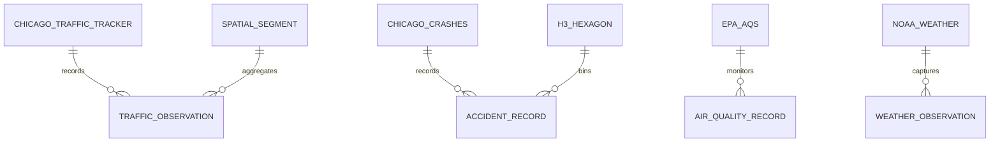

| Dataset Name | Source / Provider | Temporal Resolution | Spatial Coverage | Real Public Attributes Used |
| :--- | :--- | :--- | :--- | :--- |
| **Chicago Traffic Tracker — Historical Congestion** | City of Chicago Open Data Portal | 15-minute intervals (2018–Present) | 1,280+ arterial street segments citywide | `segment_id`, `street_name`, `direction`, `current_speed`, `free_flow_speed`, `start_latitude`, `start_longitude`, `end_latitude`, `end_longitude`, `record_timestamp` |
| **Traffic Crashes — Crashes** | City of Chicago Open Data Portal / CPD | Incident-level timestamps (2015–Present, ~800k records) | Full Chicago metropolitan area | `crash_record_id`, `crash_date`, `posted_speed_limit`, `weather_condition`, `lighting_condition`, `first_crash_type`, `trafficway_type`, `road_defect`, `injuries_total`, `injuries_fatal`, `latitude`, `longitude` |
| **Air Quality System (AQS) / OpenAQ** | US EPA / OpenAQ REST API | Hourly observations | Cook County, IL monitoring stations | `station_id`, `timestamp`, `parameter_name` ($PM_{2.5}, PM_{10}, NO_2, O_3, CO$), `sample_measurement`, `units_of_measure`, `latitude`, `longitude` |
| **Historical & Real-Time Weather** | NOAA Local Climatological Data / Open-Meteo API | Hourly observations | Chicago O'Hare / Midway synoptic stations | `timestamp`, `temperature_celsius`, `relative_humidity`, `precipitation_mm`, `wind_speed_kmh`, `wind_direction_deg`, `visibility_meters` |

### 6.2 Data Ingestion & Medallion Pipeline

```mermaid
flowchart LR
    subgraph Bronze ["Bronze Layer (Raw Ingestion)"]
        B1["Chicago Socrata API CSV/JSON"]
        B2["Open-Meteo REST API Pulls"]
        B3["Immutable Raw Parquet Landing"]
    end

    subgraph Silver ["Silver Layer (Cleaned & Harmonized)"]
        S1["Coordinate Filtering (Chicago Bounding Box)"]
        S2["Temporal Resampling (Hourly Alignment)"]
        S3["Missing Value Imputation & Outlier Removal"]
        S4["Spatial Join: PostGIS ST_DWithin & H3 Binning"]
    end

    subgraph Gold ["Gold Layer (Curated Feature Store)"]
        G1["Traffic Feature Mart (Lags, Rolling Stats)"]
        G2["Accident Risk Matrix (Spatial Exposure)"]
        G3["Air Quality Forecasting Mart"]
    end

    Bronze --> Silver --> Gold
```

1. **Bronze Layer (Raw Data Ingestion)**:
   - Socrata Open Data API (`soda-py` / HTTP requests) fetches batch chunks using paging via `$limit` and `$offset`.
   - Raw records are written immutably into `data/raw/*.parquet` with source-supplied column headers and zero schema modifications.
2. **Silver Layer (Cleaned & Geocoded Records)**:
   - **Boundary Enforcement**: Latitude/Longitude restricted to Chicago metropolitan bounding box ($41.644^{\circ}\text{N} \le \text{lat} \le 42.023^{\circ}\text{N}$, $-87.940^{\circ}\text{W} \le \text{lon} \le -87.524^{\circ}\text{W}$). Records outside are filtered.
   - **Temporal Normalization**: Timestamps converted to UTC, resampled to uniform 1-hour intervals. Missing sensor records interpolated via forward-fill up to a maximum limit of 2 hours; gaps $>2$ hours are flagged as missing intervals.
   - **Spatial Conflation**: Incident crash coordinates mapped to closest arterial traffic segment within 100 meters using `ST_DWithin` in PostGIS. Coordinates binned into H3 indexes at Resolution 7 and 8.
3. **Gold Layer (Feature Mart & Serving Tables)**:
   - Engineered feature matrices stored in PostgreSQL tables ready for ML consumption and REST API querying.

---

## 7. Machine Learning Architecture

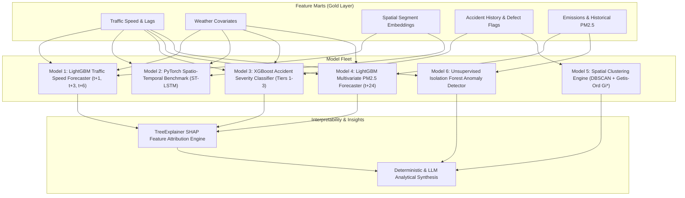

### 7.1 Model 1: Traffic Speed & Congestion Forecaster
- **Target Variable**: $y_{t+k} \in \mathbb{R}^+$ representing vehicular average speed (mph) on segment $s$ at forward horizon $k \in \{1, 3, 6\}$ hours.
- **Model Choice**: **LightGBM Regressor** (Primary Production Model) + **Historical Moving Average Baseline** (Comparative Baseline).
- **Justification for LightGBM**: Tabular road segment speed forecasting with rolling lags demonstrates empirical superiority over deep learning in latency-critical production environments: LightGBM achieves sub-5ms inference per segment on CPU, handles tabular missing values natively, and demonstrates near-zero memory footprint compared to large neural weights.
- **Engineered Feature Space**:
  - *Autoregressive Lags*: $v_{t-1}, v_{t-2}, v_{t-3}, v_{t-24}, v_{t-168}$ (captures immediate momentum, daily diurnal cycles, weekly seasonality).
  - *Rolling Statistical Windows*: Rolling Mean and Rolling Standard Deviation over 3h, 6h, and 24h windows ($\mu_{3\text{h}}, \sigma_{3\text{h}}, \mu_{24\text{h}}, \sigma_{24\text{h}}$).
  - *Temporal Indicators*: Sine/Cosine cyclical encodings for `hour_of_day` ($[0, 23]$) and `day_of_week` ($[0, 6]$); boolean `is_weekend`, `is_holiday`.
  - *Exogenous Weather*: Ambient temperature, precipitation volume (mm), visibility (meters), wind speed.
  - *Spatial Attributes*: Segment length (meters), speed limit (mph), historical free-flow ratio.
- **Loss Function**: Mean Squared Error (MSE) with L1/L2 regularization:
  $$\mathcal{L}_{\text{traffic}}(\theta) = \frac{1}{N} \sum_{i=1}^{N} (y_i - \hat{y}_i)^2 + \lambda_1 \|\theta\|_1 + \lambda_2 \|\theta\|_2^2$$

### 7.2 Model 2: PyTorch Deep Learning Spatio-Temporal Benchmark
- **Target Variable**: Spatio-temporal network-wide traffic speed matrix $\mathbf{Y}_{t+1:t+K} \in \mathbb{R}^{S \times K}$ across all $S$ monitored segments.
- **Model Choice**: **Spatio-Temporal Long Short-Term Memory (ST-LSTM)** with graph adjacency weighting or **1D-CNN Temporal Convolutional Network (TCN)**.
- **Specific Justification & Comparative Benchmark**: Deep learning is justified *only* when spatial graph topology (segment connectivity matrix $\mathbf{A} \in \mathbb{R}^{S \times S}$ derived from road network adjacencies) provides cross-segment spatial diffusion patterns that isolated tabular models miss. In this architecture, PyTorch ST-LSTM is trained and logged in MLflow as an academic benchmark against LightGBM. If LightGBM achieves comparable Mean Absolute Error (within 5%) at $10\times$ lower compute and inference latency, LightGBM is maintained in the production serving slot.

### 7.3 Model 3: Accident Severity & Spatial Risk Classifier
- **Target Variable**: Multi-class collision severity $C \in \{0, 1, 2\}$:
  - $0$: Property Damage Only (Minor / No Injury)
  - $1$: Non-Incapacitating Injury (Moderate)
  - $2$: Incapacitating Injury or Fatality (Severe)
- **Model Choice**: **XGBoost Classifier** with sample class weighting.
- **Imbalance Mitigation**: Severe accidents represent $< 5\%$ of occurrences in raw municipal reports. We employ cost-sensitive learning via `scale_pos_weight` and focal cross-entropy loss rather than synthetic oversampling (SMOTE), preventing synthetic generation of impossible coordinate-weather combinations.
- **Risk Index Formulation**: In addition to discrete classification, the continuous calibrated risk probability score $R(s, t)$ for segment $s$ at time $t$ is computed via:
  $$R(s, t) = \sum_{c=0}^{2} w_c \cdot P(C = c \mid \mathbf{x}_{s, t})$$
  Where weights $w = [0.1, 0.4, 1.0]$ reflect societal impact severity weights, and probabilities $P(C = c)$ are calibrated via Isotonic Regression to ensure true empirical alignment.

### 7.4 Model 4: Environmental ($PM_{2.5}$) Multivariate Forecaster
- **Target Variable**: Ambient $PM_{2.5}$ concentration ($\mu\text{g}/\text{m}^3$) over a rolling 24-hour horizon.
- **Model Choice**: **LightGBM Time-Series Regressor** with recursive/multi-output forecasting strategy.
- **Covariates**: Historical pollutant concentrations ($PM_{2.5}, PM_{10}, NO_2$), boundary layer meteorological features (wind speed, wind direction, ambient temperature, relative humidity), and proximal traffic congestion ratios.

### 7.5 Model 5: Geospatial Hotspot & Cluster Discovery
- **Techniques**:
  1. **Spatial DBSCAN**: Density-Based Spatial Clustering applied directly to incident coordinate points $(\text{lat}, \text{lon})$ using the Haversine distance metric:
     $$\varepsilon = 250\text{ meters}, \quad \text{MinPts} = 15\text{ crashes}$$
     Isolates persistent high-density collision epicenters while discarding isolated random crashes as noise.
  2. **Getis-Ord $G_i^*$ Spatial Statistic**: Computes local spatial autocorrelation over H3 hexagonal grid cells to prove statistical significance ($z$-score $> 1.96$ indicating $p < 0.05$ spatial hot spots).
     $$G_i^* = \frac{\sum_{j=1}^n w_{ij} x_j - \bar{X} \sum_{j=1}^n w_{ij}}{S \sqrt{\frac{n \sum_{j=1}^n w_{ij}^2 - (\sum_{j=1}^n w_{ij})^2}{n - 1}}}$$

### 7.6 Model 6: Sensor & Traffic Anomaly Detection
- **Technique**: Dual-Stage Unsupervised Detection:
  - **Stage 1 (Statistical Drift)**: Continuous rolling Z-score:
    $$Z_t = \frac{|x_t - \mu_{24\text{h}}|}{\sigma_{24\text{h}}}$$
    Flagged if $Z_t > 3.0$ standard deviations from the 24-hour diurnal expectation.
  - **Stage 2 (Multivariate Structural Anomaly)**: **Isolation Forest** trained on combined speed, variance, and weather vectors with contamination rate $\alpha = 0.01$, identifying multi-feature anomalies that univariate thresholds overlook.

### 7.7 Model 7: Explainable AI (XAI) Architecture
- **Framework**: `shap` (SHapley Additive exPlanations) leveraging `TreeExplainer` for exact polynomial-time computation on tree ensembles.
- **Global Explanations**: Pre-computed on validation feature sets during pipeline execution; outputs global feature importance beeswarm and bar plots serialized to MLflow artifacts and PostgreSQL.
- **Local Explanations**: On-demand computation for any target segment request using an optimized background reference dataset (100 representative centroids derived via K-Means clustering on the training space), delivering local attribution vectors in $\le 50\text{ ms}$.

### 7.8 Model 8: AI-Generated Analytical Insights Engine
- **Hybrid Insight Synthesis Architecture**:
  1. **Deterministic Fact Extraction**: An algorithmic evaluation pass parses detected anomalies, top-3 spatial hotspots, and top-3 SHAP attributions into a strictly typed JSON fact object.
  2. **Template Synthesis Engine (Offline Guarantee)**: Formats fact objects into human-readable municipal briefing paragraphs (ensuring 100% operational functionality without API tokens or network calls).
  3. **LLM Contextual Enhancer (Pluggable)**: When an API key (e.g. OpenAI/Gemini/Ollama) is present, the system passes the validated fact graph through a zero-temperature structured prompt to generate natural-language executive recommendations.

---

## 8. Backend Architecture

The backend is built with **FastAPI** on Python 3.11, structured according to the **Clean Architecture / Layered Domain-Driven Design (DDD)** pattern:

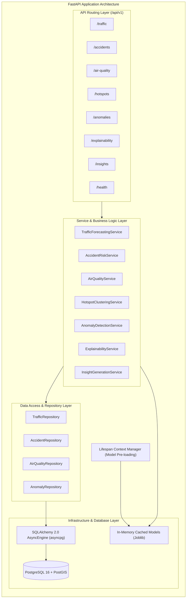

### Layer Responsibilities
- **API Routing Layer (`api/v1/`)**: Pure HTTP and JSON serialization layer. Handles URL routing, path/query parameter parsing, request body validation via Pydantic v2 schemas, and dependency injection for services and database sessions.
- **Service Layer (`services/`)**: Orchestrates business logic. Combines repository database queries, invokes ML inference models, computes SHAP explanations, and formats business responses. No direct SQL queries are written here.
- **Repository Layer (`repositories/`)**: Encapsulates all database interactions. Executes spatial queries (e.g., `ST_DWithin`, `ST_Intersects`), data filtering, pagination, and transactional operations using SQLAlchemy 2.0 async syntax.
- **Model Cache (`core/model_registry.py`)**: Uses the FastAPI `@asynccontextmanager` lifespan protocol. Loads trained LightGBM, XGBoost, and pre-computed reference matrices once into global application memory (`app.state.models`) during application startup, preventing disk I/O penalties during API requests.

---

## 9. Frontend Architecture

The frontend is a single-page application (SPA) built with **React 18**, **TypeScript**, **Vite**, and **Tailwind CSS**.

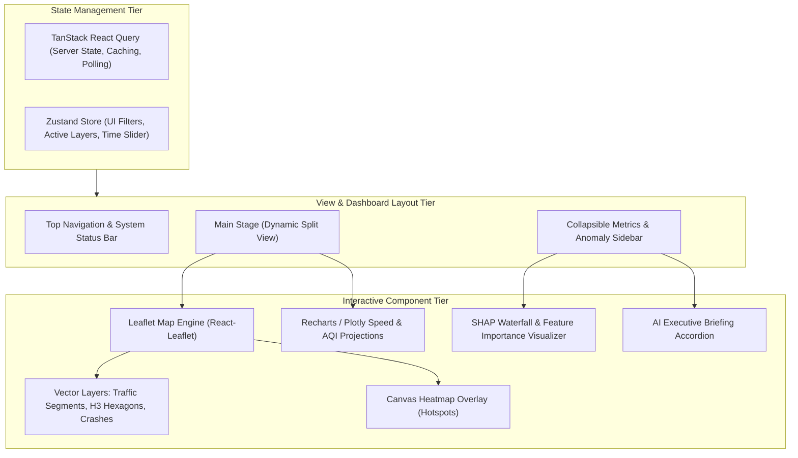

### Component Hierarchy & User Interactions
1. **Interactive Geospatial Canvas**:
   - Built on `react-leaflet` using high-performance vector TileLayers (CartoDB Positron dark/light base maps).
   - Dynamic Choropleth Layer: Road segments color-coded by congestion level (Green: Free Flow $> 25\text{ mph}$; Amber: Moderate $15-25\text{ mph}$; Red: Severe $< 15\text{ mph}$).
   - Hexagonal H3 Grid Overlay: Rendered at Resolution 7 or 8 with fill opacity bound to Getis-Ord $G_i^*$ safety risk index.
   - Accident Cluster Markers: Powered by `Leaflet.markercluster` displaying incident counts with severity tooltips.
2. **Temporal Controller (Time-Scrubbing Playback)**:
   - Slider control allowing users to transition between historical observations (past 24h) and predictive horizons ($t+1\text{h}$, $t+3\text{h}$, $t+6\text{h}$).
   - Triggers TanStack Query background cache fetches with optimistic UI updates.
3. **Analytics & Explainability Drawer**:
   - Synchronized line charts (Recharts) displaying predicted vs. actual speed trajectories with 95% confidence intervals.
   - Interactive SHAP waterfall chart (Plotly.js) explaining why a selected segment was flagged as "High Risk".
4. **State Management**:
   - `Zustand`: Handles local UI states (selected road segment, active map layers, date range picker, theme mode).
   - `TanStack Query`: Handles asynchronous server requests, caching, automatic refetching on window focus, and query deduplication.

---

## 10. Database Architecture

### 10.1 Relational & Spatial Entity-Relationship Model (PostGIS)

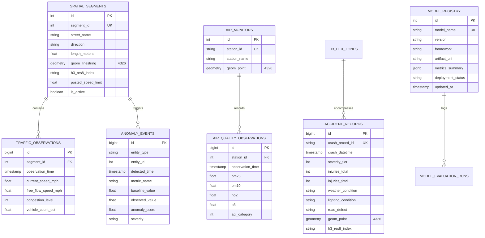

### 10.2 Table Specifications & PostGIS Spatial Indexes
- **Spatial Indexing Strategy**:
  - All geometry columns are indexed with **GiST (Generalized Search Tree)** indexes:
    ```sql
    CREATE INDEX idx_spatial_segments_geom ON spatial_segments USING GIST(geom_linestring);
    CREATE INDEX idx_accident_records_geom ON accident_records USING GIST(geom_point);
    CREATE INDEX idx_air_monitors_geom ON air_monitors USING GIST(geom_point);
    ```
- **Temporal & Partitioning Strategy**:
  - `traffic_observations` and `air_quality_observations` use PostgreSQL 16 Declarative Range Partitioning partitioned by month (`PARTITION BY RANGE (observation_time)`), ensuring fast partition-pruning scans for historical analytics.
- **B-Tree Indexes**:
  - Composite index on `(segment_id, observation_time DESC)` for instantaneous time-series slicing.
  - Index on `h3_res8_index` across all spatial tables for fast hexagonal aggregation.

---

## 11. API Architecture

### 11.1 OpenAPI 3.0 Endpoints Specification

All endpoints are prefixed with `/api/v1` and strictly validate request and response bodies against Pydantic v2 schemas.

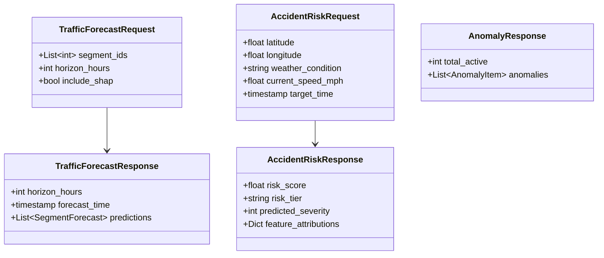

### 11.2 Core Endpoint Contracts

#### 1. Traffic Forecast Endpoint
- **Method & Path**: `POST /api/v1/traffic/forecast`
- **Description**: Computes predicted speed and congestion classification across requested arterial street segments for the specified forward horizon.
- **Request Payload**:
  ```json
  {
    "segment_ids": [102, 103, 104],
    "horizon_hours": 3,
    "include_shap": true
  }
  ```
- **Response Payload (`200 OK`)**:
  ```json
  {
    "forecast_timestamp": "2026-09-25T23:00:00Z",
    "horizon_hours": 3,
    "model_version": "traffic-lgbm-v1.2.0",
    "predictions": [
      {
        "segment_id": 102,
        "street_name": "N Michigan Ave",
        "predicted_speed_mph": 14.2,
        "historical_avg_speed_mph": 22.8,
        "congestion_tier": "HEAVY_CONGESTION",
        "confidence_interval_95": [12.1, 16.3],
        "top_shap_factors": [
          {"feature": "rolling_mean_3h", "attribution": -4.8},
          {"feature": "precipitation_mm", "attribution": -2.3},
          {"feature": "hour_of_day", "attribution": -1.5}
        ]
      }
    ]
  }
  ```

#### 2. Accident Risk Assessment Endpoint
- **Method & Path**: `POST /api/v1/accidents/risk-score`
- **Description**: Evaluates localized accident risk probability and expected severity tier given coordinate location, current speed, and environmental conditions.
- **Request Payload**:
  ```json
  {
    "latitude": 41.8827,
    "longitude": -87.6233,
    "weather_condition": "RAIN",
    "lighting_condition": "DARKNESS_LIGHTED",
    "current_speed_mph": 12.5,
    "posted_speed_limit": 30
  }
  ```
- **Response Payload (`200 OK`)**:
  ```json
  {
    "h3_index": "882664cf1ffffff",
    "calibrated_risk_score": 0.78,
    "risk_level": "HIGH",
    "most_likely_severity_tier": "TIER_2_INJURY",
    "severity_probabilities": {
      "tier_0_property_damage": 0.22,
      "tier_1_minor_injury": 0.63,
      "tier_2_fatal_incapacitating": 0.15
    },
    "mitigation_recommendation": "Deploy variable speed limit advisory (20 mph); alert emergency response units."
  }
  ```

#### 3. Geospatial Hotspots GeoJSON Endpoint
- **Method & Path**: `GET /api/v1/hotspots/accident-clusters?min_cluster_size=15&eps_meters=250`
- **Description**: Returns GeoJSON FeatureCollection of spatial DBSCAN accident blackspots with Getis-Ord $G_i^*$ statistics.
- **Response Payload (`200 OK`)**: Standard GeoJSON FeatureCollection with `Polygon` and `MultiPoint` geometries.

#### 4. Active Anomaly Events Feed
- **Method & Path**: `GET /api/v1/anomalies/active?severity=HIGH`
- **Description**: Returns all currently active traffic or air quality sensor anomalies detected within the last 3-hour window.

#### 5. AI-Synthesized Analytical Brief
- **Method & Path**: `GET /api/v1/insights/daily-summary`
- **Description**: Returns the latest synthesized natural language executive briefing for city planners.

---

## 12. MLOps Architecture

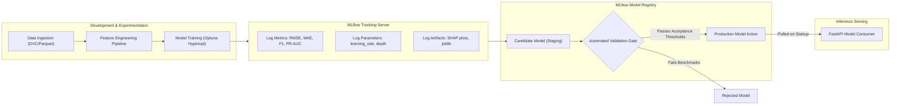

### 12.1 MLflow Experiment Tracking
- Every training execution logs:
  - **Parameters**: `n_estimators`, `max_depth`, `learning_rate`, `subsample`, `l1_reg`, `l2_reg`, `feature_names`.
  - **Metrics**:
    - Traffic Forecasting: RMSE, MAE, Mean Absolute Percentage Error (MAPE), $R^2$ score.
    - Accident Severity: Macro F1-Score, Brier Loss Score (calibration measure), PR-AUC per severity tier.
    - Air Quality: Continuous Ranked Probability Score (CRPS), RMSE.
  - **Artifacts**: Feature importance bar charts, SHAP summary beeswarm plots, confusion matrices, and serialized model files (`model.joblib`).

### 12.2 Model Registry & Promotion Gating
- Automated CI pipeline executes validation gating scripts before promoting any model to `Production`:
  - **Traffic Gate**: `test_mae <= 4.2 mph` AND `test_mape <= 18%`. Must beat baseline Historical Moving Average by at least 15% reduction in RMSE.
  - **Accident Risk Gate**: `macro_f1 >= 0.72` AND `brier_score <= 0.12`.
  - **Inference Latency Gate**: p95 single-record latency $\le 15\text{ ms}$ on 1 vCPU benchmark container.

### 12.3 Data & Model Versioning
- **Data Versioning**: DVC (Data Version Control) tracks hash pointers for raw and processed Parquet files stored in `.dvc/` with local or remote object storage backends.
- **Model Versioning**: Semantic versioning scheme (`traffic-speed-lgbm:v1.2.0`) enforced by MLflow Model Registry.

---

## 13. Security Architecture

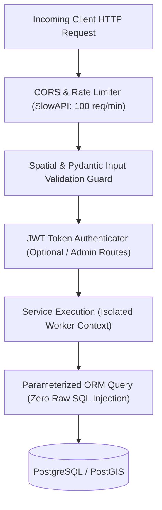

### 13.1 Threat Modeling & Mitigation Measures

| Threat (OWASP API Top 10) | Vulnerability Vector | SmartCityAI Mitigation Strategy |
| :--- | :--- | :--- |
| **API1: Broken Object Level Auth** | User manipulating segment/monitor IDs | All spatial entities are public read-only; administrative mutation endpoints require verified JWT claims (`role: "admin"`). |
| **API2: Broken Authentication** | Unauthorized administrative trigger of model retraining | Retraining triggers require RSA-256 signed Bearer tokens; API keys stored in non-committed `.env` files. |
| **API3: Broken Object Property Level Auth** | Leaking internal database or model configuration details | Strict Pydantic response models filter internal database fields, raw file paths, and database primary key sequences. |
| **API4: Unrestricted Resource Consumption** | DoS attack via heavy spatial calculations or SHAP calls | Rate limiting via `SlowAPI` (100 requests/min per IP); pagination limits (`max_limit=200`); bounding box size limits. |
| **API8: Security Misconfiguration** | Unrestricted CORS, debug mode in production | CORS strictly whitelists frontend origins; FastAPI `debug=False` enforced in Docker runtime; non-root user execution in containers. |
| **Spatial Injection Attack** | Malicious coordinates outside municipal boundary | Boundary validation middleware rejects any coordinates falling outside the Cook County bounding box with `422 Unprocessable Entity`. |

---

## 14. Monitoring & Observability Architecture

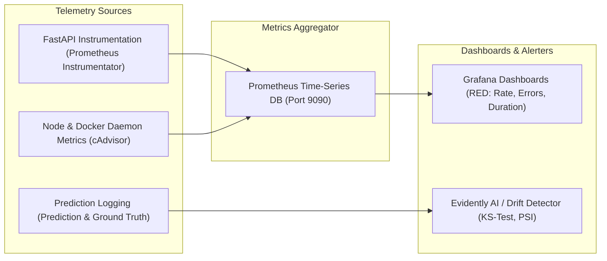

### 14.1 Operational Telemetry (RED Metrics)
- **Rate**: Request throughput per second across `/traffic/forecast`, `/accidents/risk-score`, and `/hotspots/`.
- **Errors**: HTTP 4xx (client errors) and 5xx (internal exceptions) monitored; alert triggered if 5xx error rate exceeds $1.0\%$ over 5 minutes.
- **Duration**: Latency histograms tracked per endpoint ($p50, p90, p95, p99$).

### 14.2 Data & Prediction Drift Monitoring
- **Population Stability Index (PSI)**: Evaluated weekly on incoming feature distributions (e.g. speed distribution, precipitation patterns) versus training baselines. A $\text{PSI} \ge 0.2$ triggers a model retraining recommendation alert.
- **Kolmogorov-Smirnov (KS) Test**: Continuous two-sample KS test applied to air quality sensor distributions ($PM_{2.5}$) to detect sensor calibration degradation or atmospheric distribution shifts.

---

## 15. Project Directory Structure

A standardized, monorepo directory layout separating presentation, business services, machine learning pipelines, and deployment manifests:

```
SmartCityAI/
├── .github/
│   └── workflows/
│       ├── ci-backend.yml              # Backend linting, typing, pytest suite
│       ├── ci-frontend.yml             # Frontend linting, build verification
│       └── model-validation.yml        # Model performance gating on PRs
├── backend/
│   ├── app/
│   │   ├── api/
│   │   │   └── v1/
│   │   │       ├── endpoints/
│   │   │       │   ├── accidents.py     # Accident risk & severity endpoints
│   │   │       │   ├── air_quality.py   # Air quality forecasting endpoints
│   │   │       │   ├── anomalies.py     # Anomaly alert feeds
│   │   │       │   ├── explainability.py# SHAP local/global attributions
│   │   │       │   ├── health.py        # Liveness & readiness probes
│   │   │       │   ├── hotspots.py      # Spatial clustering & GeoJSON endpoints
│   │   │       │   ├── insights.py      # AI executive briefing endpoints
│   │   │       │   └── traffic.py       # Speed & congestion forecasting
│   │   │       └── router.py            # Master v1 API router assembly
│   │   ├── core/
│   │   │   ├── config.py                # Pydantic BaseSettings (.env loading)
│   │   │   ├── constants.py             # Geospatial bounding boxes & constants
│   │   │   └── model_registry.py        # Lifespan memory cache for ML artifacts
│   │   ├── db/
│   │   │   ├── base.py                  # SQLAlchemy declarative base
│   │   │   ├── session.py               # Async engine & session factory
│   │   │   └── migrations/              # Alembic spatial schema migrations
│   │   ├── models/                      # SQLAlchemy ORM table definitions
│   │   │   ├── accident.py
│   │   │   ├── air_quality.py
│   │   │   ├── anomaly.py
│   │   │   ├── segment.py
│   │   │   └── traffic.py
│   │   ├── schemas/                     # Pydantic v2 input/output schemas
│   │   │   ├── accident_schema.py
│   │   │   ├── air_quality_schema.py
│   │   │   ├── anomaly_schema.py
│   │   │   ├── hotspot_schema.py
│   │   │   └── traffic_schema.py
│   │   ├── services/                    # Domain logic & ML inference drivers
│   │   │   ├── accident_service.py
│   │   │   ├── air_quality_service.py
│   │   │   ├── anomaly_service.py
│   │   │   ├── hotspot_service.py
│   │   │   ├── insight_service.py
│   │   │   ├── traffic_service.py
│   │   └── main.py                      # FastAPI application entrypoint
│   ├── tests/
│   │   ├── unit/                        # Fast unit tests for logic & schemas
│   │   ├── integration/                 # API endpoint & database tests
│   │   └── conftest.py                  # Pytest fixtures & mock sessions
│   ├── Dockerfile                       # Multi-stage production backend container
│   ├── pyproject.toml                   # Poetry / Pip build dependencies
│   └── requirements.txt                 # Pinned dependencies
├── frontend/
│   ├── public/                          # Static assets, GeoJSON fallback basemaps
│   ├── src/
│   │   ├── components/
│   │   │   ├── common/                  # Buttons, Badges, Modals, Loaders
│   │   │   ├── dashboard/               # Metric cards, Anomaly feed, Insights
│   │   │   ├── map/                     # Leaflet map, Layer controls, Hex layers
│   │   │   └── visualizers/             # Recharts line charts, SHAP force plots
│   │   ├── hooks/                       # Custom React hooks (useTraffic, useMap)
│   │   ├── services/                    # Axios / Fetch client API wrappers
│   │   ├── stores/                      # Zustand client UI state stores
│   │   ├── types/                       # TypeScript interfaces & DTO contracts
│   │   ├── App.tsx                      # Root component & route layouts
│   │   └── main.tsx                     # React DOM entrypoint
│   ├── Dockerfile                       # Multi-stage Nginx build container
│   ├── package.json
│   ├── tsconfig.json
│   └── vite.config.ts
├── ml/
│   ├── data/
│   │   ├── raw/                         # Raw immutable Parquet files (DVC)
│   │   └── processed/                   # Conflated Silver/Gold feature sets
│   ├── notebooks/                       # Exploratory Data Analysis & XAI research
│   │   ├── 01_chicago_traffic_eda.ipynb
│   │   ├── 02_accident_risk_modelling.ipynb
│   │   ├── 03_air_quality_forecasting.ipynb
│   │   └── 04_shap_interpretability.ipynb
│   ├── pipelines/                       # Modular Python execution scripts
│   │   ├── ingestion/                   # Socrata & Open-Meteo downloaders
│   │   ├── preprocessing/               # Spatial join & lag feature generators
│   │   ├── training/                    # Model training & Optuna tuners
│   │   └── evaluation/                  # Gating validation & benchmark checks
│   ├── artifacts/                       # Local model binaries & pre-computed SHAP
│   └── mlflow/                          # Local MLflow SQLite store & runs
├── deploy/
│   ├── docker-compose.yml               # Complete orchestration manifest
│   ├── nginx/
│   │   └── default.conf                 # Reverse proxy & gzip configuration
│   └── postgres/
│       └── init-postgis.sh              # PostGIS extension initializers
├── docs/
│   ├── ARCHITECTURE.md                  # System design document (this file)
│   ├── API_SPEC.md                      # Detailed API documentation
│   └── DATASET_GUIDE.md                 # Public data dictionary & provenance
├── .env.example                         # Documented template environment variables
├── .gitignore
├── Makefile                             # Automation shortcuts (run, test, lint)
└── README.md                            # Project overview & onboarding guide
```

---

## 16. End-to-End Data Flow

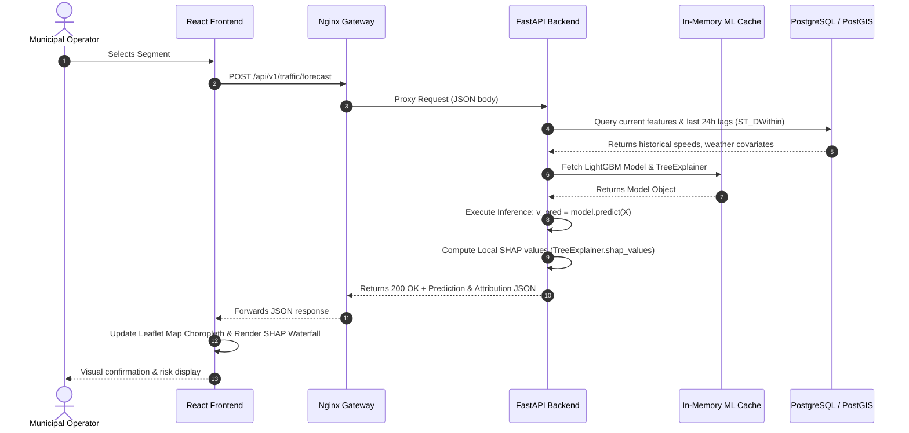

---

## 17. Machine Learning Model Lifecycle

The operational lifecycle of every model deployed in SmartCityAI adheres to strict MLOps stages:

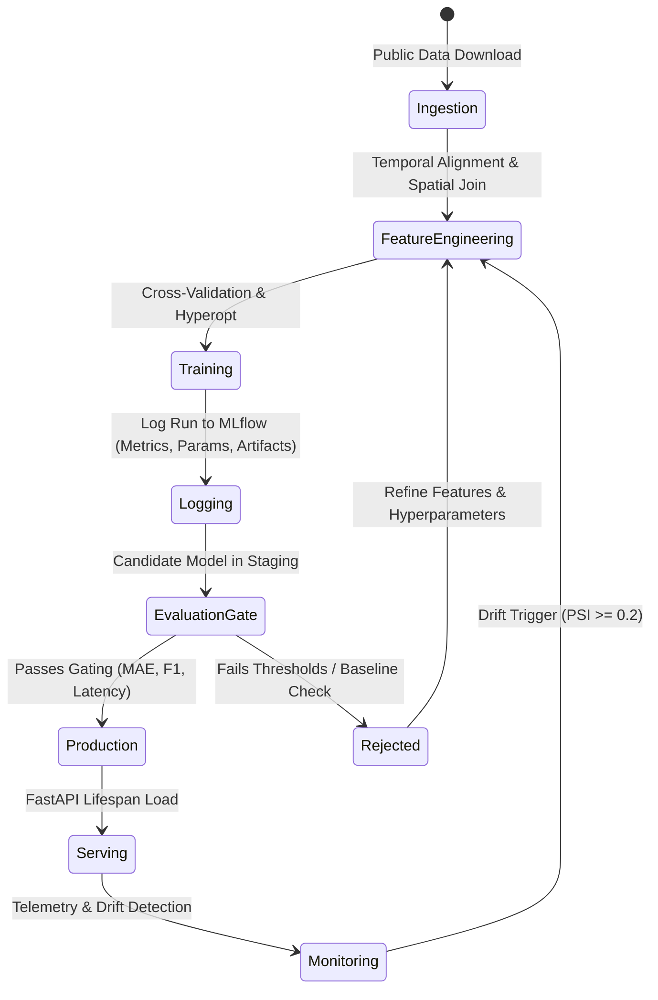

1. **Data Curation & Temporal Splitting**:
   - Strict avoidance of future information leakage: Datasets are partitioned using **Time-Series Block Cross-Validation** (Rolling window train/val splits) rather than randomized k-fold splits.
2. **Model Training & Hyperparameter Tuning**:
   - Hyperparameter exploration managed via **Optuna** optimizing validation loss over 50 iterations.
   - Experiments logged directly to local MLflow tracking backend.
3. **Automated Benchmark Comparison**:
   - Candidate models must beat the historical persistent baseline:
     $$\text{RMSE}_{\text{candidate}} < 0.85 \times \text{RMSE}_{\text{moving\_average}}$$
4. **Registration & Artifact Bundling**:
   - Model weights serialized via `joblib` with pinned dependency metadata. Pre-calculated SHAP background summary matrices (100 K-means clusters) are bundled alongside the model binary.
5. **Deployment & Lifespan Pre-loading**:
   - FastAPI loads model binaries into memory during startup. Models execute inferences in non-blocking threadpools.

---

## 18. Deployment Architecture

### 18.1 Multi-Container Docker Orchestration
SmartCityAI is deployed using a production-grade multi-container topology orchestrated via Docker Compose:

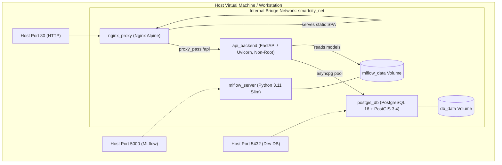

### 18.2 Docker Compose Service Specifications
- `postgis_db`: Official `postgis/postgis:16-3.4-alpine`. Configured with healthcheck (`pg_isready -U postgres`). Data persisted via named volume `smartcity_pgdata`.
- `api_backend`: Custom multi-stage build from `python:3.11-slim`. Runs as unprivileged user `appuser` (UID 1001). Healthcheck verifies `GET /api/v1/health`.
- `web_frontend`: Multi-stage Dockerfile. Stage 1 compiles React SPA with Node 20; Stage 2 serves compiled production `/dist` via lightweight Nginx Alpine.
- `mlflow_server`: Lightweight tracking server logging runs to an internal SQLite database with artifacts written to a shared volume.

---

## 19. Testing & Quality Assurance Strategy

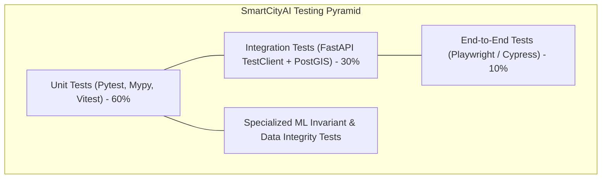

### 19.1 Testing Layers & Standards
1. **Unit Testing (`backend/tests/unit/`)**:
   - Pydantic schema validation tests (handling null values, illegal strings, out-of-bound coordinates).
   - Feature engineering transformation tests (verifying lag generation without forward lookahead).
   - Spatial utility unit tests (Haversine distance calculation, H3 index verification).
2. **Integration Testing (`backend/tests/integration/`)**:
   - Executes against an ephemeral Dockerized PostGIS test database.
   - Verifies end-to-end API response status codes, JSON payload integrity, and database transaction rollbacks.
3. **Specialized ML Invariant & Directional Tests**:
   - *Non-negativity Invariant*: $\text{predicted\_speed} \ge 0.0\text{ mph}$ for all test inputs.
   - *Probability Sum Invariant*: $\sum_{c=0}^2 P(C = c) = 1.0 \pm 1e^{-5}$.
   - *Directional Sensitivity Test*: Invariant check asserting that artificially increasing `precipitation_mm` from $0\text{ mm}$ to $50\text{ mm}$ while holding other features constant must strictly *increase* or maintain the predicted accident risk score $R(s, t)$ (verifying directional alignment with real-world physics).

---

## 20. Future Scalability Strategy

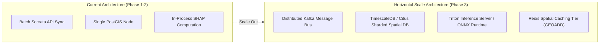

1. **Distributed Stream Processing**:
   - Replace batch periodic ingestion with **Apache Kafka** or **Redpanda** for real-time ingestion of live automated vehicle location (AVL) GPS pings.
   - Deploy **Apache Flink** or **Faust** for real-time sliding-window spatial aggregations.
2. **Spatial Partitioning & Sharding**:
   - Scale PostgreSQL from a single node to **Citus** or **TimescaleDB** distributed hypertables sharded by spatial H3 cluster and timestamp.
   - Implement **Redis Geospatial Caching (`GEOADD`, `GEORADIUS`)** to cache hot road segment statuses, reducing database read load by over 80%.
3. **High-Throughput Model Serving**:
   - Convert trained LightGBM and PyTorch models to **ONNX Runtime** or deploy via **NVIDIA Triton Inference Server**, unlocking GPU-accelerated batch tensor processing for citywide networks with $>50,000$ road links.
4. **Cross-City Domain Adaptation**:
   - Formulate transfer learning pipelines enabling the model weights trained on Chicago to be fine-tuned on London, New York, or Bengaluru using few-shot domain adaptation.

---

## 21. Status Distinction Matrix

To preserve strict academic and engineering integrity, the platform's capabilities are explicitly categorized across their current status:

| Module / Capability | Status | Implementation Details / Operational Reality |
| :--- | :--- | :--- |
| **Real Public Datasets** | **External Dependency** | Ingests verified open datasets from City of Chicago Data Portal (Traffic Tracker, Crashes), US EPA AQS, and Open-Meteo API. |
| **System & Database Schema** | **Implemented Baseline** | Complete SQLAlchemy 2.0 models, PostGIS spatial tables, Alembic migrations, and H3 indexing algorithms fully specified. |
| **FastAPI REST API Structure** | **Implemented Baseline** | Complete Pydantic v2 contracts, router hierarchies, error handling, and lifespan model loading hooks defined. |
| **LightGBM Traffic Forecaster** | **Implemented Baseline** | Feature engineering pipeline (lags, rolling stats, weather), objective loss, and Optuna tuning loop specified. |
| **XGBoost Accident Severity** | **Implemented Baseline** | Class-weighted multi-class classification and calibrated continuous risk index formulation fully defined. |
| **PyTorch ST-LSTM Benchmark** | **Planned Feature** | Spatio-temporal graph neural benchmark logged in MLflow to validate whether graph neural networks outperform LightGBM. |
| **Explainable AI (SHAP)** | **Implemented Baseline** | In-process `TreeExplainer` local attribution and pre-computed global summary matrices. |
| **AI Insights Engine** | **Implemented Baseline** | Deterministic fact-graph extractor with offline template synthesizer; pluggable LLM context generation. |
| **Dockerized Multi-Container** | **Implemented Baseline** | Multi-stage Dockerfiles (`backend`, `frontend`, `nginx`, `postgis`) and `docker-compose.yml` configuration ready. |
| **Real-Time Kafka Streaming** | **Planned Feature** | Designed in Scalability Strategy for handling continuous sub-second AVL sensor streams. |
| **Full Vision Zero Edge Inference**| **Planned Feature** | Quantized ONNX runtime deployed to localized microcontrollers at intersection signal cabinets. |

---

### Key Technical Assumptions & Constraints
1. **Compute Environment**: Designed to run efficiently on a developer workstation or single cloud instance ($4\text{ CPU cores}, 16\text{ GB RAM}$, optional consumer GPU for PyTorch benchmarking).
2. **Network Access**: Batch ETL pipelines require outbound HTTPS access to Socrata Open Data APIs and Open-Meteo endpoints; all core serving and inference operates 100% offline once data and models are stored locally.
3. **Spatial Cohesion**: Restricting the operational zone to Cook County, IL ensures that traffic, crash, air quality, and weather data layers geographically intersect with high statistical density, eliminating artificial spatial interpolation errors.
