# SmartCityAI — Production Data Pipeline Specification
## Engineering Principles, Medallion Architecture & Data Contracts

---

### Executive Data Engineering Principles

The SmartCityAI data platform operates under five non-negotiable data engineering laws:
1. **Raw Immutability (Write-Once, Read-Many)**: External payloads (Socrata API, OpenAQ, Open-Meteo) land in `data/raw/` with zero column renaming, zero type coercion, and zero deletion.
2. **Quarantine Isolation (Zero Silent Dropping)**: No row is ever deleted without a trace. Malformed coordinates, business key collisions, unparseable timestamps, and sensor outages are routed to `data/quarantine/` with structured metadata explaining why the row failed.
3. **Explicit Missingness & Outlier Auditing**: Missing sensor values are not quietly imputed. When forward-filling within physical tolerance limits ($\le 2$ intervals), an audit flag (`is_imputed_speed = True`) is permanently attached. Outliers (e.g. blizzard-induced gridlock or faulty sensor pings) are flagged with domain categories, preserving physical realities for the machine learning models.
4. **Leakage-Free Feature Generation**: Autoregressive lags ($t-1, t-2, \dots$) and rolling statistics ($3\text{h}, 6\text{h}, 24\text{h}$) strictly compute backwards in time using a `shift(1)` lookback guarantee, ensuring that the observation at time $t$ is NEVER part of the rolling summary used to predict $t$.
5. **Pre-flight Gating**: No model training run can execute unless the dataset passes an automated pre-flight quality gate verifying zero target nulls, strict temporal split monotonicity, and feature completeness.

---

## 1. Medallion Storage Architecture

```mermaid
flowchart LR
    subgraph Bronze ["1. Bronze Layer: data/raw/"]
        R1["Immutable Parquet Dumps"]
        R2["Raw Ingestion Checksums (SHA-256)"]
        R3["Source-Preserved Schemas"]
    end

    subgraph Quarantine ["Quarantine Layer: data/quarantine/"]
        Q1["Duplicate Business Key Collisions"]
        Q2["Out-of-Bounds Coordinates / Null Island"]
        Q3["Structural Sensor Outages (> 2h Gaps)"]
    end

    subgraph Silver ["2. Silver Layer: data/staging/"]
        S1["Timezone Normalized to UTC"]
        S2["Deduplicated Authoritative CDC Rows"]
        S3["Valid Coordinates Indexed to PostGIS / H3"]
        S4["Audited Imputation Flags (is_imputed)"]
        S5["Outlier Flags (is_outlier, severity)"]
    end

    subgraph Gold ["3. Gold Layer: data/processed/"]
        G1["Leakage-Free Lag Features (t-1h to t-168h)"]
        G2["Rolling Window Statistics (Closed Left)"]
        G3["Cyclical Time Encodings (sin/cos)"]
        G4["Weather Covariates Merged via merge_asof"]
        G5["Chronological Train/Val/Test Splits"]
    end

    Bronze -->|Cleaning Pipeline & Audit| Silver
    Bronze -.->|Failed Records| Quarantine
    Silver -->|Feature Engineering Pipeline| Gold
```



---

## 2. Directory Layout & Module Responsibilities

```
SmartCityAI/
├── config/
│   └── pipeline_config.yaml         # Central pipeline parameters & spatial bounds
├── data/
│   ├── raw/                         # Bronze: Immutable external API dumps
│   ├── staging/                     # Silver: Cleaned, deduplicated, UTC-normalized
│   ├── processed/                   # Gold: ML feature matrices (train/val/test splits)
│   └── quarantine/                  # Audit store: Records rejected during validation
├── schemas/
│   ├── __init__.py
│   ├── raw_schemas.py               # Pydantic v2 validation contracts for raw ingest
│   ├── staging_schemas.py           # Typed contracts for cleaned staging records
│   └── feature_schemas.py           # Feature matrix schema & preflight report contracts
├── pipelines/
│   ├── __init__.py
│   ├── base.py                      # Base pipeline with structured JSON logging & hashing
│   ├── cleaning.py                  # Bronze-to-Silver cleaning & quarantine orchestration
│   └── build_features.py            # Silver-to-Gold feature generation & temporal splitting
├── features/
│   ├── __init__.py
│   ├── temporal.py                  # Cyclical time encodings, lags, and rolling stats
│   ├── spatial.py                   # Haversine distance & spatial grid quantization
│   └── transformers.py              # Scikit-learn BaseEstimator leakage-free transformers
├── validation/
│   ├── __init__.py
│   ├── coordinate_validator.py      # Bounding box & null-island auditing
│   ├── outlier_detector.py          # Physical and statistical outlier tagging
│   ├── leakage_guard.py             # Temporal split isolation & target leak auditing
│   └── preflight_gate.py            # Pre-training quality gatekeeper
└── tests/
    ├── test_schemas.py              # Pydantic schema validation tests
    ├── test_cleaning.py             # Cleaning, deduplication & coordinate tests
    ├── test_features.py             # Feature engineering & cyclical tests
    └── test_leakage.py              # Zero-lookahead & temporal isolation tests
```

---

## 3. Transformation & Validation Logic

### 3.1 Timezone Normalization & Resampling
- **Problem**: Raw municipal feeds provide naive local timestamps in source municipal timezones (e.g. `America/Chicago` or `Asia/Kolkata`), introducing daylight saving time (DST) shifts and ambiguity.
- **Engineering Solution**: 
  1. Localize incoming naive strings to the declared source timezone with explicit ambiguity handling:
     $$\text{dt}_{\text{localized}} = \text{to\_datetime}(t).\text{dt.tz\_localize}(\text{source\_tz}, \text{ambiguous}='NaT', \text{nonexistent}='shift\_forward')$$
  2. Immediately convert all internal datetimes to UTC:
     $$\text{dt}_{\text{utc}} = \text{dt}_{\text{localized}}.\text{dt.tz\_convert}('UTC')$$
  3. All downstream database columns and Parquet files store native UTC datetimes.

### 3.2 Duplicate Auditing & Business Key Collisions
- **Detection**:
  - Exact row duplicate: identical row hash.
  - Business primary key collision: identical `(segment_id, observation_time_utc)`.
- **Handling**: Conflicting duplicate records are routed to `data/quarantine/` with `quarantine_reason = 'BUSINESS_KEY_COLLISION_DUPLICATE'`. The authoritative record is retained based on Change Data Capture (CDC) ordering.

### 3.3 Coordinate Validation & Null Island Guards
- **Detection**:
  - Mathematical boundary check: $-90.0 \le \text{lat} \le 90.0, -180.0 \le \text{lon} \le 180.0$.
  - Null Island filter: $|\text{lat}| < 1e^{-4}$ and $|\text{lon}| < 1e^{-4}$.
  - Municipal bounding box filter:
    - Chicago: $41.644^{\circ}\text{N} \le \text{lat} \le 42.023^{\circ}\text{N}$, $-87.940^{\circ}\text{W} \le \text{lon} \le -87.524^{\circ}\text{W}$.
    - Pune: $18.420^{\circ}\text{N} \le \text{lat} \le 18.640^{\circ}\text{N}$, $73.740^{\circ}\text{E} \le \text{lon} \le 73.980^{\circ}\text{E}$.
- **Handling**: Failed coordinates are annotated in `data/quarantine/` with reasons (`NULL_ISLAND_COORDINATE`, `OUT_OF_MUNICIPAL_BOUNDS`). Valid records are marked `is_valid_coordinate = True`.

### 3.4 Missing Value Imputation with Explicit Indicator Tracking
- **Sensor Speeds**: Temporary communication drops (e.g. sensor returns `-1.0` or `NaN`) are forward-filled up to a maximum limit of 2 consecutive intervals within each specific road segment.
- **Audit Preservation**: An explicit boolean column `is_imputed_speed` is set to `True` for every modified row.
- **Structural Outages**: Sensor gaps exceeding 2 intervals are treated as hardware outages; they are not fabricated and are segregated to quarantine.

### 3.5 Outlier Tagging (Zero Blind Deletion)
- **Problem**: Extreme traffic slowdowns (e.g. 2 mph due to multi-vehicle pileups or heavy snowstorms) appear as statistical outliers under standard Z-score thresholds. Blindly dropping these rows erases the most important safety signals in the dataset.
- **Engineering Solution**:
  1. Detect physical violations: $\text{speed} < 0\text{ mph}$ or $\text{speed} > 100\text{ mph}$.
  2. Detect statistical deviations: Rolling Modified Z-Score ($Z > 3.5$) and IQR ($1.5 \times \text{IQR}$).
  3. Annotate columns `speed_mph_is_outlier`, `speed_mph_outlier_type`, `speed_mph_outlier_severity`.
  4. Rows are retained in the dataset, allowing downstream models to leverage outlier flags as high-value indicator features.

### 3.6 Data Leakage Prevention Guarantees
- **Lookahead Bias Elimination**: Rolling statistics compute over a `shift(1)` series:
  $$\text{rolling\_mean}_{3\text{h}}(t) = \frac{1}{3} \sum_{i=1}^{3} v_{t-i}$$
  The observation at time $t$ ($v_t$) is mathematically excluded from the rolling window summary at time $t$.
- **Temporal Splitting Discipline**: Datasets are partitioned strictly by cutoff timestamps:
  $$\max(T_{\text{train}}) < \min(T_{\text{val}}) \le \max(T_{\text{val}}) < \min(T_{\text{test}})$$
  Randomized k-fold cross validation on time-series is strictly prohibited.
- **Pre-flight Gating**: An automated validation gate (`PreflightGate`) evaluates the final feature matrix prior to training. If any target values leak into the feature space or null percentages exceed thresholds, model training is blocked.
