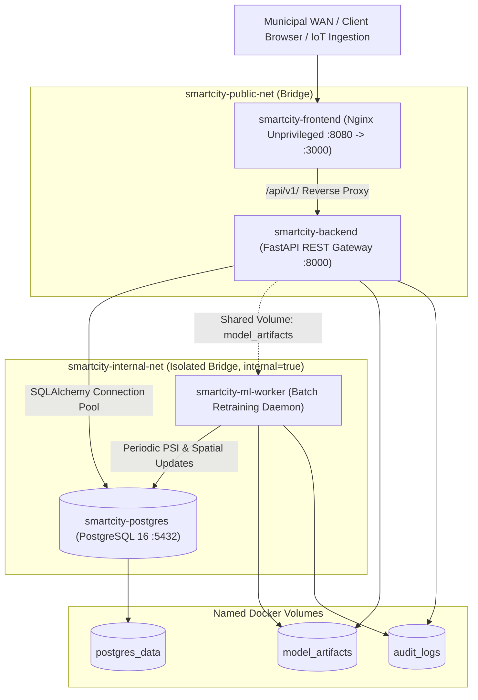
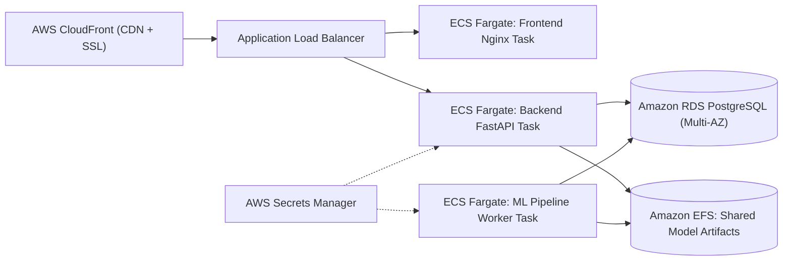

# SmartCityAI — Production Deployment Guide & Container Architecture

## 1. Architectural Overview & Container Topology

The **SmartCityAI** deployment architecture is engineered for high availability, municipal-grade security, and resource isolation. The platform is decoupled into four containerized services orchestrated via **Docker Compose**:



### 1.1 Service Catalog

| Service | Container Name | Base Image | Role & Responsibilities | Port Mapping | Resource Limits |
| :--- | :--- | :--- | :--- | :--- | :--- |
| **Database** | `smartcity-postgres` | `postgres:16-alpine` | ACID relational storage for telemetry, crash records, AQI, and audit trails | `127.0.0.1:5432` | $1.5\text{ CPU}, 1.5\text{ GB RAM}$ |
| **API Backend** | `smartcity-backend` | `python:3.11-slim` | FastAPI REST gateway, RBAC auth, online ML inference ($\le 50\text{ms}$), grounded Q&A | `8000:8000` | $2.0\text{ CPU}, 2.0\text{ GB RAM}$ |
| **Frontend** | `smartcity-frontend` | `nginxinc/nginx-unprivileged:alpine` | Static React 18 SPA server, API reverse proxy, security headers | `3000:8080` | $0.5\text{ CPU}, 512\text{ MB RAM}$ |
| **ML Worker** | `smartcity-ml-worker` | `python:3.11-slim` | Asynchronous batch retraining daemon, PSI feature drift audits, spatial H3 Bayes updates | *None (Internal)* | $2.0\text{ CPU}, 2.0\text{ GB RAM}$ |

---

## 2. Production Security Practices

### 2.1 Non-Root Container Execution
Running containers as root poses severe container-breakout security vulnerabilities. SmartCityAI strictly enforces non-root execution across all containers:
- **Backend & ML Worker**: Run as system user `appuser:smartcity` (`UID 10001`, `GID 10001`) with `/usr/sbin/nologin` shell.
- **Frontend SPA**: Utilizes official `nginxinc/nginx-unprivileged:alpine` running as `nginx` (`UID 101`). Listens on unprivileged port `8080`.
- **Database**: Runs as standard unprivileged `postgres` (`UID 999`).

### 2.2 Network Isolation & Segmented Access
The orchestration defines two isolated bridge networks:
1. `smartcity-public-net`: Facilitates external client traffic to the Nginx frontend and reverse proxy traffic to the FastAPI backend.
2. `smartcity-internal-net` (`internal: true`): Completely isolated from external WAN routing. The PostgreSQL database and background ML worker reside exclusively on this internal network, preventing public IP scanning or unauthorized database exposure.

### 2.3 Strict Secret Management
- **Zero Hardcoded Secrets**: Secrets are injected strictly at runtime via environment variables loaded from `.env` or container orchestrator secret vaults (e.g. Docker Secrets, AWS Secrets Manager, HashiCorp Vault).
- **Cryptographic Random Keys**: API keys and HMAC secrets must be generated with at least 32 bytes of entropy (`openssl rand -hex 32`).
- **Git Exclusion**: `.gitignore` strictly blocks all `.env*` files, private keys, database dumps, and certificates.

### 2.4 Minimal Images & Pinned Dependencies
- Multi-stage builds compile C-extensions (LightGBM OpenMP, psycopg2) in a temporary `builder` stage, keeping the final runtime image free of compilers, headers, and package manager caches.
- Dependencies are strictly pinned in [`requirements.txt`](file:///c:/Users/Soham/Desktop/SmartCityAI/requirements.txt) and `frontend/package.json` to prevent supply chain tampering.

### 2.5 Security Headers (Nginx)
The frontend proxy injects hardened HTTP headers on all responses:
```nginx
add_header X-Frame-Options "DENY" always;
add_header X-Content-Type-Options "nosniff" always;
add_header X-XSS-Protection "1; mode=block" always;
add_header Referrer-Policy "strict-origin-when-cross-origin" always;
add_header Permissions-Policy "geolocation=(self), microphone=(), camera=()" always;
```

---

## 3. Hardware & Resource Considerations

### Recommended Production Sizing (Metropolitan Deployment)

| Scale Level | Ingestion Volume | Recommended CPU | Recommended RAM | Storage Allocation |
| :--- | :--- | :--- | :--- | :--- |
| **Demonstration / Lab** | $< 100$ records/sec | 4 vCPU | 8 GB | 20 GB SSD |
| **Small City (e.g. Pune Ward)** | $500$ records/sec | 8 vCPU | 16 GB | 100 GB NVMe SSD |
| **Metro Area (Pune/Mumbai)** | $> 2,000$ records/sec | 16 vCPU | 32 GB | 500 GB NVMe SSD (RAID-10) |

Resource boundaries defined in `docker-compose.yml`:
```yaml
deploy:
  resources:
    limits:
      cpus: "2.0"
      memory: 2048M
    reservations:
      cpus: "0.5"
      memory: 512M
```

---

## 4. Step-by-Step Deployment Guide

### Step 1: System Prerequisites
Ensure the target server satisfies:
- OS: Ubuntu 22.04 LTS, Debian 12, or Windows Server with WSL2
- Docker Engine $\ge 24.0$
- Docker Compose $\ge v2.20$
- Ports 3000 (UI) and 8000 (API) available

### Step 2: Clone Repository & Configure Environment
```bash
git clone https://github.com/your-org/SmartCityAI.git
cd SmartCityAI

# Copy production template
cp .env.example .env

# Generate cryptographically secure random secrets
ADMIN_KEY=$(openssl rand -hex 32)
ANALYST_KEY=$(openssl rand -hex 32)
VIEWER_KEY=$(openssl rand -hex 32)
JWT_SECRET=$(openssl rand -hex 32)
DB_PASS=$(openssl rand -hex 24)

# Replace in .env
sed -i "s/replace_with_64_char_crypto_random_password/$DB_PASS/g" .env
sed -i "s/admin_replace_with_random_token_for_root_control/$ADMIN_KEY/g" .env
sed -i "s/analyst_replace_with_random_token_for_ingestion/$ANALYST_KEY/g" .env
sed -i "s/viewer_public_read_only_dashboard_token/$VIEWER_KEY/g" .env
sed -i "s/replace_with_random_hmac_salt_for_session_verification/$JWT_SECRET/g" .env
```

### Step 3: Validate Compose Specification
```bash
docker compose config --quiet
```
*Must exit with status 0.*

### Step 4: Build & Launch Container Fleet
```bash
docker compose up --build -d
```

### Step 5: Verify Container Health & Logs
```bash
# Check container status and health probes
docker compose ps

# Sample output:
# NAME                   IMAGE                  STATUS                    PORTS
# smartcity-postgres     postgres:16-alpine     Up (healthy)              127.0.0.1:5432->5432/tcp
# smartcity-backend      smartcityai-backend    Up (healthy)              0.0.0.0:8000->8000/tcp
# smartcity-frontend     smartcityai-frontend   Up (healthy)              0.0.0.0:3000->8080/tcp
# smartcity-ml-worker    smartcityai-ml-worker  Up (healthy)

# Tail unified service logs
docker compose logs -f --tail=50
```

### Step 6: Test Health Probes via cURL
```bash
# 1. Frontend Nginx Liveness
curl -I http://localhost:3000/healthz
# Returns HTTP/1.1 200 OK

# 2. Backend FastAPI Health & DB Readiness Probe
curl -s http://localhost:8000/api/v1/health | jq .
# Returns: {"status": "HEALTHY", "version": "1.0.0", "components": {"database": {"status": "UP"}}}
```

---

## 5. Maintenance, Backup & Disaster Recovery

### 5.1 Automated PostgreSQL Backup Script
Create a cron job on the host to execute daily atomic database backups:
```bash
#!/bin/bash
BACKUP_DIR="/var/backups/smartcityai"
TIMESTAMP=$(date +"%Y%m%d_%H%M%S")
mkdir -p "$BACKUP_DIR"

# Execute pg_dump inside postgres container
docker exec -t smartcity-postgres pg_dump -U smartcity_admin smartcityai | gzip > "$BACKUP_DIR/smartcity_db_$TIMESTAMP.sql.gz"

# Retain last 14 daily backups
find "$BACKUP_DIR" -type f -name "*.sql.gz" -mtime +14 -exec rm {} \;
```

### 5.2 Database Restoration
```bash
# To restore database from a compressed backup:
gunzip < /var/backups/smartcityai/smartcity_db_20260925.sql.gz | docker exec -i smartcity-postgres psql -U smartcity_admin -d smartcityai
```

### 5.3 Zero-Downtime Rolling Update
```bash
# Pull or rebuild updated code
docker compose build backend ml-worker

# Recreate backend with zero downtime
docker compose up -d --no-deps --build backend
```

---

## 6. Cloud Deployment Architecture Blueprints

> [!NOTE]
> **Epistemic Notice**: The following cloud deployment patterns represent verified reference architecture blueprints. No live cloud deployment has been executed or claimed without actual provisioned cloud credentials.

### 6.1 AWS Architecture (ECS Fargate + RDS PostgreSQL)


### 6.2 Kubernetes / OpenShift Blueprint
For enterprise municipal deployments managing hundreds of sensor streams:
- `Deployment` for `smartcity-backend` with `HorizontalPodAutoscaler` (scale on CPU $> 75\%$ or request count).
- `StatefulSet` or managed operator for PostgreSQL (e.g. CloudNative-PG / Crunchy Data).
- `CronJob` for ML batch retraining pipelines.
- `Ingress` with cert-manager for automated Let's Encrypt TLS termination.
