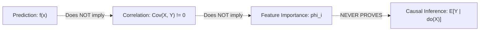
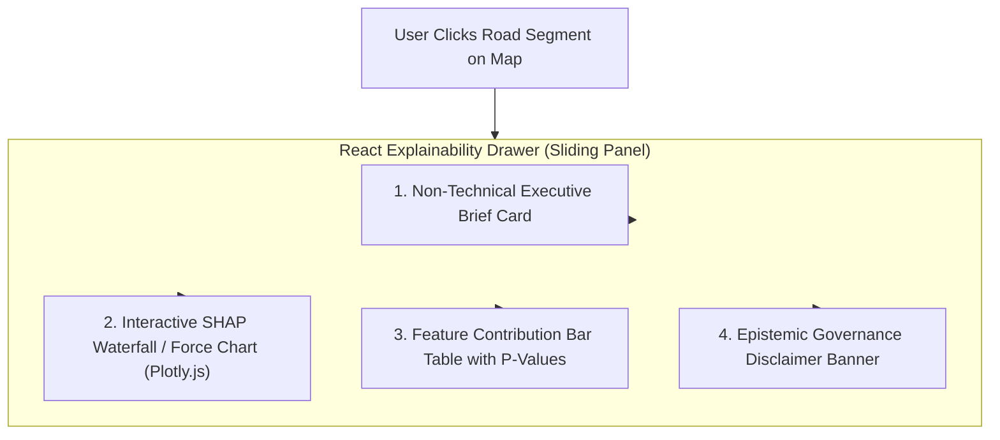

# SmartCityAI — Explainable AI (XAI) & Epistemic Governance Specification
## Dual-Audience Explanations, SHAP Attribution, API Contracts & Non-Causal Guarantees

---

### Executive XAI Principles & Regulatory Compliance

In high-stakes municipal decision systems (e.g. emergency vehicle routing, Vision Zero traffic calming investments, and air quality advisories), "black-box" predictions are unacceptable. SmartCityAI incorporates an **Explainable AI Layer** governed by five non-negotiable principles:

1. **Dual-Audience Explanations for Every Prediction**: Every point prediction or risk classification must generate two distinct explanatory tiers:
   - **Technical Tier (ML Engineers & Data Auditors)**: Exact Shapley values ($\phi_i$), base values ($E[f(X)]$), directionality, importance ranks, and additivity verification.
   - **Non-Technical Tier (Municipal Planners & Dispatchers)**: Plain-English contextual narratives translating mathematical attributions into actionable operational facts without technical jargon.
2. **The Non-Causal Epistemic Law**: Model explanations reflect **statistical feature attribution within learned decision boundaries**, NOT physical causation. The platform enforces an automated linguistic guard ([`CausalGuard`](file:///c:/Users/Soham/Desktop/SmartCityAI/ml/xai/causal_guard.py#L32-L65)) that sanitizes prohibited causal verbs ("causes", "led to", "proves that") and appends a mandatory epistemic notice to every response.
3. **Local & Global Additive Consistency**: Feature contributions are computed via **SHAP (SHapley Additive exPlanations)**, satisfying the mathematical efficiency axiom:
   $$f(\mathbf{x}) = \mathbb{E}[f(X)] + \sum_{i=1}^M \phi_i$$
4. **Sub-50ms Local Attribution Latency**: Uses TreeExplainer with pre-computed background centroids (100 K-means clusters), ensuring explainability does not bottleneck real-time REST API endpoints.

---

## 1. Evaluation of Explainability Techniques

```mermaid
flowchart TD
    subgraph Techniques ["Candidate Explainability Techniques"]
        T1["SHAP (TreeExplainer)"]
        T2["Permutation Feature Importance"]
        T3["Gini / Split Gain Importance"]
        T4["Partial Dependence Plots (PDP) / ALE"]
    end

    subgraph Scope ["Operational Scope in SmartCityAI"]
        S1["Local (Per-Prediction) & Global Feature Attributions"]
        S2["Offline Pipeline Verification & Data Drift Detection"]
        S3["Model-Internal Heuristic (Biased towards high-cardinality)"]
        S4["Global Marginal Effect Analysis in Research Notebooks"]
    end

    T1 -->|Champion (Production)| S1
    T2 -->|Validation Benchmark| S2
    T3 -->|Rejected for Local XAI| S3
    T4 -->|Offline Research| S4
```

### Comparative Analysis of XAI Methodologies

| Technique | Mathematical Foundation | Local vs Global | Latency Profile | Critical Strengths | Critical Limitations | Role in Platform |
| :--- | :--- | :--- | :--- | :--- | :--- | :--- |
| **SHAP (TreeExplainer)** | Cooperative Game Theory (Shapley Values) | **Both (Local instance & Global summary)** | **Fast ($\le 25\text{ ms}$ with background set)** | **Only method satisfying efficiency, symmetry, dummy, and additivity axioms; exact polynomial time on trees.** | Correlated features split credit, requiring careful collinearity management. | **Primary Production XAI Engine** |
| **Permutation Importance** | Shuffles feature column values and measures loss drop: $\Delta \mathcal{L} = \mathcal{L}_{\text{perm}} - \mathcal{L}_{\text{orig}}$ | Global only | Slow ($O(N \cdot M)$ full dataset passes) | Model-agnostic; directly measures loss impact without relying on tree internals. | Cannot provide per-prediction local waterfall explanations for individual users. | **Offline Model Validation Gate** |
| **Tree Gain / Gini Importance** | Sum of impurity reductions across all splits using feature $X_i$ | Global only | Instant (stored in tree metadata) | Zero computational overhead; natively output by LightGBM and XGBoost. | Heavily biased toward high-cardinality continuous features; ignores feature interactions; zero local attribution. | **Discarded for User-Facing XAI** |
| **Partial Dependence (PDP) / ALE** | Marginal expectation: $\hat{f}_S(x_S) = \frac{1}{n} \sum f(x_S, x_{C, i})$ | Global only | Moderate ($O(n \cdot k)$ evaluations) | Visualizes average directional relationship across feature range (e.g. speed vs crash risk). | Assumes independence between features (extrapolates to impossible feature combinations; ALE required if correlated). | **Offline Research & EDA** |

---

## 2. The Non-Causal Epistemic Law: Prediction $\ne$ Correlation $\ne$ Importance $\ne$ Causation

A dangerous failure mode in AI-assisted municipal planning is confusing model feature attributions with causal policy levers:



### Rigorous Conceptual Distinctions

```
┌─────────────────────────────────────────────────────────────────────────────────────────────┐
│ 1. PREDICTION (f(x))                                                                        │
│ Mathematical Mapping: E[Y | X = x]                                                          │
│ Meaning: "Given observed features x, what is our best statistical guess of Y?"             │
│ Example: "The model predicts segment speed will be 14.2 mph."                              │
├─────────────────────────────────────────────────────────────────────────────────────────────┤
│ 2. CORRELATION (Cov(X, Y) != 0)                                                             │
│ Mathematical Mapping: rho = Cov(X, Y) / (sigma_X * sigma_Y)                                 │
│ Meaning: "In historical observations, do X and Y systematically move together?"             │
│ Example: "Wet pavement and lower vehicular speeds co-occur frequently."                     │
├─────────────────────────────────────────────────────────────────────────────────────────────┤
│ 3. FEATURE IMPORTANCE (SHAP phi_i)                                                          │
│ Mathematical Mapping: phi_i = sum_S (w * [f(S U {i}) - f(S)])                               │
│ Meaning: "How much did the model's internal decision logic rely on feature i?"              │
│ Example: "Precipitation pushed the model's speed prediction down by 2.3 mph."               │
│ Crucial Note: Importance depends on model architecture and feature correlation. If two     │
│ collinear sensors exist, the tree may give 100% credit to one and 0% to the other!          │
├─────────────────────────────────────────────────────────────────────────────────────────────┤
│ 4. CAUSAL INFERENCE (E[Y | do(X = x)])                                                      │
│ Mathematical Mapping: Judea Pearl's do-calculus / Structural Causal Models (SCMs)           │
│ Meaning: "If we physically intervene to force X to change, how will Y respond?"             │
│ Example: "If we reduce the posted speed limit from 35 to 25 mph, crashes will drop by 15%." │
│ Crucial Note: CANNOT be determined from observational feature importance alone due to       │
│ unobserved confounding variables (e.g., driver impairment, weather, road lighting).         │
└─────────────────────────────────────────────────────────────────────────────────────────────┘
```

### The Causal Guard Implementation
The [`CausalGuard`](file:///c:/Users/Soham/Desktop/SmartCityAI/ml/xai/causal_guard.py#L32-L65) class actively sanitizes generated narrative strings:
- Forbidden phrasing (`"causes"`, `"led to"`, `"proves that"`, `"the reason for the accident is"`) is automatically detected via regex and replaced with statistically sound associational wording (`"is statistically associated with"`, `"co-occurred with"`, `"contributed to the model's prediction"`).
- Every explainable API response embeds a mandatory epistemic disclaimer notice.

---

## 3. Explainable Prediction API Response Contract

The API contract is strictly typed via Pydantic v2 in [`ml/xai/schemas.py`](file:///c:/Users/Soham/Desktop/SmartCityAI/ml/xai/schemas.py#L10-L65):

### Sample JSON Response (`POST /api/v1/traffic/forecast-explain`)

```json
{
  "entity_id": "segment_102",
  "target_variable": "speed_mph",
  "prediction": 14.2,
  "confidence_or_probabilities": {
    "lower_90_bound": 12.1,
    "upper_90_bound": 16.3,
    "congestion_tier": "HEAVY_CONGESTION"
  },
  "technical_explanation": {
    "base_value_e_fx": 22.8,
    "predicted_value_fx": 14.2,
    "sum_shap_attributions": -8.6,
    "additivity_residual": 0.0,
    "top_features": [
      {
        "feature_name": "speed_lag_1h",
        "feature_value": 15.0,
        "attribution_value": -4.82,
        "direction": "DECREASES_PREDICTION",
        "rank": 1,
        "technical_description": "Vehicular speed observed in the previous hour (value=15.0) contributed -4.82 to the model prediction."
      },
      {
        "feature_name": "precipitation_mm",
        "feature_value": 8.5,
        "attribution_value": -2.31,
        "direction": "DECREASES_PREDICTION",
        "rank": 2,
        "technical_description": "Rainfall volume over the interval (value=8.5) contributed -2.31 to the model prediction."
      },
      {
        "feature_name": "hour_of_day",
        "feature_value": 17,
        "attribution_value": -1.47,
        "direction": "DECREASES_PREDICTION",
        "rank": 3,
        "technical_description": "Diurnal hour timestamp (value=17) contributed -1.47 to the model prediction."
      }
    ]
  },
  "non_technical_explanation": {
    "summary_narrative": "The model estimates speed_mph to be 14.2 mph (compared to the typical baseline of 22.8 mph). This prediction is most strongly associated with recent historical patterns and environmental features: Reduced by observed conditions: speed lag 1h (15.0), precipitation mm (8.5).",
    "primary_contributing_factors": [
      "Vehicular speed observed in the previous hour (15.0 mph) pulled the forecast down by 4.8 mph.",
      "Heavy rainfall (8.5 mm) pulled the forecast down by 2.3 mph.",
      "Peak evening commute timing (17:00) contributed to an additional 1.5 mph slowdown."
    ],
    "operational_context": "Operators should monitor this location for potential slowdowns or elevated risk. These factors represent statistical patterns observed in historical data, not proven root causes."
  },
  "epistemic_notice": {
    "prediction_type": "STATISTICAL_CORRELATION",
    "is_causal_claim": false,
    "disclaimer": "DISCLAIMER: This explanation reflects feature importance within the predictive model based on historical correlations. It does NOT establish physical causation. Interventions should be corroborated with domain engineering and on-site inspection.",
    "conceptual_distinction": {
      "prediction": "Statistical expectation of the target given observed features.",
      "correlation": "Observed co-variation between variables in historical data.",
      "feature_importance": "Relative contribution of a feature to the model's loss reduction or decision path.",
      "causal_inference": "Counterfactual impact of physical intervention, which cannot be proven by this predictive model."
    }
  }
}
```

---

## 4. Frontend UI Components for Displaying Explanations

The frontend displays explanations across four dedicated modular components:



### Component 1: Non-Technical Executive Brief Card (`NonTechnicalBrief.tsx`)
- Displays an accessible summary card in plain language.
- Highlights:
  - Large prediction badge (`14.2 mph — Heavy Congestion`).
  - Bulleted list of primary contributing factors with intuitive color-coded icons (e.g. 🌧️ Rainfall: $-2.3\text{ mph}$, 🚗 Past Hour Speed: $-4.8\text{ mph}$).
  - Operational dispatch advisory for emergency services.

### Component 2: Interactive SHAP Waterfall Chart (`SHAPWaterfallChart.tsx`)
- Built with **Plotly.js**.
- Renders an interactive horizontal waterfall diagram:
  - Base value anchor on the left: $E[f(X)] = 22.8\text{ mph}$.
  - Red bars extending leftward: Negative push factors (speed lag, precipitation).
  - Blue bars extending rightward: Positive push factors (free flow speed limit).
  - Terminal value on the right: Final prediction $f(\mathbf{x}) = 14.2\text{ mph}$.
- Hover tooltips expose the exact feature values, raw attribution magnitudes ($\phi_i$), and percentage contributions.

### Component 3: Feature Contribution Data Table (`FeatureContributionTable.tsx`)
- Detailed table for data engineers and safety auditors displaying:
  - Feature Name | Raw Observed Value | Attribution ($\phi_i$) | Impact Direction | Global Importance Rank.

### Component 4: Epistemic Governance Disclaimer Banner (`CausalDisclaimerBanner.tsx`)
- A permanent, high-contrast amber alert banner anchored at the bottom of the explanation drawer:
  > **Epistemic Notice**: This explanation displays statistical associations learned by the model from historical patterns. High feature importance indicates predictive correlation, not physical causation. Do not base municipal structural interventions solely on these weights without independent civil engineering verification.
