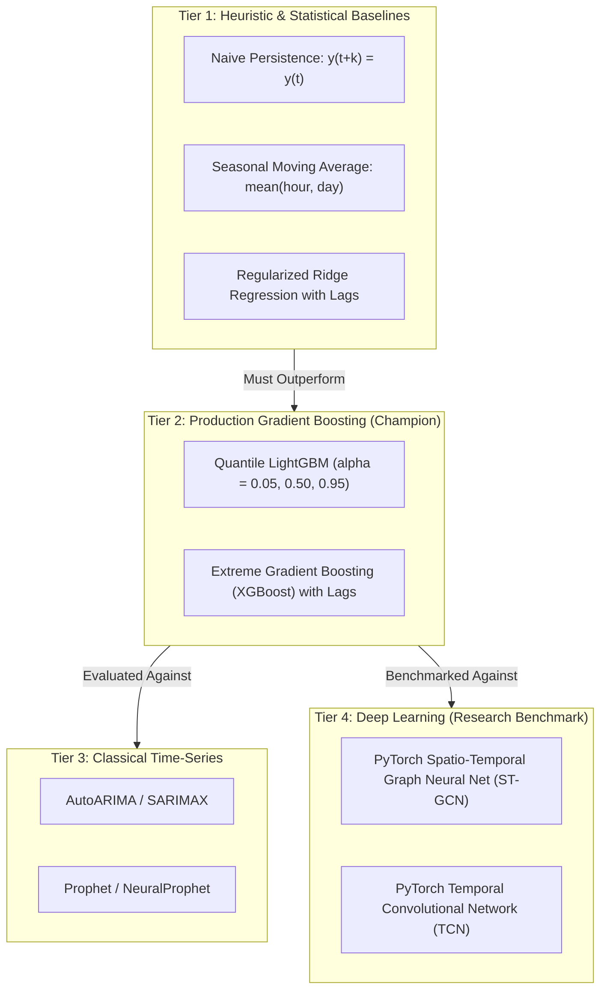
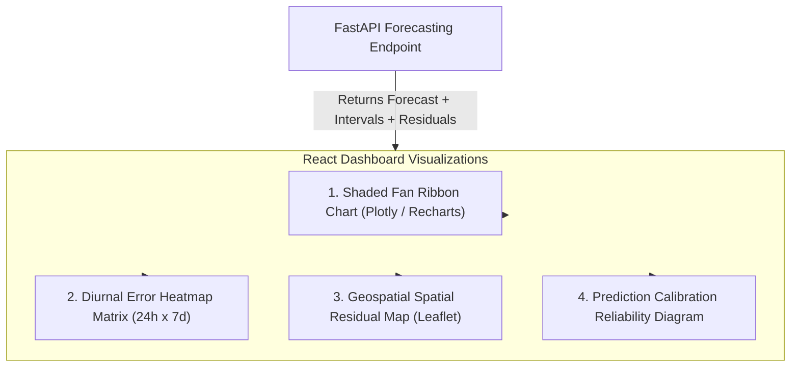

# SmartCityAI — Forecasting Subsystem Specification
## Multi-Horizon Traffic, Air Quality & Pollutant Predictive Modeling

---

### Executive Summary

The Forecasting Subsystem for SmartCityAI powers real-time predictive decision-making across two mission-critical urban streams:
1. **Traffic Speed & Congestion Forecasting**: Continuous arterial vehicular velocity (mph) and derived congestion regimes at $t+1\text{h}$, $t+3\text{h}$, and $t+6\text{h}$.
2. **Air Quality & Criteria Pollutant Forecasting**: Next 24-hour continuous concentrations of fine particulate matter ($PM_{2.5}$), coarse particulate matter ($PM_{10}$), and nitrogen dioxide ($NO_2$), alongside composite National Air Quality Index (NAQI) classifications.

Every forecast is delivered as a **calibrated probabilistic distribution**: rather than returning a single deterministic point forecast, the system outputs the median $\hat{y}_{0.50}$ flanked by a non-parametric $90\%$ prediction interval $[\hat{y}_{0.05}, \hat{y}_{0.95}]$ produced via **Quantile Gradient Boosting**.

---

## 1. Comparative Modeling Approaches & Architectural Tradeoffs

### In-Depth Model Evaluation Matrix

| Model Family | Specific Model Architecture | Strengths & Capabilities | Critical Limitations | Role in SmartCityAI |
| :--- | :--- | :--- | :--- | :--- |
| **Naive Baseline** | Persistence Forecaster ($\hat{y}_{t+k} = y_t$) | Zero computation; optimal for ultra-short horizons ($t+5\text{min}$). | Fails completely at diurnal inflection points (e.g. morning rush-hour transition). | **Mandatory baseline lower bound** |
| **Seasonal Baseline** | Historical Moving Average | Captures weekly diurnal rhythms ($24\text{h} \times 7\text{d}$) with zero training. | Blind to immediate weather shocks, crashes, and trend drift. | **Benchmark gating baseline** |
| **Linear / Statistical** | Regularized Ridge / ElasticNet | Convex optimization; fast closed-form solution; interpretable linear coefficients. | Inability to learn non-linear interactions without manual polynomial expansion. | **Linear baseline check** |
| **Classical Time-Series** | SARIMAX / AutoARIMA | Strong theoretical foundation for stationary linear processes. | Does not scale to thousands of spatial segments; cannot share cross-segment representations. | **Segment-isolated reference** |
| **Decomposition Models** | Meta Prophet | Decomposes trend, weekly, and annual seasonality natively. | High inference latency ($> 200\text{ms}$ per segment); vulnerable to abrupt traffic shocks. | **Evaluated & rejected for latency** |
| **Gradient Boosted Trees** | **Quantile LightGBM (Primary Champion)** | **Sub-5ms CPU latency; non-parametric prediction intervals via pinball loss; handles tabular missingness natively; superior empirical accuracy.** | Cannot natively capture spatial graph message passing across edges without explicit lag features. | **Primary Production Model** |
| **Deep Learning** | **PyTorch ST-GCN / TCN (Academic Benchmark)** | Learns spatial graph diffusion over road networks via edge Laplacian matrices $\mathbf{A} \in \mathbb{R}^{S \times S}$. | $10\times$ higher training time; requires GPU acceleration; complex deployment footprint; marginal gains ($< 3\%$) over tuned LightGBM. | **Academic Comparative Benchmark** |

### The Deep Learning Justification Criterion
In SmartCityAI, deep learning is **only justified** when spatial topology provides cross-edge predictive signals that tabular autoregressive models miss:
$$\mathbf{H}^{(l+1)} = \sigma\left(\mathbf{D}^{-\frac{1}{2}} \mathbf{A} \mathbf{D}^{-\frac{1}{2}} \mathbf{H}^{(l)} \mathbf{W}^{(l)}\right)$$
In production, if tuned LightGBM achieves Mean Absolute Error within $5\%$ of PyTorch ST-GCN while operating at $20\times$ lower compute cost and $\le 5\text{ms}$ latency on CPU, **LightGBM is retained as the serving champion**, and ST-GCN is logged in MLflow as an academic benchmark.

---

## 2. Feature Engineering Architecture

```mermaid
flowchart LR
    subgraph Ingest ["Raw Staging Inputs"]
        S[Traffic Speeds]
        W[Weather Covariates]
        M[Spatial Metadata]
    end

    subgraph FeaturePipes ["Feature Transformers (Leakage-Free)"]
        F1["Autoregressive Lags: t-1h, t-2h, t-3h, t-24h, t-168h"]
        F2["Closed-Left Rolling Windows: shift(1) -> mean, std, min, max"]
        F3["Cyclical Calendar Transforms: sin/cos hour, day, month"]
        F4["Weather Orthogonal Decompositions: u, v wind vectors"]
        F5["Location Embeddings: Length, Speed Limit, H3 Index"]
    end

    subgraph OutputMart ["Gold Feature Store"]
        Matrix["Clean Feature Matrix X(t)"]
    end

    Ingest --> FeaturePipes --> OutputMart
```

### 2.1 Autoregressive Lag Features
- **Formulation**: Historical observations strictly backwards in time:
  $$\mathbf{L}_t = \big[v_{s, t-1}, \, v_{s, t-2}, \, v_{s, t-3}, \, v_{s, t-24}, \, v_{s, t-168}\big]$$
- **Rationale**:
  - $t-1, t-2, t-3$: Captures short-term momentum and transient congestion shockwaves.
  - $t-24$: Captures the 24-hour diurnal cycle (yesterday at the exact same hour).
  - $t-168$: Captures the 7-day seasonal cycle (same day-of-week and hour from the previous week).

### 2.2 Leakage-Free Rolling Statistics (Closed-Left Shift)
- **Mathematical Law**: The observation at time $t$ ($v_{s, t}$) must NEVER enter the rolling summary used to predict $t+k$.
- **Implementation**: Handled by [`TemporalFeatureGenerator.add_rolling_statistics`](file:///c:/Users/Soham/Desktop/SmartCityAI/features/temporal.py#L48-L85):
  $$\mu_{w}(t) = \frac{1}{w} \sum_{i=1}^{w} v_{s, t-i}, \quad \sigma_{w}(t) = \sqrt{\frac{1}{w-1} \sum_{i=1}^{w} (v_{s, t-i} - \mu_{w}(t))^2}$$
  Computed over windows $w \in \{3\text{h}, 6\text{h}, 24\text{h}\}$.

### 2.3 Calendar & Cyclical Features
- Continuous cyclical projection preventing artificial boundary discontinuities between 23:00 and 00:00:
  $$\text{hour\_sin} = \sin\left(\frac{2\pi \cdot \text{hour}}{24}\right), \quad \text{hour\_cos} = \cos\left(\frac{2\pi \cdot \text{hour}}{24}\right)$$
  $$\text{day\_sin} = \sin\left(\frac{2\pi \cdot \text{day}}{7}\right), \quad \text{day\_cos} = \cos\left(\frac{2\pi \cdot \text{day}}{7}\right)$$
- Categorical indicators: `is_weekend` ($0$ or $1$) and municipal public holidays.

### 2.4 Weather Features
- Continuous meteorological covariates merged via backward time-matching (`merge_asof`):
  - Ambient temperature ($^\circ\text{C}$), precipitation volume (mm), relative humidity (%).
  - Orthogonal wind vector decomposition:
    $$u = -v_{\text{wind}} \sin(\theta_{\text{deg}}), \quad v = -v_{\text{wind}} \cos(\theta_{\text{deg}})$$

### 2.5 Spatial & Location Features
- Segment physical properties: posted speed limit, segment length (meters), street classification (`highway` tier).
- Uber H3 hexagonal discrete global grid index (Resolution 8) capturing localized micro-neighborhood spatial clusters.

---

## 3. Evaluation Metrics & Theoretical Rationale

### 3.1 MAE vs RMSE: Complementary Error Profiles
- **Mean Absolute Error (MAE)**: Measures average expected prediction error in physical units (mph or $\mu\text{g}/\text{m}^3$):
  $$\text{MAE} = \frac{1}{N} \sum_{i=1}^N |y_i - \hat{y}_i|$$
- **Root Mean Squared Error (RMSE)**: Penalizes large errors quadratically:
  $$\text{RMSE} = \sqrt{\frac{1}{N} \sum_{i=1}^N (y_i - \hat{y}_i)^2}$$
- **The Operational Ratio**: Tracking $\text{RMSE} / \text{MAE}$ reveals error variance. An $\text{RMSE} / \text{MAE} \approx 1.25$ indicates normally distributed errors; an $\text{RMSE} / \text{MAE} > 1.60$ flags localized severe prediction blowouts during abrupt rush-hour congestion transitions.

### 3.2 The Breakdown of MAPE & Why WAPE / SMAPE are Mandatory
- **The MAPE Failure Mode**: Mean Absolute Percentage Error ($\text{MAPE} = \frac{100\%}{N} \sum \left|\frac{y - \hat{y}}{y}\right|$) divides by the ground-truth value $y$.
  - When traffic slows to severe gridlock ($y = 2\text{ mph}$) and the model predicts $6\text{ mph}$, error is only $4\text{ mph}$ in absolute terms, but MAPE records a catastrophic $200\%$ error!
  - When pollutant concentrations or rainfall approach $0.0$, MAPE divides by zero and explodes to infinity.
- **The Solution: WAPE & SMAPE**:
  - **Weighted Absolute Percentage Error (WAPE)**: Weights percentage errors globally by total traffic volume:
    $$\text{WAPE} = \frac{\sum_{i=1}^N |y_i - \hat{y}_i|}{\sum_{i=1}^N |y_i|}$$
  - **Symmetric Mean Absolute Percentage Error (SMAPE)**: Bounded in $[0\%, 200\%]$ by averaging the denominator:
    $$\text{SMAPE} = \frac{100\%}{N} \sum_{i=1}^N \frac{2 |y_i - \hat{y}_i|}{|y_i| + |\hat{y}_i| + \epsilon}$$

### 3.3 When is $R^2$ Meaningful (and When is it Deceptive)?
- On **stationary or de-trended residuals**, $R^2$ measures true feature explanatory power.
- On **raw non-stationary time-series with strong diurnal seasonality**, $R^2$ is deceptive: a completely naive seasonal moving average model will easily score $R^2 > 0.85$ simply by riding the diurnal wave, without learning any causal predictive dynamics.
- **Engineering Rule**: $R^2$ is never evaluated in isolation; candidate models must prove statistical superiority over the seasonal baseline's MAE and WAPE.

---

## 4. Prediction Intervals & Uncertainty Estimation

### 4.1 Non-Parametric Quantile Regression
Real-world urban uncertainty is **heteroscedastic**: prediction variance is narrow during stable 3:00 AM overnight free flow ($\sigma \approx 2\text{ mph}$) and wide during volatile 17:30 PM evening rush hour ($\sigma \approx 12\text{ mph}$). Gaussian error assumptions ($\hat{y} \pm 1.96 \sigma$) fail because traffic speed distributions are skewed and bounded by zero.

SmartCityAI trains three dedicated LightGBM models using the **Pinball Loss function**:
$$\mathcal{L}_q(y, \hat{y}) = \max\big(q(y - \hat{y}), \, (1 - q)(\hat{y} - y)\big)$$
Implemented in [`QuantileLightGBMForecaster`](file:///c:/Users/Soham/Desktop/SmartCityAI/ml/forecasting/quantile_forecaster.py#L12-L95):
- $\alpha = 0.05$: Learns the lower $5^{\text{th}}$ percentile boundary $\hat{y}_{0.05}$.
- $\alpha = 0.50$: Learns the median conditional expectation $\hat{y}_{0.50}$ (point forecast).
- $\alpha = 0.95$: Learns the upper $95^{\text{th}}$ percentile boundary $\hat{y}_{0.95}$.

### 4.2 Quantile Monotonicity Enforcement
To eliminate the mathematical artifact of crossing quantiles ($\hat{y}_{0.05} > \hat{y}_{0.50}$), the forecaster applies sorting post-processing across quantile outputs:
$$\hat{y}_{0.05} \le \hat{y}_{0.50} \le \hat{y}_{0.95}$$

### 4.3 Uncertainty Evaluation Metrics
1. **Prediction Interval Coverage Probability (PICP)**: Percentage of true ground-truth observations contained within the predicted interval:
   $$\text{PICP} = \frac{1}{N} \sum_{i=1}^N \mathbb{I}(\hat{y}_{0.05, i} \le y_i \le \hat{y}_{0.95, i})$$
   For a nominal $90\%$ prediction interval, target: $\text{PICP} \ge 0.88$.
2. **Mean Prediction Interval Width (MPIW)**: Measures the sharpness of the prediction interval:
   $$\text{MPIW} = \frac{1}{N} \sum_{i=1}^N (\hat{y}_{0.95, i} - \hat{y}_{0.05, i})$$
   A superior model achieves nominal coverage while minimizing MPIW.

---

## 5. Dashboard Visualization of Forecasting Errors & Uncertainty

The frontend presentation tier translates complex uncertainty metrics into intuitive visual controls for municipal operators:

### 1. Shaded Fan Ribbon Chart (Interactive Forecast Horizon)
- Built with **Recharts / Plotly.js**.
- Displays historical observations as a solid line, transitioning seamlessly into the predictive horizon:
  - Central dotted line: Point forecast (median $\hat{y}_{0.50}$).
  - Shaded semi-transparent colored ribbon: $90\%$ prediction interval $[\hat{y}_{0.05}, \hat{y}_{0.95}]$.
  - The ribbon dynamically expands during stormy weather or rush hour, visually communicating elevated uncertainty to traffic dispatchers.

### 2. Diurnal Residual Heatmap Matrix ($24\text{ hours} \times 7\text{ days}$)
- A grid displaying average error magnitude $|\epsilon|$ across all 168 hours of the week.
- Color scale: Green (low error $\le 2\text{ mph}$) to Red (high error $\ge 8\text{ mph}$).
- Enables urban planners to pinpoint recurring model blindspots (e.g., Friday 18:00 outbound arterial gridlock).

### 3. Geospatial Spatial Residual Choropleth (Leaflet)
- Road segments rendered on the Leaflet vector map color-coded by their real-time prediction residual:
  $$\text{Residual} = v_{\text{observed}} - \hat{v}_{\text{predicted}}$$
- Segments where observed speed is dramatically lower than predicted ($\text{Residual} \le -15\text{ mph}$) flash amber/red, immediately alerting operators to unreported traffic incidents or sudden lane blockages.

### 4. Calibration & Reliability Curves
- Displays empirical vs. nominal coverage curves, proving to data science auditors that the $90\%$ prediction interval covers exactly $90\%$ of real-world observations.
