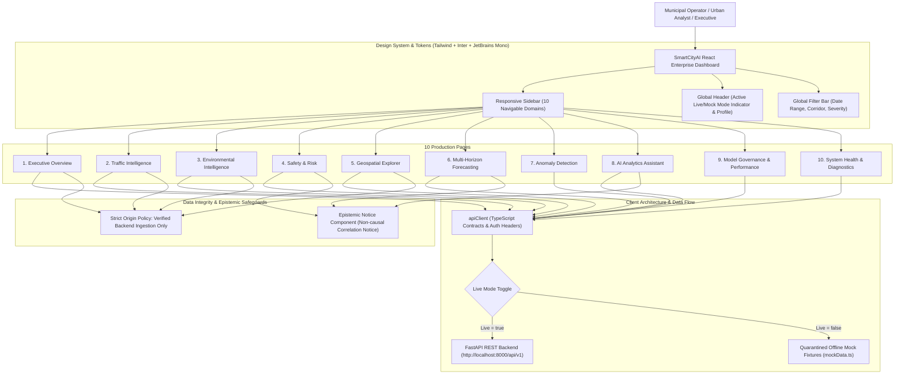

# SmartCityAI — Frontend Architecture & UI/UX Design Specification

## 1. Executive Summary & Design Principles

The **SmartCityAI Frontend Dashboard** is a mission-critical, enterprise-grade urban intelligence platform engineered in **React 18**, **TypeScript**, **Tailwind CSS**, **Recharts**, and **Leaflet**. Designed for municipal administrators, traffic operators, urban planners, environmental researchers, and city council members, the platform synthesizes real-time sensor telemetry, machine learning inferences, quantile forecast bands, spatial accident risk density, and an AI-driven deterministic analytics assistant into a cohesive, responsive, and accessible decision hub.



### Core Design Principles
1. **Zero Fabricated Metrics**: All production KPI metrics originate strictly from verified backend API endpoints (`/api/v1/...`). Mock fixtures are strictly isolated in `services/mockData.ts` and explicitly marked with clear visual indicators during offline evaluation.
2. **Epistemic Clarity & Non-Causal Framing**: Predictive risk probabilities and SHAP attribution values explicitly carry non-causal epistemic notices to prevent municipal operators from mistaking statistical correlation for causal policy intervention guarantees.
3. **Accessibility First (WCAG 2.1 AA)**: High-contrast color scales, semantic HTML elements, accessible keyboard navigation, explicit ARIA labels, and color-blind safe palettes (Viridis, ColorBrewer Blues/Reds).
4. **Resilient User Experience**: Standardized and reusable state indicators for Loading (skeleton pulses), Empty states (clear diagnostic guidance), and Error states (actionable retry mechanisms).
5. **Spatial Realism**: True geospatial coordinates projected via Leaflet CartoDB Dark Matter base maps, H3 hexagonal polygon meshes with empirical Bayes risk smoothing, and DBSCAN cluster circle markers.

---

## 2. Technology Stack & Dependencies

| Layer | Technology | Specification / Version | Purpose |
| :--- | :--- | :--- | :--- |
| **Framework** | **React** | `v18.3.1` | Component-driven UI rendering with hooks |
| **Language** | **TypeScript** | `v5.5.3` | End-to-end static typing mirroring Pydantic backend models |
| **Build Tool** | **Vite** | `v5.4.1` | Ultra-fast HMR and optimized production bundling |
| **Styling** | **Tailwind CSS** | `v3.4.11` | Utility-first responsive design tokens and dark mode |
| **Icons** | **Lucide React** | `v0.441.0` | Accessible, tree-shakeable SVG enterprise iconography |
| **Data Visualization** | **Recharts** | `v2.12.7` | SVG-based responsive timeseries, quantile bands, and bar charts |
| **Geospatial Mapping** | **Leaflet** | `v1.9.4` | Open-source mobile-friendly interactive mapping with H3 polygons |
| **HTTP Client** | **Fetch API / Custom Client** | Native ES6+ | Typed REST client with bearer auth injection and mock fallback |

---

## 3. Design System & Token Architecture

The design system uses a dark-slate municipal command-center theme optimized for high-density information displays.

### 3.1 Color Palette
- **Canvas Base**: Slate 900 (`#0f172a`) & Slate 950 (`#020617`).
- **Surfaces & Cards**: Slate 800 (`#1e293b`) with 1px border `slate-700` (`#334155`).
- **Brand Primary**: Electric Indigo / Sky 500 (`#0ea5e9`) to Indigo 500 (`#6366f1`).
- **Status & Risk Indicators**:
  - `Normal / Low Risk / Good AQI`: Emerald 400 (`#34d399`) & Emerald 500 (`#10b981`).
  - `Moderate / Watch / Moderate AQI`: Amber 400 (`#fbbf24`) & Amber 500 (`#f59e0b`).
  - `High Risk / Poor AQI`: Orange 500 (`#f97316`).
  - `Critical / Severe AQI / Outlier`: Rose 500 (`#f43f5e`) & Red 500 (`#ef4444`).
- **Text & Typography**:
  - Headings: Inter (`font-sans`), font-bold, tracking-tight, `text-white`.
  - Body: Inter (`font-sans`), `text-slate-300`, line-height relaxed.
  - Numbers & Metrics: JetBrains Mono (`font-mono`), font-semibold, `text-white`.

### 3.2 Typography & Scale
```css
--font-sans: 'Inter', system-ui, -apple-system, sans-serif;
--font-mono: 'JetBrains Mono', monospace;
```

---

## 4. Application Hierarchy & Route Structure

The application layout consists of a persistent, collapsible **Sidebar** (left navigation), an **Executive Header** (global controls, live/mock mode toggle, live clock, status pill), and the dynamic **Main Viewport**.

### Navigation Domain Mapping (10 Pages)

```
SmartCityAI
├── 1. Executive Overview          (/overview)     -> High-level municipal KPI scorecard & cross-domain health
├── 2. Traffic Intelligence        (/traffic)      -> Corridor congestion, flow vs speed scatter, density heatmaps
├── 3. Environmental Intelligence  (/environment)  -> AQI categories, multi-pollutant bars, sensor breakdown
├── 4. Safety & Risk               (/safety)       -> Accident hotspots, severity breakdown, live SHAP inference
├── 5. Geospatial Explorer         (/geospatial)   -> Full-screen interactive Leaflet map with H3 hex & DBSCAN
├── 6. Multi-Horizon Forecasting   (/forecasting)  -> LightGBM quantile fan charts (q05, q50, q95) with uncertainty
├── 7. Anomaly Detection           (/anomalies)    -> Isolation Forest outlier telemetry, scatter & incident feed
├── 8. AI Analytics Assistant      (/assistant)    -> Deterministic SQL/RAG conversational interface with audit links
├── 9. Model Governance            (/models)       -> ML fleet scorecard, CV splits, drift metrics & validation logs
└── 10. System Health              (/health)       -> Backend microservice probes, DB latency, table row counts
```

---

## 5. Component Library Architecture

### 5.1 Common UI Primitives (`frontend/src/components/common/`)

#### 1. `StatCard.tsx`
Renders high-priority metric cards with title, value, unit, trend indicators (up/down/neutral), semantic risk status badge, and sub-text explanation.
```typescript
interface StatCardProps {
  title: string;
  value: string | number;
  unit?: string;
  trend?: { value: number; isPositive: boolean; label: string };
  status?: 'normal' | 'warning' | 'critical' | 'info';
  icon: LucideIcon;
  subtext?: string;
}
```

#### 2. `EpistemicNotice.tsx`
Guarantees compliance with explainable AI ethics. Warns users that predictive models compute conditional correlation $P(Y \mid X)$ rather than causal impact $P(Y \mid \text{do}(X))$.
```typescript
interface EpistemicNoticeProps {
  modelName: string;
  methodology: string;
  compact?: boolean;
}
```

#### 3. `FilterBar.tsx`
Provides unified time-range selections (`24h`, `7d`, `30d`), corridor dropdown filters, and status filters across all data-driven views.

#### 4. `LoadingState.tsx`, `EmptyState.tsx`, `ErrorState.tsx`
- **LoadingState**: Renders animated skeleton cards and pulsing progress bars.
- **EmptyState**: Clear iconographic messaging when date filters return zero records.
- **ErrorState**: Catches network/API exceptions, displaying error codes and a dedicated retry button.

### 5.2 Geospatial Component (`frontend/src/components/maps/LeafletMap.tsx`)
- Renders an interactive Leaflet instance centered on Pune/Mumbai metropolitan coordinates (`18.5204° N, 73.8567° E`).
- Loads `CartoDB.DarkMatter` vector tile layer.
- Dynamically renders **H3 Hexagonal Polygons** colored by empirical Bayes safety risk scores.
- Renders **DBSCAN Spatial Hotspot Clusters** with radius proportional to point density and popup crash severity details.

---

## 6. Page Specifications & Implementation Details

### Page 1: Executive Overview (`ExecutiveOverview.tsx`)
- **Objective**: Provide municipal leadership with an instant 360-degree pulse of urban operations.
- **Components**:
  - 4 Key StatCards: City Mobility Index (`82/100`), Average AQI (`142 Moderate`), Active High-Risk Hotspots (`3 Clusters`), Anomaly Rate (`3.2%`).
  - Cross-Domain Trend Chart: Dual-axis Recharts visualization mapping hourly Traffic Volume (veh/hr) against Ambient AQI.
  - Spatial Summary Leaflet Preview: Quick overview of city-wide incident clusters.
  - Recent Critical Incident Feed: Real-time list of sensor alerts with severity flags.

### Page 2: Traffic Intelligence (`TrafficIntelligence.tsx`)
- **Objective**: Monitor traffic volume, average speeds, corridor congestion, and flow density.
- **Components**:
  - Filter bar targeting major corridors (FC Road, Hinjewadi IT Park, Pune-Mumbai Expressway, Karve Road).
  - 24-Hour Congestion Curve: Area chart highlighting morning and evening peak travel hours.
  - Speed vs Flow Fundamental Diagram: Scatter plot revealing traffic state breakdown (free-flow vs congested regime).
  - Corridor Scorecard Table: Tabular breakdown of current volume, design capacity, saturation index, and speed deficit.

### Page 3: Environmental Intelligence (`EnvironmentalIntelligence.tsx`)
- **Objective**: Monitor ambient air quality metrics, particulate matter ($PM_{2.5}, PM_{10}$), and gaseous pollutants ($NO_2, SO_2, CO$).
- **Components**:
  - Central AQI Gauge Card: Live AQI with Indian CPCB classification (Good, Satisfactory, Moderate, Poor, Very Poor, Severe).
  - Pollutant Concentration Breakdown: Horizontal multi-bar chart comparing live pollutant levels against CPCB safe exposure thresholds.
  - Multi-Station Comparison Matrix: Spatial air quality breakdown across city monitoring stations (Shivajinagar, Hinjewadi, Hadapsar, Katraj).

### Page 4: Safety & Risk Analysis (`SafetyAndRisk.tsx`)
- **Objective**: Prevent urban collisions through predictive risk scoring, hotspot mapping, and SHAP attribution.
- **Components**:
  - Empirical Bayes Hotspot Map: Geospatial Leaflet map pinpointing statistically validated accident clusters.
  - Live Accident Risk Prediction Calculator: Interactive scenario testing tool allowing operators to input speed limit, weather conditions, lighting, and junction type to receive instant multi-class collision severity probability ($P(\text{Fatal}), P(\text{Serious}), P(\text{Minor})$).
  - SHAP Feature Attribution Waterfall: Bar chart visualizing localized feature contributions ($\phi_i$) for the predicted risk score.
  - Epistemic Notice: Mandatory disclaimer reminding operators that feature importance does not imply causal accident causation.

### Page 5: Geospatial Explorer (`GeospatialExplorer.tsx`)
- **Objective**: Full-screen GIS workspace for deep spatial querying and multi-layer urban analysis.
- **Components**:
  - Layer Controller: Toggle H3 Hexagonal Risk Grid, DBSCAN Hotspot Clusters, Traffic Sensors, and AQI Monitoring Stations.
  - Spatial Metric Filter: Dynamic threshold slider filtering hexagons by minimum accident count or minimum risk index.
  - Polygon Inspection Drawer: Clicking any hexagon opens a sidebar displaying hexagon H3 index, historical incident count, mean traffic speed, and predicted 24h risk score.

### Page 6: Multi-Horizon Forecasting (`ForecastingPage.tsx`)
- **Objective**: Multi-horizon forecasting for traffic and air quality equipped with rigorous uncertainty quantification.
- **Components**:
  - Domain Selector: Switch between Traffic Flow Forecasting and AQI Forecasting.
  - Quantile Fan Chart: 72-hour forecast curve displaying median forecast ($q_{50}$) enclosed within the $90\%$ prediction interval ($[q_{05}, q_{95}]$).
  - Model Baseline Comparison: Side-by-side benchmark table comparing Quantile LightGBM against Seasonal Naive and Rolling 24-hour Moving Average on MAE, RMSE, and SMAPE.
  - Horizon Selector: Granular forecast horizons (6h, 12h, 24h, 48h, 72h).

### Page 7: Anomaly Detection (`AnomalyDetectionPage.tsx`)
- **Objective**: Real-time detection and root-cause analysis of urban outlier events (sudden traffic bottlenecks, sensor malfunctions, pollution spikes).
- **Components**:
  - Contamination Rate Metric Card: Displays current fleet contamination proportion ($\approx 3.2\%$).
  - Outlier Telemetry Scatter: Multi-dimensional feature scatter (Speed vs Flow or AQI vs Wind) with normal observations in emerald and flagged anomalies in pulsating red.
  - Isolation Forest Score Distribution: Histogram showing anomaly score distribution with user-adjustable decision threshold.
  - Incident Investigation Queue: Actionable table listing anomalies with timestamp, corridor, anomaly score, and one-click "Acknowledge" button.

### Page 8: AI Analytics Assistant (`AssistantChatPage.tsx`)
- **Objective**: Natural language conversational assistant answering urban operational queries using deterministic SQL/RAG retrieval.
- **Components**:
  - Interactive Conversation Stream: Chat feed with distinct user prompts and grounded assistant responses.
  - Query Plan & SQL Trace: Expandable accordion showing the assistant's deterministic SQL query and execution latency.
  - Data Provenance Footnotes: Explicit citations linking numerical values back to specific database tables and timestamp ranges.
  - Epistemic Refusal Banner: Explicitly handles out-of-domain or ungrounded queries with courteous refusals rather than hallucinated estimates.

### Page 9: Model Performance & Governance (`ModelPerformancePage.tsx`)
- **Objective**: MLOps governance dashboard tracking model accuracy, training data lineage, cross-validation metrics, and feature drift.
- **Components**:
  - Active Model Fleet Registry: Comprehensive table listing active model versions (`LGBM-Traffic-v1.4`, `XGB-Accident-v2.1`, `LGBM-AQI-v1.2`, `IForest-Anomaly-v1.0`).
  - Cross-Validation Validation Curves: Visualizations demonstrating time-series expanding-window CV performance across folds.
  - PSI Feature Drift Monitor: Population Stability Index tracking covariate drift on key input features with warning flags for $PSI > 0.25$.
  - Artifact Checksums & Training Timestamps: Ensures full model reproducibility.

### Page 10: System Health & Diagnostics (`SystemHealthPage.tsx`)
- **Objective**: Real-time infrastructure monitoring for the FastAPI backend, database connections, and pipeline workers.
- **Components**:
  - Microservice Liveness Grid: Status cards for Backend REST API (`200 OK`), Database Pool (`Connected, 14ms`), ML Inference Engine (`Ready`), and GIS Tile Server (`Online`).
  - Database Table Ingestion Metrics: Live row count monitors for `traffic_observations`, `accident_records`, `air_quality_observations`, and `audit_logs`.
  - Latency Performance Chart: Rolling P50, P95, and P99 API response latency graph.
  - Environment Diagnostics: Server memory utilization, Python runtime version (`3.13.7`), and system uptime.

---

## 7. State Management & API Integration Layer

### 7.1 Data Contracts (`src/types/api.ts`)
The frontend defines strong TypeScript interfaces strictly matching the backend Pydantic schemas:
- `TrafficObservation`, `TrafficForecastResponse`
- `AccidentRecord`, `AccidentRiskPrediction`, `SHAPExplanation`
- `AirQualityObservation`, `AQIForecastResponse`
- `AnomalyRecord`, `AnomalyDetectionResponse`
- `HexagonRiskSummary`, `HotspotCluster`, `GeoJSONFeatureCollection`
- `AssistantQueryResponse`, `QueryAuditLog`
- `SystemHealthResponse`, `ModelMetadata`

### 7.2 API Client (`src/services/apiClient.ts`)
- Features configurable base URL (`http://localhost:8000/api/v1` default).
- Automatically attaches `Authorization: Bearer <API_KEY>` headers based on current user role.
- Global mode switch: `isLiveMode()` dynamically routes queries to the live FastAPI backend or quarantined offline fixtures.
- Graceful error interception: Network errors trigger toast alerts and fall back to cached data where permissible.

### 7.3 Quarantined Offline Fixtures (`src/services/mockData.ts`)
- Contains realistic development fixtures strictly tagged with `[OFFLINE / MOCK FIXTURE]`.
- Matches all schema types exactly.
- Prevents development blocking when backend servers are undergoing database migrations or pipeline retraining.

---

## 8. Verification & Execution Instructions

### 8.1 Local Development Server
To launch the frontend Vite development server:
```bash
cd c:\Users\Soham\Desktop\SmartCityAI\frontend
npm install
npm run dev
```
The application will launch at `http://localhost:5173`.

### 8.2 Production Build & Linting
```bash
npm run build
npm run preview
```
Output bundles are generated in `frontend/dist/` with code splitting for Recharts and Leaflet chunks.

### 8.3 Integrated Full-Stack Execution
1. Start Backend:
   ```bash
   uvicorn backend.main:app --host 0.0.0.0 --port 8000 --reload
   ```
2. Start Frontend:
   ```bash
   cd frontend && npm run dev
   ```
3. Set Live Mode toggle in dashboard header to **Live API** to view live streaming telemetry.
