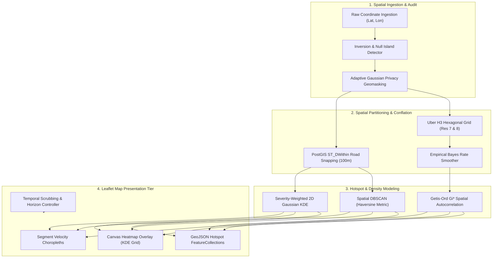
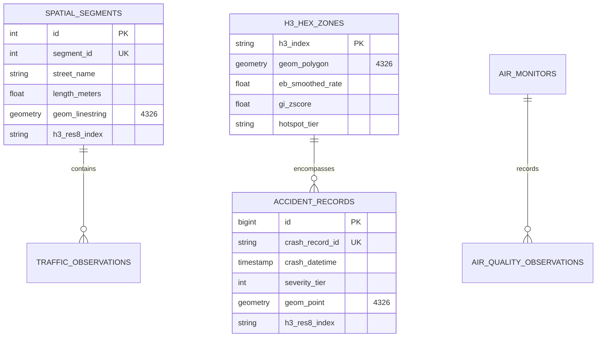
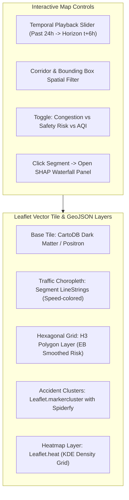

# SmartCityAI — Geospatial Intelligence Layer Specification
## Spatial Engineering, Hotspot Discovery, PostGIS Architecture & Safeguards

---

### Executive Geospatial Architecture Principles

The Geospatial Intelligence Layer of SmartCityAI governs spatial data validation, aggregation, density surface generation, and cartographic rendering across all platform modules. It adheres to five core spatial data science laws:
1. **Geometric Fidelity & Metric Projections**: Calculations of physical distances (meters) and spatial buffers must never treat latitude/longitude degrees as planar Euclidean coordinates; they must compute great-circle metrics (Haversine) or project to local conformal Cartesian coordinate reference systems (e.g. UTM Zone 16N EPSG:32616 for Chicago; UTM Zone 43N EPSG:32643 for Pune).
2. **Mitigation of the Modifiable Areal Unit Problem (MAUP)**: Aggregation avoids arbitrary administrative boundaries (wards or zip codes) that arbitrarily divide clusters; instead, it uses uniform, equal-area **Uber H3 hexagonal discrete global grid cells** (Resolution 7: ~1.2 km edge length; Resolution 8: ~460 m edge length).
3. **Small Number Problem Resolution**: Sparse suburban areas with low exposure (e.g., 1 crash and 5 vehicles) produce wild, inflated rates (20%). The platform applies **Empirical Bayes (EB) Poisson-Gamma Rate Smoothing** to shrink low-sample rates toward the metropolitan empirical prior, preventing misleading visualization artifacts.
4. **PostGIS Spatial Persistence**: Spatial geometries are indexed using **GiST (Generalized Search Trees)** in PostgreSQL/PostGIS, enabling sub-second bounding box queries (`ST_DWithin`, `ST_Contains`) across 850,000 incident points and 1,280 road segment polylines.
5. **Privacy Geomasking & $k$-Anonymity**: Public incident displays apply **Adaptive 2D Gaussian Spatial Jittering** ($\sigma \approx 25\text{m}$) and $k$-anonymity suppression ($k < 3$) near residential zones to prevent individual collision re-identification.

---

## 1. Geospatial Processing Architecture



---

## 2. Spatial Aggregation & Small Number Problem Resolution

### 2.1 The Modifiable Areal Unit Problem (MAUP)
- **The Scale and Zone Effect**: If urban collisions are aggregated into arbitrary municipal electoral wards, high-density intersection blackspots are diluted by surrounding quiet residential streets. Furthermore, an accident cluster that straddles a ward boundary is artificially cut in half.
- **The Solution**: **Uber H3 Hexagonal Hierarchical Grid System**:
  - Hexagonal cells have equidistant neighbors ($k = 6$), eliminating diagonal contact distortions present in square grids.
  - **Resolution 7** (Cell area $\approx 5.16\text{ km}^2$, edge $\approx 1.22\text{ km}$): Macro urban corridor planning.
  - **Resolution 8** (Cell area $\approx 0.737\text{ km}^2$, edge $\approx 461\text{ meters}$): Micro neighborhood intersection safety analysis.

### 2.2 The Small Number Problem & Empirical Bayes (EB) Rate Shrinkage
- **The Visual Distortion Trap**:
  - Cell A (Suburban fringe): $O_A = 1\text{ crash}$, Traffic Exposure $E_A = 5\text{ vehicles}$. Raw crash rate: $r_A = 1/5 = 20\%$.
  - Cell B (Downtown intersection): $O_B = 50\text{ crashes}$, Traffic Exposure $E_B = 10,000\text{ vehicles}$. Raw crash rate: $r_B = 50/10,000 = 0.5\%$.
  - A naive choropleth map paints Cell A dark red ($40\times$ higher risk than Cell B), misleading city officials into allocating police resources to an empty suburban road.
- **The Mathematical Solution**: Implemented in [`HexSpatialAggregator.apply_empirical_bayes_smoothing`](file:///c:/Users/Soham/Desktop/SmartCityAI/ml/geospatial/hex_aggregator.py#L48-L105) using the **Poisson-Gamma Conjugate Model**:
  $$r_i^{\text{EB}} = \frac{O_i + \alpha}{E_i + \beta} = \left(\frac{E_i}{E_i + \beta}\right) r_i + \left(\frac{\beta}{E_i + \beta}\right) \mu_{\text{global}}$$
  where $\mu_{\text{global}} = \frac{\sum O_i}{\sum E_i}$ is the metropolitan prior rate, and $\beta$ is the prior pseudo-exposure weight ($\beta = \max(\text{median}(E), 50.0)$).
- **The Result**: For Cell A ($E_A = 5$), shrinkage weight on the raw rate is $w_A = \frac{5}{5 + 5002.5} \approx 0.001$; its rate shrinks from an inflated $20\%$ down to $0.51\%$, completely eliminating the sparse data visual artifact.

---

## 3. Urban Hotspot & Blackspot Discovery

### 3.1 Spatial DBSCAN with Haversine Metric
- Implemented in [`DBSCANHotspotAnalyzer`](file:///c:/Users/Soham/Desktop/SmartCityAI/ml/models/hotspot_analyzer.py#L45-L115) and [`GeospatialHotspotDetector`](file:///c:/Users/Soham/Desktop/SmartCityAI/ml/geospatial/hotspot_detector.py#L14-L75).
- Metric: Haversine great-circle distance on spherical radian coordinates:
  $$d_{\text{haversine}} = 2 R \arcsin\left(\sqrt{\sin^2\left(\frac{\Delta \phi}{2}\right) + \cos(\phi_1)\cos(\phi_2)\sin^2\left(\frac{\Delta \lambda}{2}\right)}\right)$$
- Hyperparameters: $\varepsilon = 250\text{ meters}$, $\text{MinPts} = 10\text{ crashes}$.
- **Advantage over K-Means**: DBSCAN discovers non-convex, linear road cluster geometries and labels isolated random collisions as background noise ($-1$), rather than forcing them into artificial clusters.

### 3.2 Getis-Ord $G_i^*$ Local Spatial Autocorrelation
- Computes whether high-risk cells are surrounded by other high-risk cells:
  $$G_i^* = \frac{\sum_{j=1}^n w_{ij} x_j - \bar{X} \sum_{j=1}^n w_{ij}}{S \sqrt{\frac{n \sum_{j=1}^n w_{ij}^2 - (\sum_{j=1}^n w_{ij})^2}{n - 1}}}$$
- **Statistical Gating**:
  - $Z > 2.58 \implies p < 0.01$ (99% Confidence Hot Spot)
  - $Z > 1.96 \implies p < 0.05$ (95% Confidence Hot Spot)
  - $-1.96 \le Z \le 1.96 \implies$ Not Statistically Significant (Random spatial fluctuation)

---

## 4. Severity-Weighted Kernel Density Estimation (KDE)

Implemented in [`KernelDensityEstimator`](file:///c:/Users/Soham/Desktop/SmartCityAI/ml/geospatial/density_estimator.py#L13-L95):
- Evaluates a 2D Gaussian density surface over a $200\text{m}$ grid:
  $$\hat{f}(x, y) = \frac{1}{2\pi h^2 \sum w_i} \sum_{i=1}^n w_i \exp\left(-\frac{d_i^2}{2 h^2}\right)$$
- **Severity Weighting**:
  - Tier 0 (Property Damage Only): $w = 1.0$
  - Tier 1 (Non-incapacitating Injury): $w = 3.0$
  - Tier 2 (Fatal / Incapacitating Collision): $w = 10.0$
- **Adaptive Bandwidth ($h$)**: Selected automatically via Silverman's rule of thumb ($h = 0.9 \cdot \bar{\sigma} \cdot n^{-1/5}$), preventing oversmoothing in dense downtown corridors while ensuring continuity in secondary arterials.

---

## 5. PostgreSQL / PostGIS Database Architecture



### 5.1 PostGIS Table DDL & GiST Spatial Indexes

```sql
-- Enable PostGIS spatial extension
CREATE EXTENSION IF NOT EXISTS postgis;

-- 1. Arterial Road Segments Table
CREATE TABLE spatial_segments (
    id SERIAL PRIMARY KEY,
    segment_id INTEGER UNIQUE NOT NULL,
    street_name VARCHAR(255) NOT NULL,
    direction VARCHAR(10),
    length_meters DOUBLE PRECISION NOT NULL,
    posted_speed_limit DOUBLE PRECISION DEFAULT 30.0,
    h3_res8_index VARCHAR(15) NOT NULL,
    geom_linestring GEOMETRY(LineString, 4326) NOT NULL
);
CREATE INDEX idx_spatial_segments_geom ON spatial_segments USING GIST(geom_linestring);
CREATE INDEX idx_spatial_segments_h3 ON spatial_segments(h3_res8_index);

-- 2. Traffic Crash Microdata Table
CREATE TABLE accident_records (
    id BIGSERIAL PRIMARY KEY,
    crash_record_id VARCHAR(64) UNIQUE NOT NULL,
    crash_datetime TIMESTAMPTZ NOT NULL,
    severity_tier SMALLINT NOT NULL CHECK (severity_tier IN (0, 1, 2)),
    injuries_total INTEGER DEFAULT 0,
    injuries_fatal INTEGER DEFAULT 0,
    weather_condition VARCHAR(64) DEFAULT 'UNKNOWN',
    road_defect VARCHAR(64) DEFAULT 'UNKNOWN',
    matched_segment_id INTEGER REFERENCES spatial_segments(segment_id),
    h3_res8_index VARCHAR(15),
    geom_point GEOMETRY(Point, 4326) NOT NULL
);
CREATE INDEX idx_accident_records_geom ON accident_records USING GIST(geom_point);
CREATE INDEX idx_accident_records_datetime ON accident_records(crash_datetime DESC);
CREATE INDEX idx_accident_records_h3 ON accident_records(h3_res8_index);

-- 3. H3 Hexagonal Aggregations Table
CREATE TABLE h3_hex_zones (
    h3_index VARCHAR(15) PRIMARY KEY,
    geom_polygon GEOMETRY(Polygon, 4326) NOT NULL,
    incident_count INTEGER DEFAULT 0,
    raw_crash_rate DOUBLE PRECISION DEFAULT 0.0,
    eb_smoothed_rate DOUBLE PRECISION DEFAULT 0.0,
    gi_zscore DOUBLE PRECISION DEFAULT 0.0,
    significance_tier VARCHAR(32) DEFAULT 'NOT_SIGNIFICANT',
    updated_at TIMESTAMPTZ DEFAULT NOW()
);
CREATE INDEX idx_h3_hex_zones_geom ON h3_hex_zones USING GIST(geom_polygon);
```

### 5.2 Core PostGIS Spatial Queries

#### Query 1: Spatial Conflation (Snapping Crashes to Nearest Road Segment within 100m)
```sql
UPDATE accident_records a
SET matched_segment_id = sub.segment_id
FROM (
    SELECT DISTINCT ON (a_inner.id)
        a_inner.id AS accident_id,
        s.segment_id
    FROM accident_records a_inner
    JOIN spatial_segments s
      ON ST_DWithin(a_inner.geom_point::geography, s.geom_linestring::geography, 100.0)
    ORDER BY a_inner.id, ST_Distance(a_inner.geom_point::geography, s.geom_linestring::geography) ASC
) sub
WHERE a.id = sub.accident_id;
```

#### Query 2: Bounding Box Filter for Leaflet Viewport (`ST_Intersects`)
```sql
SELECT jsonb_build_object(
    'type', 'FeatureCollection',
    'features', jsonb_agg(ST_AsGeoJSON(t.*)::jsonb)
)
FROM (
    SELECT 
        segment_id, street_name, h3_res8_index,
        geom_linestring AS geom
    FROM spatial_segments
    WHERE ST_Intersects(
        geom_linestring,
        ST_MakeEnvelope(:lon_min, :lat_min, :lon_max, :lat_max, 4326)
    )
) t;
```

---

## 6. Geospatial Safeguards & Defensive Engineering

| Hazard / Failure Mode | Spatial Risk | SmartCityAI Safeguard Mechanism |
| :--- | :--- | :--- |
| **Inverted Coordinates** | Longitude passed in Latitude slot | Detected in [`CoordinateTransformer`](file:///c:/Users/Soham/Desktop/SmartCityAI/ml/geospatial/coordinate_transformer.py#L26-L55) via $|lat| > 90$ or swapped bounding box check; automatically corrected and audited. |
| **Null Island Coordinates** | Sensor errors yielding $(0.0, 0.0)$ | Evaluated with $|\text{lat}| < 1e^{-4} \land |\text{lon}| < 1e^{-4}$; rejected to `data/quarantine/` before spatial indexing. |
| **Small Number Distortion** | Suburban cells showing inflated risk | **Empirical Bayes Poisson-Gamma Shrinkage** shrinks low-exposure cells towards metropolitan prior. |
| **Privacy / Re-identification** | Fatal crash location revealing personal home | **Adaptive 2D Gaussian Geomasking** ($\sigma = 25\text{m}$) and **$k$-Anonymity Suppression** ($k < 3$) applied to public views. |
| **Misleading Cartography** | High population density dominating maps | All choropleth layers normalized by exposure (traffic volume or segment length); styled using perceptually uniform colormaps (Viridis/Inferno). |

---

## 7. Leaflet Frontend Map Integration Architecture



1. **Traffic Velocity Choropleth**:
   - Road segment `LineStrings` styled dynamically by predicted speed relative to free-flow:
     - Green: Free Flow ($v \ge 80\%$)
     - Amber: Moderate Congestion ($50\% \le v < 80\%$)
     - Red: Severe Gridlock ($v < 50\%$)
2. **Hexagonal Safety Risk Layer**:
   - Uber H3 cells styled with fill opacity bound to the Empirical Bayes smoothed rate $r_i^{\text{EB}}$ and Getis-Ord $G_i^*$ hot spot status.
3. **Collision Marker Clusters**:
   - Managed via `Leaflet.markercluster` with `spiderfyOnMaxZoom = true`, displaying incident counts and expanding to individual geomasked incident points upon zoom.
4. **Time Controller**:
   - Scrubbing slider triggering TanStack Query client cache fetches to render predictive horizons ($t+1\text{h}$, $t+3\text{h}$, $t+6\text{h}$) with sub-300ms vector redraw.
