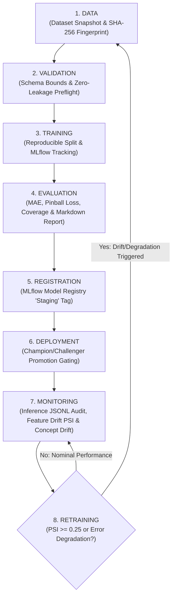

# SmartCityAI — Production MLOps Workflow & Model Lifecycle Specification

## 1. Executive Summary & Tooling Philosophy

The **SmartCityAI MLOps Workflow** establishes an automated, auditable, and reproducible operational pipeline for urban intelligence machine learning models. 

### Core Design Philosophy: Purpose-Driven Tooling
In accordance with production engineering standards, **no tool is introduced for resume decoration**. Every tool in the SmartCityAI MLOps stack serves an explicit, non-redundant operational role:

| Tool / Technology | Specific Operational Role | Why Alternatives Were Excluded |
| :--- | :--- | :--- |
| **MLflow** | Experiment tracking, hyperparameter logging, model artifact repository, and Model Registry | Replaces disparate custom metadata trackers; lightweight SQLite/file-based backend avoids heavyweight enterprise server overhead (e.g. Kubeflow, Neptune). |
| **SHA-256 Dataset Hasher** | Deterministic dataset versioning and immutable lineage manifests | Eliminates heavy external storage dependencies (e.g. DVC, Pachyderm) for tabular telemetry while providing cryptographic data reproducibility. |
| **Python & NumPy/SciPy** | Population Stability Index (PSI) drift monitoring & Kolmogorov-Smirnov tests | Computes mathematically exact distribution shifts natively without external proprietary monitoring SaaS (e.g. Arize, Evidently). |
| **JSONL Append Stream** | High-throughput, thread-safe production inference logging with zero latency overhead | Outperforms asynchronous DB network writes for high-concurrency sensor scoring; easily ingestible into Elasticsearch/Loki. |
| **FastAPI & Docker Compose** | Low-latency inference serving and network-isolated background worker daemon | Eliminates unnecessary model serving wrappers (e.g. BentoML, TorchServe, Triton) since tabular LightGBM/XGBoost models infer in $< 10\text{ms}$ natively. |

---

## 2. The 8-Stage Model Lifecycle

The platform models follow an explicit, continuous closed-loop lifecycle from raw ingestion through autonomous retraining:



---

## 3. Stage-by-Stage Implementation & Operational Details

### Stage 1: Data (Dataset Versioning & Lineage Fingerprinting)
- **Component**: [`mlops/dataset_versioner.py`](file:///c:/Users/Soham/Desktop/SmartCityAI/mlops/dataset_versioner.py)
- **Mechanism**:
  1. Computes a deterministic SHA-256 content hash across all DataFrame rows and columns (`DatasetVersioner.compute_sha256(df)`).
  2. The hash is column-order invariant: sorting columns prior to hashing guarantees identical fingerprints across identical data regardless of ingestion projection.
  3. Emits an immutable `DatasetManifest` recorded in `data/manifests/{version_id}.json` capturing row count, column data types, and min/max temporal boundaries (`time_min_utc`, `time_max_utc`).

### Stage 2: Validation (Data Quality & Leakage Gating)
- **Components**: [`pipelines/cleaning.py`](file:///c:/Users/Soham/Desktop/SmartCityAI/pipelines/cleaning.py), [`validation/leakage_detector.py`](file:///c:/Users/Soham/Desktop/SmartCityAI/validation/leakage_detector.py)
- **Gating Rules**:
  1. **Missing Data Policy**: Missing value ratio must not exceed $15\%$. Missing values are explicitly flagged (`is_imputed_speed`) rather than silently dropped.
  2. **Physical Boundary Checks**: Rejects vehicular speeds outside $[-1.0, 200.0]\text{ mph}$ and coordinates outside valid spatial bounding boxes.
  3. **Data Leakage Invariant**: Mandatory `shift(1)` lookback on rolling statistics to ensure observation at time $t$ is strictly excluded from rolling summaries at time $t$.

### Stage 3: Training (Reproducible Experiment Tracking with MLflow)
- **Components**: [`mlops/tracking.py`](file:///c:/Users/Soham/Desktop/SmartCityAI/mlops/tracking.py), [`ml/forecasting/quantile_forecaster.py`](file:///c:/Users/Soham/Desktop/SmartCityAI/ml/forecasting/quantile_forecaster.py)
- **Tracking Protocols**:
  - Local SQLite tracking store: `sqlite:///mlruns.db`.
  - Hyperparameter logging: `n_estimators`, `learning_rate`, `max_depth`, `num_leaves`, `quantiles=[0.05, 0.50, 0.95]`.
  - Lineage tags: Git commit hash, active dataset `version_id`, `sha256_hash`, and random seed (`42`).

### Stage 4: Evaluation (Automated Reporting & Governance Artifacts)
- **Component**: [`mlops/evaluation_report.py`](file:///c:/Users/Soham/Desktop/SmartCityAI/mlops/evaluation_report.py)
- **Outputs**:
  - Automatically compiles both machine-readable JSON (`reports/*.json`) and executive Markdown (`reports/*.md`) artifacts.
  - Documents quantitative metrics:
    - **Regression**: Mean Absolute Error (MAE), Root Mean Squared Error (RMSE), SMAPE.
    - **Uncertainty Quantification**: 90% Prediction Interval Coverage ($\ge 88\%$), Pinball Quantile Loss.
    - **Metamorphic Validation**: Invariant verification confirming $q_{0.05}(x) \le q_{0.50}(x) \le q_{0.95}(x)$ with zero quantile crossing.
  - Appends mandatory non-causal epistemic disclaimer.

### Stage 5: Registration (MLflow Model Registry)
- **Component**: [`mlops/registry.py`](file:///c:/Users/Soham/Desktop/SmartCityAI/mlops/registry.py)
- **Lifecycle Tagging**:
  - Newly trained models are automatically registered under stage `Staging`.
  - Tagged with dataset lineage hash, MLflow run ID, and timestamp.

### Stage 6: Deployment & Promotion Criteria (Champion vs Challenger)
- **Component**: [`mlops/registry.py::PromotionCriteria`](file:///c:/Users/Soham/Desktop/SmartCityAI/mlops/registry.py)
- **Gating Gates**: A candidate in `Staging` is promoted to `Production` **if and only if** all of the following conditions are met:
  1. **Physical Ceiling**: Candidate $\text{MAE} \le 3.5\text{ mph}$ on holdout validation.
  2. **Champion Improvement**: If a production incumbent exists, candidate must improve MAE by at least $\ge 2.0\%$ ($\Delta \text{MAE} / \text{MAE}_{\text{champ}} \ge 0.02$).
  3. **Uncertainty Calibration**: Coverage of the 90% prediction interval must be $\ge 80.0\%$ (target $90\%$).
  4. **Latency Budget**: Single-sample P95 inference latency must be $\le 50.0\text{ms}$.
  5. **Feature Stability**: Pre-deployment feature drift must satisfy $\text{PSI} < 0.10$.
- Upon passing all gates:
  - Candidate is transitioned to stage `Production`.
  - Previous production model is transitioned to stage `Archived`.

### Stage 7: Monitoring (Production Inference Logging & Drift Detection)
- **Inference Audit Logging** ([`mlops/inference_logger.py`](file:///c:/Users/Soham/Desktop/SmartCityAI/mlops/inference_logger.py)):
  Every API inference call logs an immutable JSON record to `logs/inference_audit.jsonl` with `inference_id`, timestamp, input vector, prediction, confidence intervals, and latency.
- **Covariate Drift Monitoring** ([`mlops/drift_monitor.py`](file:///c:/Users/Soham/Desktop/SmartCityAI/mlops/drift_monitor.py)):
  Calculates Population Stability Index (PSI) between baseline training data and rolling production telemetry:
  $$PSI = \sum_{b=1}^{B} \left( P_{\text{prod}}(b) - P_{\text{train}}(b) \right) \times \ln\left( \frac{P_{\text{prod}}(b)}{P_{\text{train}}(b)} \right)$$
  - $PSI < 0.10$: `STABLE` (Nominal operation).
  - $0.10 \le PSI < 0.25$: `DRIFT_WARNING` (Dashboard alert flagged).
  - $PSI \ge 0.25$: `CRITICAL_DRIFT` (Triggers Stage 8 Retraining).
- **Concept Drift Monitoring** ([`mlops/performance_monitor.py`](file:///c:/Users/Soham/Desktop/SmartCityAI/mlops/performance_monitor.py)):
  Matches delayed ground-truth telemetry with predictions to compute rolling MAE. If rolling MAE degrades by $> 35\%$ over baseline ($\text{MAE} > 1.35 \times \text{baseline}$), status transitions to `DEGRADED`.

### Stage 8: Retraining (Closed-Loop Retraining Trigger)
- **Component**: [`scripts/ml_pipeline_worker.py`](file:///c:/Users/Soham/Desktop/SmartCityAI/scripts/ml_pipeline_worker.py), [`mlops/lifecycle_orchestrator.py`](file:///c:/Users/Soham/Desktop/SmartCityAI/mlops/lifecycle_orchestrator.py)
- **Trigger Conditions**:
  1. Covariate drift exceeds critical threshold ($PSI \ge 0.25$).
  2. Rolling prediction error exceeds degradation threshold ($\text{MAE} > 1.35 \times \text{baseline}$).
  3. Scheduled periodic interval elapsed (e.g. 7 days).
- **Retraining Workflow**:
  - Extracts latest validated dataset snapshot from PostgreSQL storage.
  - Re-executes the pipeline starting at Stage 1 (fingerprint new dataset) through Stage 6 (candidate evaluated against current production champion).
  - Model is promoted **only** if it demonstrates superior metrics. If candidate fails promotion criteria, the current production champion remains active and an alert is dispatched to analysts.

---

## 4. Execution & Verification

### Running the End-to-End MLOps Lifecycle Orchestrator
```python
from mlops.lifecycle_orchestrator import ModelLifecycleOrchestrator
import pandas as pd

# Load fresh municipal telemetry
df = pd.read_parquet("data/processed/traffic_telemetry.parquet")

# Initialize orchestrator
orchestrator = ModelLifecycleOrchestrator(model_name="traffic_quantile_forecaster")

# Execute all 8 lifecycle stages
result = orchestrator.run_lifecycle(raw_df=df)
print(result)
```

### Running the MLOps Test Suite
```bash
# Execute MLOps unit & lifecycle tests (6 tests)
pytest tests/test_mlops.py -v

# Launch MLflow UI to inspect runs, artifacts, and model registry
mlflow ui --backend-store-uri sqlite:///mlruns.db --port 5000
```
