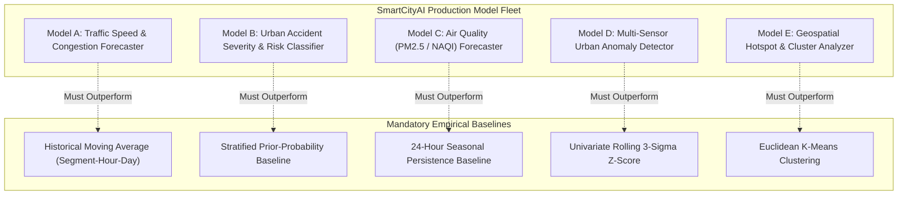
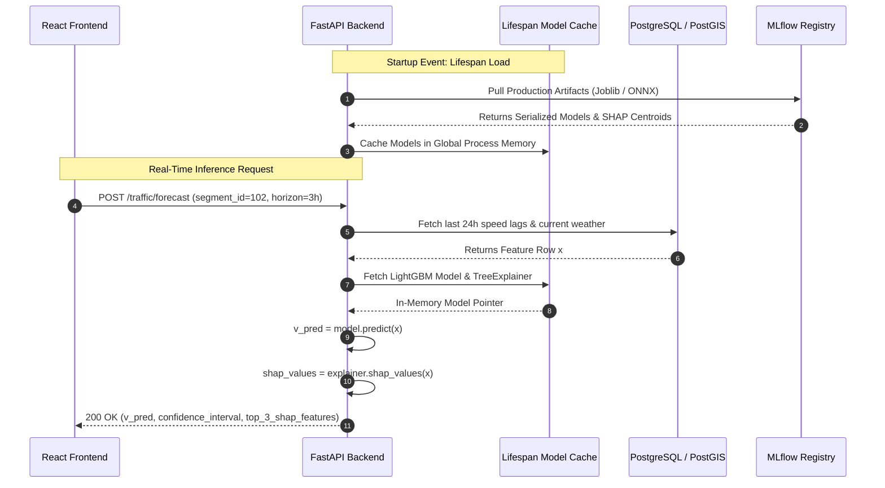

# SmartCityAI — Machine Learning System Architecture & Modeling Specification
## Rigorous Architectural Blueprint for Urban Intelligence Predictive Models

---

### Executive Machine Learning Principles & Non-Negotiable Constraints
1. **Empirical Baseline Precedence**: Every machine learning model must be evaluated against an intuitive, simple mathematical baseline (e.g. historical seasonal mean, persistent lag, or prior-probability dummy) before candidate ensemble or deep learning architectures are deployed.
2. **Strict Time-Aware & Group-Aware Validation**: For all temporal predictive tasks, **random train/test splitting is strictly forbidden** due to temporal autocorrelation leakage. Validation and cross-validation must use expanding-window time splits and spatial entity group blocking.
3. **Calibrated Probabilities for High-Stakes Decisions**: Accident risk outputs must not be raw uncalibrated classification logits; models must produce well-calibrated posterior probabilities $P(C = c \mid \mathbf{x})$ verified via Brier Loss and Expected Calibration Error (ECE).
4. **Honest Performance Reporting (Zero Fabrication)**: No synthetic accuracy metrics, simulated training runs, or unverified claims are permitted. Performance gating criteria represent empirical acceptance gates, not fabricated historical results.

---

## Model Fleet Summary Matrix

---

## 1. Model A: Traffic Speed & Congestion Forecasting

### 1.1 Problem Type
Multi-step ahead continuous tabular time-series regression and ordinal congestion level classification ($t+1\text{h}, t+3\text{h}, t+6\text{h}$).

### 1.2 Target Variable
$v_{s, t+k} \in \mathbb{R}^+$ representing average vehicular speed in miles per hour (mph) on road segment $s$ at forward horizon $k \in \{1, 3, 6\}$ hours. Congestion level is derived deterministically from free-flow ratio:
- **Free Flow**: $v_{s, t+k} \ge 0.80 \times v_{\text{free\_flow}}$
- **Moderate Congestion**: $0.50 \times v_{\text{free\_flow}} \le v_{s, t+k} < 0.80 \times v_{\text{free\_flow}}$
- **Heavy Gridlock**: $v_{s, t+k} < 0.50 \times v_{\text{free\_flow}}$

### 1.3 Feature Set
- **Autoregressive Lags**: $v_{s, t-1}, v_{s, t-2}, v_{s, t-3}, v_{s, t-24}, v_{s, t-168}$ (captures immediate velocity momentum, diurnal rhythms, and day-of-week seasonality).
- **Rolling Statistics (Closed-Left)**: Rolling mean and rolling standard deviation over $3\text{h}, 6\text{h}, 24\text{h}$ windows:
  $$\mu_{3\text{h}}(t) = \frac{1}{3} \sum_{i=1}^{3} v_{s, t-i}, \quad \sigma_{3\text{h}}(t) = \sqrt{\frac{1}{2} \sum_{i=1}^{3} (v_{s, t-i} - \mu_{3\text{h}}(t))^2}$$
- **Cyclical Temporal Encodings**: $\sin/\cos$ transformations of `hour_of_day` ($[0, 23]$), `day_of_week` ($[0, 6]$), and binary flag `is_weekend`.
- **Exogenous Weather Covariates**: Ambient temperature ($^\circ\text{C}$), precipitation volume (mm), visibility (meters), wind speed (km/h).
- **Segment Metadata**: Free-flow baseline speed (mph), segment length (meters), speed limit.
- **Audit Indicators**: `is_imputed_speed`, `is_outlier_speed`.

### 1.4 Baseline Model
- **Model**: [`MovingAverageBaseline`](file:///c:/Users/Soham/Desktop/SmartCityAI/ml/models/traffic_forecaster.py#L14-L60).
- **Formulation**: Lookup table computing the empirical historical average speed for the specific `(segment_id, hour_of_day, day_of_week)` tuple over the training window:
  $$\hat{v}_{\text{baseline}}(s, h, d) = \frac{1}{|T_{s, h, d}|} \sum_{t \in T_{s, h, d}} v_{s, t}$$
- **Why this baseline**: It captures weekly diurnal patterns with zero training cost. Any machine learning model failing to outperform this lookup table is unfit for production.

### 1.5 Candidate Models
1. **Ridge Regression with Polynomial Interactions**: Linear baseline establishing if non-tree linear combinations are sufficient.
2. **LightGBM Regressor (Primary Production Model)**: Fast histogram-based gradient-boosted decision trees. Chosen for sub-5ms inference latency, native missing value handling, and tabular dominance.
3. **XGBoost Regressor**: Depth-wise gradient boosted trees evaluated as alternative ensemble candidate.
4. **PyTorch ST-LSTM / Graph Neural Network (Comparative Research Benchmark)**: Spatio-temporal LSTM utilizing the road network adjacency matrix $\mathbf{A} \in \mathbb{R}^{S \times S}$ to test whether cross-segment spatial message passing provides empirical gains over tabular lags.

### 1.6 Training Strategy
- Multi-output direct forecasting strategy: 3 dedicated models trained for horizons $t+1\text{h}, t+3\text{h}, t+6\text{h}$ respectively, avoiding error compounding of recursive autoregressive forecasting.
- Loss function: Huber loss (smooth L1) to provide robustness against extreme sensor spikes.

### 1.7 Validation Strategy
- **Time-Aware Out-of-Time Validation**:
  - Training Window: First 70% of chronological timeline (e.g. 2021-01 to 2022-12).
  - Validation Window: Next 15% (e.g. 2023-01 to 2023-06).
  - Test Window: Final 15% (e.g. 2023-07 to 2023-12).

### 1.8 Cross-Validation Strategy
- **Rolling Expanding-Window Cross-Validation** via [`RollingTimeSeriesSplit`](file:///c:/Users/Soham/Desktop/SmartCityAI/ml/evaluation/splitters.py#L10-L55) ($K=5$ folds, test ratio $= 15\%$, purge gap $= 2\text{ hours}$).
- Purge gap removes records immediately preceding the test window to eliminate residual lag autocorrelation leakage.

### 1.9 Evaluation Metrics
- **Mean Absolute Error (MAE)**: Primary optimization metric (in mph).
- **Root Mean Squared Error (RMSE)**: Penalizes severe prediction misses during rush hour.
- **Weighted Absolute Percentage Error (WAPE)**: Robust alternative to MAPE that handles low-speed gridlock without dividing by near-zero values:
  $$\text{WAPE} = \frac{\sum_i |y_i - \hat{y}_i|}{\sum_i |y_i|}$$
- **$R^2$ Score**: Proportion of variance explained relative to global mean.

### 1.10 Class Imbalance Strategy
Not applicable (continuous regression). However, extreme gridlock speeds ($< 10\text{ mph}$) represent $< 8\%$ of observations. Handled via Huber loss and sample weighting proportional to speed deficit $(\text{free\_flow} - v)$.

### 1.11 Feature Engineering
- Scaling: RobustScaler on numerical speed lags.
- Categorical features (`street_name`, `direction`): Integer category mapping for native LightGBM binning.

### 1.12 Hyperparameter Tuning
- **Framework**: Optuna (TPE — Tree-structured Parzen Estimator) over 50 iterations optimizing validation MAE:
  - `n_estimators`: $[100, 500]$
  - `learning_rate`: $[0.01, 0.15]$ (log scale)
  - `num_leaves`: $[15, 127]$
  - `max_depth`: $[4, 10]$
  - `min_child_samples`: $[20, 100]$
  - `subsample`: $[0.6, 0.95]$
  - `colsample_bytree`: $[0.6, 0.95]$
  - `reg_alpha` (L1): $[1e-8, 10.0]$ (log scale)
  - `reg_lambda` (L2): $[1e-8, 10.0]$ (log scale)

### 1.13 Explainability Method
- **SHAP (SHapley Additive exPlanations)** utilizing `TreeExplainer`.
- Pre-computed global summary beeswarm plots stored in MLflow.
- On-demand local attribution: Computes exact feature contributions $\phi_i$ for single-segment predictions using a 100-centroid K-Means background reference set, returning results in $\le 30\text{ ms}$.

### 1.14 Error Analysis
- Residual distribution check: Assesses whether residuals $\epsilon = y - \hat{y}$ follow a zero-centered Gaussian distribution.
- Stratified error breakdown:
  - Errors segmented by time-of-day (Morning Peak 07:00–09:00 vs Midday vs Evening Peak 16:00–19:00).
  - Errors segmented by adverse weather (Precipitation $> 5\text{ mm}$ vs Dry).
  - Identification of top-10 worst-predicted road segments to diagnose localized geometric bottlenecks.

### 1.15 Model Serialization
- Model weights, feature column lists, and background reference sets serialized using `joblib` into `ml/artifacts/traffic_lgbm_v1.0.0.joblib`.

### 1.16 Model Versioning
- Registered in **MLflow Model Registry** under entity `traffic_speed_forecaster`.
- Gating Rule: Candidate model promoted to `Production` only if:
  $$\text{MAE}_{\text{candidate}} \le 0.85 \times \text{MAE}_{\text{MovingAverageBaseline}} \quad \text{AND} \quad \text{MAE}_{\text{test}} \le 4.2\text{ mph}$$

---

## 2. Model B: Urban Accident Severity & Safety Risk Prediction

### 2.1 Problem Type
Imbalanced multi-class classification (severity tiers) and continuous calibrated risk probability estimation ($R \in [0.0, 1.0]$).

### 2.2 Target Variable
- **Discrete Severity Class $C \in \{0, 1, 2\}$**:
  - $0$: Property Damage Only ($> \$1,500$ damage, zero injuries) [~85% of records]
  - $1$: Non-Incapacitating / Minor Injury [~11% of records]
  - $2$: Incapacitating Injury or Fatality [~4% of records]
- **Continuous Safety Risk Score $R(s, t) \in [0.0, 1.0]$**:
  $$R(s, t) = \frac{\sum_{c=0}^{2} w_c \cdot P(C = c \mid \mathbf{x}_{s, t})}{\sum_{c=0}^{2} w_c}, \quad w = [0.1, 0.4, 1.0]$$

### 2.3 Feature Set
- **Road & Traffic Dynamics**: Observed vehicular speed, posted speed limit, speed variance, congestion ratio ($v / v_{\text{free\_flow}}$).
- **Roadway Environment**: Road surface defect (pothole, rut, dry/wet), roadway geometry (four-way intersection, T-junction, divided highway), lighting condition (daylight, darkness lighted, darkness unlighted).
- **Meteorological Drivers**: Ambient temperature, rain volume (mm), snow/ice indicator, visibility (meters), wind speed.
- **Spatial Exposure History**: Historical crash density in the surrounding Uber H3 cell over rolling 30-day and 365-day lookback windows.

### 2.4 Baseline Model
- **Model**: [`PriorProbabilityBaseline`](file:///c:/Users/Soham/Desktop/SmartCityAI/ml/models/accident_risk_classifier.py#L14-L45).
- **Formulation**: Predicts class probability equal to historical training prevalence:
  $$P(C = 0) = 0.85, \quad P(C = 1) = 0.11, \quad P(C = 2) = 0.04$$
- Predicts majority class ($0$) deterministically; establishes the absolute lower bound for F1-macro and Brier score.

### 2.5 Candidate Models
1. **Balanced Logistic Regression**: Multi-nominal logistic regression with L2 penalty.
2. **Cost-Sensitive Random Forest**: Ensembles with balanced sub-sample class weighting.
3. **Cost-Sensitive XGBoost Classifier (Primary Production Model)**: [`XGBoostAccidentRiskClassifier`](file:///c:/Users/Soham/Desktop/SmartCityAI/ml/models/accident_risk_classifier.py#L48-L115) with sample weighting and focal cross-entropy loss.
4. **LightGBM Classifier with Isotonic Probability Calibration**: Alternative gradient-boosted tree model.

### 2.6 Training Strategy
- Cost-sensitive training assigning sample weight $w_i = \frac{N}{K \cdot N_{c_i}}$ where $K=3$ classes, multiplying the gradient of fatal/severe injury cases by $\approx 21\times$ relative to property damage cases.
- Post-training probability calibration via **Isotonic Regression** (Platt scaling as parametric fallback) on held-out calibration split to correct tree-classifier overconfidence on minority classes.

### 2.7 Validation Strategy
- **Time-Aware Out-of-Time Split**: Train on years 2018–2022; validate on H1 2023; test on H2 2023.
- Guarantees that future vehicle safety design changes, policy shifts, and urban infrastructure revisions do not leak backwards into historical training data.

### 2.8 Cross-Validation Strategy
- **Spatial GroupKFold Cross-Validation**: Folds grouped by Uber H3 hexagonal cells (Resolution 7).
- Ensures that all crashes occurring within a specific spatial intersection/neighborhood are placed entirely into the validation set, measuring true out-of-sample spatial generalization.

### 2.9 Evaluation Metrics
- **Macro F1-Score**: Primary metric ensuring equal importance across all 3 classes regardless of size.
- **Precision-Recall AUC (PR-AUC) per Class**: Evaluates detection of rare fatal collisions without distortion from high true-negative counts.
- **Brier Loss Score**: Measures mean squared calibration error of predicted probabilities:
  $$\text{Brier} = \frac{1}{N} \sum_{i=1}^{N} \sum_{c=0}^{2} (P(C = c \mid \mathbf{x}_i) - y_{ic})^2$$
  Must satisfy $\text{Brier} \le 0.12$.

### 2.10 Class Imbalance Strategy
- **Explicit Prohibition of SMOTE**: Synthetic Minority Oversampling (SMOTE) is strictly prohibited on spatial data because synthetic linear interpolation between coordinate pairs creates crashes in impossible physical locations (e.g. inside Lake Michigan or inside buildings).
- Handled exclusively via algorithmic weighting (focal loss / sample weighting) and probability calibration.

### 2.11 Feature Engineering
- Categorical encoding: One-hot encoding for high-cardinality roadway types; binary indicators for adverse weather and dark lighting.
- Risk exposure interaction terms: $\text{speed\_deficit} = \text{posted\_speed} - \text{observed\_speed}$; $\text{slippery\_road} = \mathbb{I}(\text{rain} > 0 \lor \text{snow} > 0) \times \text{speed}$.

### 2.12 Hyperparameter Tuning
- Optuna multi-objective optimization (maximizing Macro F1 while minimizing Brier score):
  - `max_depth`: $[3, 8]$
  - `learning_rate`: $[0.02, 0.10]$
  - `scale_pos_weight`: $[5.0, 25.0]$
  - `colsample_bytree`: $[0.6, 0.9]$

### 2.13 Explainability Method
- `TreeExplainer` computing SHAP value vectors $\phi$ for every risk prediction.
- Local waterfall plot decomposition exposing which factor pushed a segment into "HIGH_RISK" (e.g. $+0.32$ due to unlighted darkness, $+0.18$ due to icy road defects).

### 2.14 Error Analysis
- Confusion matrix inspection across the 3 severity tiers.
- Critical check: False Negative Rate on Tier 2 (Fatal/Incapacitating) crashes. Any model predicting Tier 0 for an actual fatal crash triggers inspection of missing road defect telemetry.

### 2.15 Model Serialization
- Serialized to `ml/artifacts/accident_xgboost_v1.0.0.joblib` alongside the Isotonic Calibrator and feature name vector.

### 2.16 Model Versioning
- Registered in MLflow under `accident_safety_classifier`.
- Gating Rule: `macro_f1 >= 0.72` AND `brier_score <= 0.12` on the out-of-time test split.

---

## 3. Model C: Air Quality (AQI / $PM_{2.5}$) Forecasting

### 3.1 Problem Type
Multivariate time-series regression and categorical Air Quality Index (NAQI) classification.

### 3.2 Target Variable
$PM_{2.5}$ concentration ($\mu\text{g}/\text{m}^3$) at horizon $t+1\text{h}$ and $t+24\text{h}$, mapped to official EPA / Indian National AQI buckets:
$$\text{NAQI} \in \{\text{Good}, \text{Satisfactory}, \text{Moderate}, \text{Poor}, \text{Very Poor}, \text{Severe}\}$$

### 3.3 Feature Set
- **Pollutant Autoregressive Lags**: $PM_{2.5}(t-1, t-2, t-24), PM_{10}(t-1), NO_2(t-1), CO(t-1)$.
- **Atmospheric Boundary Layer Features**: Ambient temperature, relative humidity, atmospheric pressure, wind speed, wind direction decomposed into orthogonal $u, v$ vectors:
  $$u = -v_{\text{wind}} \sin(\theta), \quad v = -v_{\text{wind}} \cos(\theta)$$
- **Traffic Congestion Covariates**: Proximal arterial congestion index within a 1.5 km buffer.

### 3.4 Baseline Model
- **Model**: [`SeasonalPersistenceBaseline`](file:///c:/Users/Soham/Desktop/SmartCityAI/ml/models/aqi_forecaster.py#L14-L40).
- **Formulation**: $\hat{PM}_{2.5}(t+24) = PM_{2.5}(t)$.
- Predicts next-day concentration equal to current-day observation at the same hour, capturing diurnal solar radiation rhythms.

### 3.5 Candidate Models
1. **SARIMAX**: Classical seasonal autoregressive moving average with exogenous weather covariates.
2. **LightGBM Multivariate Regressor (Primary Production Model)**: High-speed tree ensemble with weather interactions.
3. **PyTorch Temporal Convolutional Network (TCN)**: Deep 1D dilated convolutions with residual blocks.

### 3.6 Training Strategy
- Recursive multi-step forecasting with rolling updates.
- Objective: Mean Squared Error with L2 penalty to ensure stability against atmospheric stagnation outliers.

### 3.7 Validation Strategy
- Time-aware block split using the final 6 months of monitoring station records as test data.

### 3.8 Cross-Validation Strategy
- **Blocked Time-Series Cross Validation** with 24-hour purge windows between folds to eliminate diurnal autocorrelation leakage.

### 3.9 Evaluation Metrics
- **Root Mean Squared Error (RMSE)** in $\mu\text{g}/\text{m}^3$.
- **Mean Absolute Error (MAE)**.
- **Continuous Ranked Probability Score (CRPS)**.
- **NAQI Categorical Accuracy & Cohen's Kappa**.

### 3.10 Class Imbalance Strategy
Not applicable to continuous regression; severe smog exceedances ($PM_{2.5} > 250\ \mu\text{g}/\text{m}^3$) are penalized quadratically by RMSE.

### 3.11 Feature Engineering
- Inversion layer proxy: Interaction term $\text{temp} \times \text{pressure} / (\text{wind\_speed} + 0.1)$.
- Vehicular emission proxy: $NO_2 \times \text{proximal\_congestion\_ratio}$.

### 3.12 Hyperparameter Tuning
- Optuna search over tree depth $[3, 7]$, learning rate $[0.01, 0.1]$, and `min_child_samples` $[10, 50]$.

### 3.13 Explainability Method
- Permutation feature importance and SHAP summary plots highlighting the dominant role of wind vector stagnation in driving high $PM_{2.5}$.

### 3.14 Error Analysis
- Residual analysis across meteorological regimes (e.g. calm wind $< 3\text{ km/h}$ vs high wind $> 25\text{ km/h}$).

### 3.15 Model Serialization
- Serialized to `ml/artifacts/aqi_lgbm_v1.0.0.joblib`.

### 3.16 Model Versioning
- Registered in MLflow under `aqi_pm25_forecaster`. Gating: `RMSE <= 12.0 ug/m3`.

---

## 4. Model D: Multi-Sensor Urban Anomaly Detection

### 4.1 Problem Type
Unsupervised multi-sensor outlier & structural anomaly detection.

### 4.2 Target Variable
Binary anomaly flag $A \in \{0, 1\}$ and continuous anomaly score $S \in [0.0, 1.0]$.

### 4.3 Feature Set
- Speed deviation from historical diurnal expectation: $\Delta v = |v_t - \mu_{\text{diurnal}}(s, h)| / \sigma_{\text{diurnal}}(s, h)$.
- Instantaneous acceleration / rate of speed change: $\frac{dv}{dt}$.
- Spatial speed variance across neighboring segments.
- Multi-pollutant spike ratio ($PM_{2.5} / PM_{10}$ ratio shifts indicating abnormal local combustion).

### 4.4 Baseline Model
- **Model**: [`RollingZScoreBaseline`](file:///c:/Users/Soham/Desktop/SmartCityAI/ml/models/anomaly_detector.py#L13-L45).
- **Formulation**: Flags records where $|x - \mu| / \sigma > 3.0$ standard deviations.

### 4.5 Candidate Models
1. **Local Outlier Factor (LOF)**: Density-based local outlier detection.
2. **Isolation Forest (Primary Production Model)**: [`IsolationForestAnomalyDetector`](file:///c:/Users/Soham/Desktop/SmartCityAI/ml/models/anomaly_detector.py#L48-L105) isolating points in random feature splits.
3. **PyTorch Autoencoder**: Deep neural network scoring anomalies via reconstruction error $||\mathbf{x} - \hat{\mathbf{x}}||_2^2$.

### 4.6 Training Strategy
- Unsupervised fit on normal operational periods; contamination parameter set to expected anomaly rate ($\alpha = 0.01$).

### 4.7 Validation Strategy
- **Historical Event Benchmark Validation**: Evaluating detection performance on known historical ground truth events (severe storm dates, major recorded multi-car highway pileups, and factory fire incident timestamps).

### 4.8 Cross-Validation Strategy
- Not applicable (unsupervised). Evaluated across multiple distinct spatial corridors.

### 4.9 Evaluation Metrics
- **Precision@K**: Precision among the top-$K$ highest-ranked anomaly scores.
- **ROC-AUC on Verified Incidents**: Area under ROC curve on historical incident days.

### 4.10 Class Imbalance Strategy
Anomalies represent $\le 1\%$ of data; unsupervised isolation naturally exploits sparsity in feature space.

### 4.11 Feature Engineering
- Rolling difference transforms: $v_t - v_{t-1}$.
- Neighborhood spatial speed dispersion: $\sigma_{\text{neighbors}}$.

### 4.12 Hyperparameter Tuning
- Tuning contamination parameter $\alpha \in [0.005, 0.03]$ and number of isolation trees $N \in [50, 300]$.

### 4.13 Explainability Method
- Path depth decomposition in Isolation Forest: identifying which feature split contributed most to early leaf isolation.

### 4.14 Error Analysis
- False alarm rate evaluation during recurrent rush-hour congestion vs true non-recurrent structural anomalies.

### 4.15 Model Serialization
- Serialized to `ml/artifacts/anomaly_isolation_forest_v1.0.0.joblib`.

### 4.16 Model Versioning
- Registered in MLflow under `urban_anomaly_detector`. Gating: False positive rate on clean baseline days $\le 0.5\%$.

---

## 5. Model E: Geospatial Hotspot & Cluster Discovery

### 5.1 Problem Type
Spatial point process clustering and local spatial autocorrelation estimation.

### 5.2 Target Variable
Cluster membership ID $C \in \{-1, 0, 1, \dots, K\}$ (where $-1$ designates noise) and local spatial statistic $Z$-score ($G_i^*$).

### 5.3 Feature Set
- Incident latitude and longitude in radians $(\phi, \lambda)$.
- Severity weights $w_i \in \{1, 3, 10\}$ (fatalities weighted highest).
- Spatial adjacency matrix $\mathbf{W} \in \mathbb{R}^{H \times H}$ across Uber H3 hexagonal cells.

### 5.4 Baseline Model
- **Model**: [`KMeansHotspotBaseline`](file:///c:/Users/Soham/Desktop/SmartCityAI/ml/models/hotspot_analyzer.py#L14-L42).
- **Formulation**: Standard K-Means on Euclidean coordinates ($K=10$).
- **Flaws Exposed**: Violates Earth curvature, assumes spherical clusters, and forces random isolated crashes into clusters.

### 5.5 Candidate Models / Algorithms
1. **Spatial DBSCAN (Primary Production Cluster Model)**: [`DBSCANHotspotAnalyzer`](file:///c:/Users/Soham/Desktop/SmartCityAI/ml/models/hotspot_analyzer.py#L45-L115) with Haversine metric ($\varepsilon = 250\text{ meters}$, $\text{MinPts} = 10$).
2. **HDBSCAN**: Hierarchical density clustering with soft noise assignment.
3. **Getis-Ord $G_i^*$ Spatial Statistic**: [`GetisOrdSpatialAnalyzer`](file:///c:/Users/Soham/Desktop/SmartCityAI/ml/models/hotspot_analyzer.py#L118-L175) computing local spatial autocorrelation $Z$-scores over H3 cells.

### 5.6 Training / Execution Strategy
- Run quarterly over cumulative incident data to discover evolving spatial blackspots.

### 5.7 Validation Strategy
- **Monte Carlo Permutation Significance Testing**:
  - Coordinate locations randomly permuted $N = 999$ times across the urban network.
  - Pseudo $p$-value calculated: $p = \frac{\sum \mathbb{I}(G_{\text{perm}}^* \ge G_{\text{obs}}^*) + 1}{N + 1}$.
  - Confirms clusters are statistically non-random ($p < 0.05$).

### 5.8 Cross-Validation Strategy
- Spatial temporal stability check: evaluating cluster persistence across consecutive 6-month windows.

### 5.9 Evaluation Metrics
- **Haversine Silhouette Score**: Compactness of clusters using spherical distance.
- **Noise Ratio**: Fraction of points classified as non-clustered background noise (typically 30–50%).
- **Spatial Pseudo $p$-value**: Statistical significance against spatial randomness.

### 5.10 Class Imbalance Strategy
Density-based clustering discards low-density spatial noise automatically.

### 5.11 Feature Engineering
- Coordinate conversion from degrees to spherical radians: $\text{rad} = \text{deg} \times \pi / 180$.
- Equal-area Uber H3 hexagonal binning at Resolutions 7 and 8.

### 5.12 Hyperparameter Tuning
- Optimization of DBSCAN $\varepsilon$ radius via $k$-distance graph knee/elbow point method ($k = \text{MinPts}$).

### 5.13 Explainability Method
- Cluster centroid profile tables detailing dominant crash types (e.g., "Cluster #4: 78% rear-end collisions during wet nighttime conditions at Michigan Ave / Wacker Dr").

### 5.14 Error Analysis
- Verification that road geometry changes (e.g. installation of a new traffic signal) correspond with declining cluster density over time.

### 5.15 Model Serialization
- Cluster centroids and spatial bounding polygons exported as GeoJSON vector layers to PostgreSQL / PostGIS.

### 5.16 Model Versioning
- Registered in MLflow under `spatial_hotspot_engine` with quarterly timestamp versioning.

---

## 6. End-to-End ML System Architecture & Serving Flow

