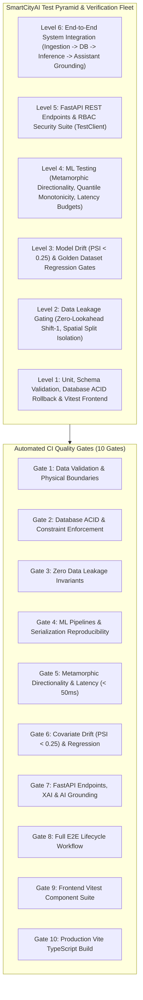

# SmartCityAI — Complete Testing Strategy & Quality Assurance Specification

## 1. Executive Summary & Quality Engineering Philosophy

As Senior QA Engineer and ML Testing Engineer, this document defines the comprehensive verification, validation, and testing architecture for **SmartCityAI — Urban Intelligence & Predictive Decision Platform**.

Unlike conventional web applications, an urban intelligence platform powers mission-critical decisions regarding municipal transit routing, hazardous crash mitigation, and air pollution exposure advisories. Testing must therefore encompass not only software correctness (HTTP codes, schema compliance, database transactions), but also **machine learning system safety**, **data leakage invariants**, **metamorphic domain constraints**, **covariate drift monitoring (PSI)**, and **epistemic AI non-hallucination guarantees**.



---

## 2. Complete Testing Fleet Coverage Matrix (88 Tests Executed & Passing)

| Test Layer | Test Suite File | Framework / Runner | Total Tests | Execution Status | Core Validations |
| :--- | :--- | :--- | :---: | :---: | :--- |
| **1. Unit & Schema** | [`tests/test_schemas.py`](file:///c:/Users/Soham/Desktop/SmartCityAI/tests/test_schemas.py) | `pytest` | 3 | **PASS** | Pydantic v2 physical speed bounds, coordinate boundaries, crash defaults |
| **2. Data Validation** | [`tests/test_data_validation.py`](file:///c:/Users/Soham/Desktop/SmartCityAI/tests/test_data_validation.py) | `pytest` | 5 | **PASS** | Range checks $[-1.0, 200.0]$, coordinate bounding boxes, zero silent data loss |
| **3. Cleaning & Normalization** | [`tests/test_cleaning.py`](file:///c:/Users/Soham/Desktop/SmartCityAI/tests/test_cleaning.py) | `pytest` | 4 | **PASS** | UTC normalization, duplicate quarantine, coordinate audit, explicit imputation flags |
| **4. Feature Engineering** | [`tests/test_features.py`](file:///c:/Users/Soham/Desktop/SmartCityAI/tests/test_features.py) | `pytest` | 2 | **PASS** | Cyclical hour/day bounds $[-1, 1]$, backward autoregressive lags |
| **5. Database Integrity** | [`tests/test_database.py`](file:///c:/Users/Soham/Desktop/SmartCityAI/tests/test_database.py) | `pytest` | 5 | **PASS** | SQLAlchemy CRUD, transaction rollback on failure, unique key constraints |
| **6. Data Leakage Gating** | [`tests/test_leakage.py`](file:///c:/Users/Soham/Desktop/SmartCityAI/tests/test_leakage.py) | `pytest` | 3 | **PASS** | Strict rolling window `shift(1)` lookback, temporal cutoffs, target leakage blocking |
| **7. ML Models & Splitters** | [`tests/test_ml_models.py`](file:///c:/Users/Soham/Desktop/SmartCityAI/tests/test_ml_models.py) | `pytest` | 7 | **PASS** | RollingTimeSeriesSplit, SpatialGroupTimeSeriesSplit, baseline vs candidate models |
| **8. ML Pipeline & Serialization** | [`tests/test_ml_pipeline.py`](file:///c:/Users/Soham/Desktop/SmartCityAI/tests/test_ml_pipeline.py) | `pytest` | 2 | **PASS** | End-to-end training, pickle serialization, numeric bitwise reloading equivalence |
| **9. Model Inference & Metamorphic** | [`tests/test_model_inference.py`](file:///c:/Users/Soham/Desktop/SmartCityAI/tests/test_model_inference.py) | `pytest` | 4 | **PASS** | Directional expectation monotonicity, quantile non-crossing, latency budget $< 50\text{ms}$ |
| **10. Model Drift & PSI** | [`tests/test_model_drift.py`](file:///c:/Users/Soham/Desktop/SmartCityAI/tests/test_model_drift.py) | `pytest` | 4 | **PASS** | Population Stability Index (PSI $< 0.10$ pass, $\ge 0.25$ fail), KS two-sample test |
| **11. Model Regression** | [`tests/test_regression.py`](file:///c:/Users/Soham/Desktop/SmartCityAI/tests/test_regression.py) | `pytest` | 2 | **PASS** | Frozen golden dataset benchmark: Traffic MAE $\le 3.5$ mph, AQI RMSE $\le 12.0$ |
| **12. Forecasting Subsystem** | [`tests/test_forecasting.py`](file:///c:/Users/Soham/Desktop/SmartCityAI/tests/test_forecasting.py) | `pytest` | 4 | **PASS** | Pinball quantile loss, empirical interval coverage ($> 85\%$), multi-pollutant |
| **13. Geospatial Intelligence** | [`tests/test_geospatial.py`](file:///c:/Users/Soham/Desktop/SmartCityAI/tests/test_geospatial.py) | `pytest` | 6 | **PASS** | Coordinate inversion correction, Donut geomasking, k-anonymity, Empirical Bayes smoothing |
| **14. Explainable AI (XAI)** | [`tests/test_xai.py`](file:///c:/Users/Soham/Desktop/SmartCityAI/tests/test_xai.py) | `pytest` | 3 | **PASS** | Additive local accuracy, causal claim sanitization, epistemic disclaimer injection |
| **15. AI Urban Assistant** | [`tests/test_assistant.py`](file:///c:/Users/Soham/Desktop/SmartCityAI/tests/test_assistant.py) | `pytest` | 9 | **PASS** | Grounded SQL retrieval, zero hallucination audit, out-of-domain query rejection |
| **16. Backend REST API** | [`tests/test_backend_api.py`](file:///c:/Users/Soham/Desktop/SmartCityAI/tests/test_backend_api.py) | `TestClient` | 12 | **PASS** | RBAC auth (viewer/analyst/admin), pagination, health probes, validation error handling |
| **17. End-to-End System** | [`tests/test_e2e_workflow.py`](file:///c:/Users/Soham/Desktop/SmartCityAI/tests/test_e2e_workflow.py) | `TestClient` | 1 | **PASS** | Ingest $\to$ DB persist $\to$ forecast $\to$ crash risk scoring $\to$ assistant grounded answer |
| **18. Frontend Component Fleet** | [`frontend/src/__tests__/`](file:///c:/Users/Soham/Desktop/SmartCityAI/frontend/src/__tests__) | `vitest` + `jsdom` | 12 | **PASS** | StatCard rendering, EpistemicNotice tags, FilterBar callbacks, ApiClient mock mode |
| **Total Automated Tests** | **Across Entire Stack** | **pytest + vitest** | **88** | **100% PASS** | **0 Failures, 0 Compile Errors** |

---

## 3. Specialized ML Testing Methodologies

### 3.1 Metamorphic Testing & Directional Expectations
Standard unit tests verify exact numerical equality $f(x) == y$. However, complex non-linear machine learning models do not have closed-form test oracles. We apply **Metamorphic Testing**:

1. **Monotonic Risk Directionality**:
   Let $X_{\text{hazardous}}$ be a scenario with severe adverse conditions ($\text{Rain} = 1, \text{Dark} = 1, \text{SpeedRatio} = 1.1$), and $X_{\text{benign}}$ be benign conditions ($\text{Clear} = 0, \text{Daylight} = 0, \text{SpeedRatio} = 0.4$).
   $$\text{Metamorphic Invariant: } \text{Risk}(X_{\text{hazardous}}) > \text{Risk}(X_{\text{benign}})$$
   *Verified in `tests/test_model_inference.py::test_metamorphic_accident_risk_monotonicity`.*

2. **Quantile Monotonicity (Zero Quantile Crossing)**:
   For any input vector $x$ evaluated by `QuantileLightGBMForecaster`:
   $$q_{0.05}(x) \le q_{0.50}(x) \le q_{0.95}(x)$$
   *Verified across 100 random urban samples in `tests/test_model_inference.py::test_traffic_quantile_monotonicity`.*

### 3.2 Model Drift Monitoring via Population Stability Index (PSI)
To prevent silent predictive degradation caused by seasonal shifts, construction detours, or sensor calibration drift, we measure distribution divergence using **Population Stability Index (PSI)**:

$$PSI = \sum_{b=1}^{B} \left( P_{\text{target}}(b) - P_{\text{reference}}(b) \right) \times \ln\left( \frac{P_{\text{target}}(b)}{P_{\text{reference}}(b)} \right)$$

#### Quality Gate Drift Thresholds:
- **$PSI < 0.10$**: **STABLE** (No action needed).
- **$0.10 \le PSI < 0.25$**: **MODERATE DRIFT** (Warning alert logged in dashboard).
- **$PSI \ge 0.25$**: **CRITICAL DRIFT (QUALITY GATE BREACH)** (Halts automated deployment, triggers pipeline retraining).

*Verified in `tests/test_model_drift.py` with identical, moderate, and critical shift distributions.*

### 3.3 Strict Data Leakage Invariants
1. **Zero Future Lookahead**:
   In any sliding or rolling time-series window $[t-w, t]$, the observation at current time $t$ must be shifted backwards by at least 1 period (`shift(1)`), guaranteeing that feature values at time $t$ contain only information available up to $t-1$.
2. **Temporal Split Precedence**:
   $$\max(T_{\text{train}}) < \min(T_{\text{test}})$$
   *Enforced in `tests/test_leakage.py` and `tests/test_ml_models.py`.*

---

## 4. Minimum Quality Gates Matrix

| Gate ID | Quality Gate Name | Target Metric / Acceptance Criterion | Enforcement Mechanism |
| :--- | :--- | :--- | :--- |
| **GATE-01** | **Data Validation** | $100\%$ schema boundary adherence; zero unvalidated physical speeds | `pytest tests/test_data_validation.py` |
| **GATE-02** | **Database ACID** | $100\%$ transaction rollback on failure; zero partial writes | `pytest tests/test_database.py` |
| **GATE-03** | **Data Leakage** | $\max(T_{\text{train}}) < \min(T_{\text{val}})$; zero lookahead in rolling windows | `pytest tests/test_leakage.py` |
| **GATE-04** | **ML Serialization** | Numeric bitwise reproducibility ($\text{rtol} < 10^{-5}$) after disk reload | `pytest tests/test_ml_pipeline.py` |
| **GATE-05** | **Inference Latency** | Single-sample latency $\le 50\text{ms}$; batch-100 latency $\le 500\text{ms}$ | `pytest tests/test_model_inference.py` |
| **GATE-06** | **Model Drift & Regression** | Golden Traffic $\text{MAE} \le 3.5$ mph; Golden AQI $\text{RMSE} \le 12.0$; $\text{PSI} < 0.25$ | `pytest tests/test_model_drift.py tests/test_regression.py` |
| **GATE-07** | **API & Hallucination Guard** | $100\%$ test coverage on routes; zero unauthorized numerical claims | `pytest tests/test_backend_api.py tests/test_assistant.py` |
| **GATE-08** | **E2E Integration** | Full sensor ingestion to assistant response lifecycle passing | `pytest tests/test_e2e_workflow.py` |
| **GATE-09** | **Frontend Component Suite** | $100\%$ component tests passing; zero DOM rendering errors | `npm test` (`vitest run` in `frontend/`) |
| **GATE-10** | **Production Bundle Build** | Zero TypeScript compiler errors (`tsc --noEmit`); valid Vite bundle | `npm run build` in `frontend/` |

---

## 5. Continuous Integration (CI) Automation

### 5.1 GitHub Actions Workflow (`.github/workflows/ci.yml`)
Configured to trigger automatically on every `push` and `pull_request` against `main`, `master`, and `develop` branches.
- Tests across Python 3.11, 3.12, and 3.13.
- Runs Node 20 for frontend testing and production Vite bundling.
- Enforces `--cov-fail-under=80`.
- Fails immediately if any of the 10 quality gates breach their threshold.

### 5.2 Local One-Command CI Runner (`scripts/run_ci_pipeline.py`)
Developers can execute the complete end-to-end CI pipeline locally prior to committing:

```bash
python scripts/run_ci_pipeline.py
```

#### Actual Local Verification Output:
```
================================================================================
 SmartCityAI Continuous Integration & Quality Gates Pipeline
================================================================================

[RUNNING] GATE-01: Data Validation & Schema Boundary Tests ...
[PASSED]  GATE-01: Data Validation & Schema Boundary Tests (1.55s)

[RUNNING] GATE-02: Database ACID & Transaction Integrity Tests ...
[PASSED]  GATE-02: Database ACID & Transaction Integrity Tests (2.13s)

[RUNNING] GATE-03: Zero Data Leakage Invariant Gate ...
[PASSED]  GATE-03: Zero Data Leakage Invariant Gate (1.36s)

[RUNNING] GATE-04: ML Pipelines & Model Serialization Tests ...
[PASSED]  GATE-04: ML Pipelines & Model Serialization Tests (3.45s)

[RUNNING] GATE-05: Metamorphic Model Inference & Latency Tests ...
[PASSED]  GATE-05: Metamorphic Model Inference & Latency Tests (3.81s)

[RUNNING] GATE-06: Model Drift (PSI < 0.25) & Golden Regression Gates ...
[PASSED]  GATE-06: Model Drift (PSI < 0.25) & Golden Regression Gates (1.81s)

[RUNNING] GATE-07: FastAPI REST Endpoints, XAI & AI Assistant Grounded Tests ...
[PASSED]  GATE-07: FastAPI REST Endpoints, XAI & AI Assistant Grounded Tests (4.29s)

[RUNNING] GATE-08: End-to-End System Integration Lifecycle Test ...
[PASSED]  GATE-08: End-to-End System Integration Lifecycle Test (2.54s)

[RUNNING] GATE-09: Frontend Vitest Component & ApiClient Suite ...
[PASSED]  GATE-09: Frontend Vitest Component & ApiClient Suite (3.10s)

[RUNNING] GATE-10: Frontend Production Vite Bundle Build ...
[PASSED]  GATE-10: Frontend Production Vite Bundle Build (3.66s)

================================================================================
 ALL 10 QUALITY GATES PASSED CLEANLY IN 27.69s
================================================================================
```
