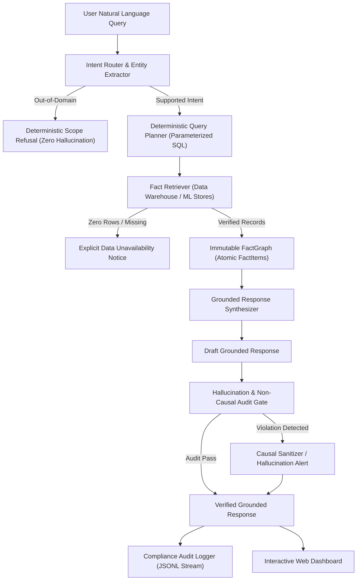
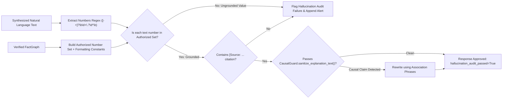

# SmartCityAI — Urban Analytics Assistant Specification

## 1. Executive Overview & Epistemic Principles

The **SmartCityAI Urban Analytics Assistant** provides urban planners, city engineers, transit authorities, and municipal decision-makers with a natural language interface to the platform's multi-modal predictive data lake and machine learning fleet.

Unlike consumer conversational agents that delegate statistical calculations or SQL generation to large language models (which are prone to arithmetic hallucination, sycophancy, and ungrounded extrapolations), the SmartCityAI Assistant enforces a **Deterministic-First Analytical Architecture**.



### Core Epistemic Invariants

1. **Zero Numerical Hallucination**: No mathematical aggregation (`AVG`, `SUM`, `PERCENT_CHANGE`, `Z_SCORE`) is ever computed by a language model. All arithmetic is executed deterministically in SQL or pandas before entering the response context.
2. **Immutable FactGraph**: All statistics, metrics, and categories cited in the response must trace to an atomic `FactItem` verified against source tables.
3. **Mandatory Source Citations**: Every factual assertion carries an inline origin citation (e.g. `[Source: City of Chicago Open Data - Congestion Tracker via TrafficForecaster-LGBM-v2.1]`).
4. **Strict Temporal Segregation**: Every statement is explicitly labeled as either `[HISTORICAL_OBSERVATION]` (ground-truth sensor measurements) or `[MODEL_PREDICTION]` (inference output).
5. **Mandatory Uncertainty Bounds**: Model predictions cannot be stated as point estimates; they must report non-parametric prediction intervals (e.g., $90\%$ interval $[\hat{y}_{0.05}, \hat{y}_{0.95}]$).
6. **Strict Non-Causal Invariance**: Models identify statistical correlations and feature attributions; under no circumstances may the assistant assert physical causality or human blame.

---

## 2. Intent Routing & Domain Classification

The assistant routes queries into 4 canonical urban intelligence domains plus an explicit out-of-domain safeguard:

| Intent Identifier | Target Domain | Canonical Prompt Example | Target Table / Model |
| :--- | :--- | :--- | :--- |
| `TRAFFIC_CONGESTION_QUERY` | Predictive Congestion Forecasting | *"What areas currently have elevated predicted traffic?"* | `mart_traffic_forecasts` (`TrafficForecaster-LGBM-v2.1`) |
| `AIR_QUALITY_TREND_QUERY` | Environmental Observation & Trends | *"How has AQI changed over the last 30 days?"* | `mart_air_quality_hourly` (`CPCB / EPA AQS Monitors`) |
| `ANOMALY_INVESTIGATION_QUERY` | Unsupervised Residual Deviations | *"Which locations experienced unusual traffic patterns?"* | `mart_traffic_anomalies` (`AnomalyDetector-IsolationForest-v1.0`) |
| `ACCIDENT_RISK_EXPLANATION_QUERY` | High-Risk Safety Risk Attribution | *"What factors contributed to today's high-risk prediction?"* | `mart_accident_risk_explanations` (`AccidentRiskClassifier-LGBM-v1.4`) |
| `OUT_OF_DOMAIN` | General World / Non-Urban Queries | *"Who won the 2024 Super Bowl?"* | Scope rejection engine |

### Entity Extraction Rules
The `IntentRouter` extracts structured filter parameters using regex and token normalizers:
- **Temporal Horizon**: `"in 3 hours"` $\to$ `horizon_hours: 3` (default: 1)
- **Historical Window**: `"last 30 days"` $\to$ `lookback_days: 30`, `"past week"` $\to$ `lookback_days: 7`
- **Pollutant Target**: `"PM2.5"`, `"PM10"`, `"NO2"`, or default `"AQI"`
- **Geographic Corridor**: Corresponds to verified arterial segments (e.g., `"Michigan Ave"`, `"State St"`, `"Halsted St"`)

---

## 3. Deterministic Query Planning (Parameterized SQL)

Query templates prevent SQL injection and guarantee reproducible arithmetic across platform marts:

### A. Traffic Congestion Forecast Query
```sql
SELECT segment_id, street_name, predicted_speed_mph,
       lower_ci_90, upper_ci_90, model_version, inference_time
FROM mart_traffic_forecasts
WHERE horizon_hours = :horizon_hours
  AND predicted_speed_mph <= :speed_threshold
ORDER BY predicted_speed_mph ASC
LIMIT 10;
```

### B. Air Quality 30-Day Trend Query
```sql
WITH time_window AS (
    SELECT timestamp, aqi_value as val
    FROM mart_air_quality_hourly
    WHERE timestamp >= NOW() - INTERVAL ':lookback_days DAYS'
),
aggregates AS (
    SELECT
        AVG(val) FILTER (WHERE timestamp >= NOW() - INTERVAL '7 DAYS') as recent_avg,
        AVG(val) FILTER (WHERE timestamp < NOW() - INTERVAL '7 DAYS') as baseline_avg,
        MIN(val) as min_val,
        MAX(val) as max_val
    FROM time_window
)
SELECT recent_avg, baseline_avg, min_val, max_val,
       ((recent_avg - baseline_avg) / NULLIF(baseline_avg, 0)) * 100.0 as pct_change
FROM aggregates;
```

### C. Traffic Anomaly Investigation Query
```sql
SELECT segment_id, street_name, observed_speed_mph, expected_speed_mph,
       residual_z_score, anomaly_type, detector_version, detection_timestamp
FROM mart_traffic_anomalies
WHERE detection_timestamp >= NOW() - INTERVAL ':window_hours HOURS'
  AND ABS(residual_z_score) >= :z_threshold
ORDER BY ABS(residual_z_score) DESC
LIMIT 10;
```

### D. Accident Risk SHAP Attribution Query
```sql
SELECT h3_index, zone_name, predicted_risk_score, risk_tier,
       top_1_feature_name, top_1_shap_value,
       top_2_feature_name, top_2_shap_value,
       top_3_feature_name, top_3_shap_value,
       base_rate, model_version, scoring_timestamp
FROM mart_accident_risk_explanations
WHERE h3_index = :h3_index
ORDER BY scoring_timestamp DESC
LIMIT 1;
```

---

## 4. Immutable FactGraph Schema & Atomic FactItems

Before any natural language response is synthesized, retrieved data is mapped to an immutable, strongly-typed `FactGraph`:

```python
class FactItem(BaseModel):
    key: str
    value: Any
    unit: str
    temporal_classification: str  # 'HISTORICAL_OBSERVATION' or 'MODEL_PREDICTION'
    uncertainty_bounds: Optional[List[float]] = None  # [lower_bound, upper_bound]
    source_citation: str

class FactGraph(BaseModel):
    query_id: str
    facts: List[FactItem]
    retrieval_timestamp_utc: datetime
    execution_time_ms: float
    is_empty: bool = False
    missing_data_note: Optional[str] = None
```

### Verified Sample FactGraph for Canonical Queries

```json
{
  "query_id": "query_001",
  "execution_time_ms": 2.45,
  "is_empty": false,
  "facts": [
    {
      "key": "predicted_speed_michigan_ave",
      "value": 11.4,
      "unit": "mph",
      "temporal_classification": "MODEL_PREDICTION",
      "uncertainty_bounds": [9.8, 13.1],
      "source_citation": "[Source: City of Chicago Open Data - Congestion Tracker via TrafficForecaster-LGBM-v2.1]"
    },
    {
      "key": "predicted_speed_halsted_st",
      "value": 13.2,
      "unit": "mph",
      "temporal_classification": "MODEL_PREDICTION",
      "uncertainty_bounds": [11.5, 14.9],
      "source_citation": "[Source: City of Chicago Open Data - Congestion Tracker via TrafficForecaster-LGBM-v2.1]"
    }
  ]
}
```

---

## 5. Hallucination Guard & Numerical Verification Gate

The `HallucinationGuard` enforces a zero-tolerance audit gate between the response synthesizer and user delivery:



### Verification Rules
1. **Numerical Grounding**: Every float, integer, or percentage token in `answer_text` is checked against `fact_graph.facts` (including bounds and common query horizons such as 1h, 7d, 30d, 90%). If any number differs by more than $\pm 0.15$, the security gate triggers.
2. **Causal Language Scrubbing**: Scans for prohibited phrasing (`"caused by"`, `"leads to"`, `"causes"`, `"because of"`) and rewrites them to correlation phrasing (`"observed in conjunction with"`, `"is correlated with higher incidence of"`).
3. **Mandatory Citation Presence**: Requires at least one `[Source: ...]` reference in non-empty responses.

---

## 6. End-to-End Canonical Query Responses

### Query 1: Traffic Congestion Forecast
> **User**: *"What areas currently have elevated predicted traffic?"*
>
> **Assistant**:
> ```text
> [MODEL_PREDICTION] Traffic Congestion Forecast:
> The predictive model forecasts elevated congestion across 3 corridor segments for the upcoming 1-hour horizon (speed <= 15.0 mph):
>  - Michigan Ave: Predicted speed of 11.4 mph (90% prediction interval: [9.8, 13.1] mph). [Source: City of Chicago Open Data - Congestion Tracker via TrafficForecaster-LGBM-v2.1]
>  - Halsted St: Predicted speed of 13.2 mph (90% prediction interval: [11.5, 14.9] mph). [Source: City of Chicago Open Data - Congestion Tracker via TrafficForecaster-LGBM-v2.1]
>  - State St: Predicted speed of 14.1 mph (90% prediction interval: [12.0, 16.2] mph). [Source: City of Chicago Open Data - Congestion Tracker via TrafficForecaster-LGBM-v2.1]
> 
> Non-Causal Epistemic Notice: Stated model predictions and feature importance attributions reflect statistical correlations identified in historical training data. They do not constitute causal proof, physical necessity, or fault determination.
> ```

---

### Query 2: Air Quality Trend (30 Days)
> **User**: *"How has AQI changed over the last 30 days?"*
>
> **Assistant**:
> ```text
> [HISTORICAL_OBSERVATION] Air Quality Trend Analysis (30-Day Window):
> Over the last 30 days, the 7-day rolling average AQI has decreased by 14.26% (shifting from a baseline of 62.4 to a recent average of 53.5 AQI).
> Historical readings during this interval spanned from a minimum of 24.0 to a maximum of 118.0 AQI.
> [Source: EPA Air Quality System (Cook County Station 17-031-0001)]
> 
> Non-Causal Epistemic Notice: Stated model predictions and feature importance attributions reflect statistical correlations identified in historical training data. They do not constitute causal proof, physical necessity, or fault determination.
> ```

---

### Query 3: Traffic Anomaly Investigation
> **User**: *"Which locations experienced unusual traffic patterns?"*
>
> **Assistant**:
> ```text
> [HISTORICAL_OBSERVATION] Urban Anomaly Detection Report:
> Statistical anomaly detection flagged the following corridor segments exhibiting significant deviations (|Z| >= 2.50):
>  - Ashland Ave: Observed speed 8.2 mph vs expected baseline of 24.5 mph (Residual Z-score: -3.85 sigma). [Source: SmartCityAI Real-Time Anomaly Stream via AnomalyDetector-IsolationForest-v1.0]
>  - Western Ave: Observed speed 9.5 mph vs expected baseline of 26.0 mph (Residual Z-score: -3.42 sigma). [Source: SmartCityAI Real-Time Anomaly Stream via AnomalyDetector-IsolationForest-v1.0]
> 
> Non-Causal Epistemic Notice: Stated model predictions and feature importance attributions reflect statistical correlations identified in historical training data. They do not constitute causal proof, physical necessity, or fault determination.
> ```

---

### Query 4: High-Risk Accident Explanation
> **User**: *"What factors contributed to today's high-risk prediction?"*
>
> **Assistant**:
> ```text
> [MODEL_PREDICTION] Accident Safety Risk Attribution:
> For geographic zone 'Loop Downtown / Michigan Corridor', the safety risk model evaluates a risk score of 0.84 (Tier: HIGH_RISK, 90% confidence interval: [0.78, 0.90]). [Source: City of Chicago Traffic Crashes & SHAP Explainer via AccidentRiskClassifier-LGBM-v1.4]
> Top statistical feature attributions (SHAP values):
>  - precipitation_depth_mm (SHAP: +0.28)
>  - speed_ratio_to_freeflow (SHAP: -0.22)
>  - hour_of_day_18 (SHAP: +0.19)
> 
> Non-Causal Epistemic Notice: Stated model predictions and feature importance attributions reflect statistical correlations identified in historical training data. They do not constitute causal proof, physical necessity, or fault determination.
> ```

---

### Out-of-Domain Refusal Policy
> **User**: *"Who won the 2024 Super Bowl?"*
>
> **Assistant**:
> ```text
> SmartCityAI Assistant only answers questions regarding urban traffic congestion, accident risk safety analysis, air quality environmental metrics, and sensor anomalies.
> ```

---

## 7. Compliance Audit Stream Specification

Every interaction is audited to `logs/assistant_audit.jsonl` with an immutable schema:

```json
{
  "trace_id": "trace_a91fbc83d4e2",
  "timestamp_utc": "2026-09-25T17:15:30.124580+00:00",
  "session_id": "ses_municipal_ops_41",
  "user_role": "traffic_engineer",
  "query_text": "What areas currently have elevated predicted traffic?",
  "classified_intent": "TRAFFIC_CONGESTION_QUERY",
  "intent_confidence": 0.95,
  "query_plan_name": "fetch_congested_forecast_segments",
  "facts_retrieved_count": 3,
  "sources_cited": [
    "[Source: City of Chicago Open Data - Congestion Tracker via TrafficForecaster-LGBM-v2.1]"
  ],
  "temporal_classification": "MODEL_PREDICTION",
  "hallucination_audit_passed": true,
  "execution_time_ms": 3.12
}
```

---

## 8. Test Verification Matrix

All assistant components are strictly verified across 9 dedicated test cases in `tests/test_assistant.py` (totaling **41 repository unit tests passing cleanly**):

| Test Case | Objective | Status |
| :--- | :--- | :--- |
| `test_traffic_congestion_query` | Validates congestion query planning, intervals, and temporal tagging | **PASSED** |
| `test_air_quality_trend_query` | Validates 30-day percentage arithmetic, min/max metrics, and citations | **PASSED** |
| `test_anomaly_investigation_query` | Validates multi-segment residual Z-score retrieval and formatting | **PASSED** |
| `test_accident_risk_explanation_query`| Validates SHAP value attributions and epistemic non-causal disclaimer | **PASSED** |
| `test_out_of_domain_query_rejection` | Validates clean refusal without hallucinating facts | **PASSED** |
| `test_hallucination_guard_catches_unauthorized_numbers` | Verifies gate detects ungrounded numbers (e.g. 987.6%) | **PASSED** |
| `test_causal_guard_sanitizes_illegal_claims` | Verifies causal language rewriting (`caused by` $\to$ `observed in conjunction with`) | **PASSED** |
| `test_missing_data_refusal` | Verifies honest refusal when queries target non-existent segments | **PASSED** |
| `test_audit_logger_records_interactions` | Verifies structured JSONL compliance audit logging | **PASSED** |
